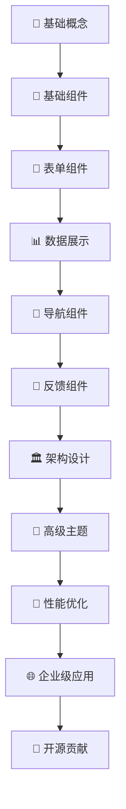

# 📚 Element Plus 学习宝典

<div align="center">


**🎯 系统掌握 Element Plus 组件库开发的完整学习路径**

</div>

## 🌟 项目简介

这是一个专为前端开发者设计的 **Element Plus 深度学习计划**，旨在帮助开发者系统性地掌握 Element Plus 组件库的使用。从基础概念到高级应用，从单个组件到完整项目开发，通过结构化的学习路径，不仅掌握组件使用，更要理解设计原理、源码实现和企业级应用实践。

### ✨ 为什么选择这个学习计划？

- 🎯 **系统性学习**：覆盖 Element Plus 全部 78 个组件的完整学习体系
- 🏗️ **架构思维**：深入理解组件库设计原理和最佳实践
- 💼 **企业级应用**：融入真实项目经验和工程化实践
- 🔍 **源码解析**：深度剖析核心组件实现原理
- 🌐 **全栈视野**：涵盖 SSR、国际化、性能优化等高级主题
- 🤝 **开源贡献**：从学习者到贡献者的完整成长路径

## 🎯 学习目标

通过系统化的学习路径，全面掌握 Element Plus 组件库的使用，能够独立开发复杂的企业级前端应用，并具备组件库设计和开发能力。

### 🏆 核心能力目标

<div style="display: grid; grid-template-columns: repeat(auto-fit, minmax(300px, 1fr)); gap: 20px; margin: 20px 0;">

**🧩 基础掌握**
- 熟练掌握 Element Plus 全部 78 个组件的使用
- 理解组件 API 设计和使用场景
- 掌握组件间的组合和配置技巧

**🏗️ 架构理解**
- 深入理解组件设计原理和架构模式
- 掌握 Vue 3 + TypeScript 最佳实践
- 理解组件库的整体设计思想

**🔍 源码分析**
- 能够阅读和理解核心组件源码
- 掌握组件实现的底层原理
- 具备源码调试和问题定位能力

**🎨 定制开发**
- 进行组件二次开发和功能扩展
- 掌握主题定制和样式覆盖技巧
- 开发自定义组件和插件

**⚡ 性能优化**
- 具备组件性能分析和优化能力
- 掌握大数据量场景的优化策略
- 理解虚拟化和懒加载技术

**🏭 工程实践**
- 掌握组件库开发、测试、发布流程
- 具备企业级项目架构设计能力
- 掌握 CI/CD 和自动化部署

</div>

## 📁 项目结构

```
element-plus-study/
├── 📄 README.md                     # 项目说明文档
├── 📚 docs/                         # 学习文档目录
│   ├── 🎯 基础概念/                  # 设计原则与基础概念
│   ├── 🧩 基础组件/                  # Button、Layout、Icon 等
│   ├── 📝 表单组件/                  # Input、Select、Form 等
│   ├── 📊 数据展示组件/              # Table、Tree、Card 等
│   ├── 🧭 导航组件/                  # Menu、Breadcrumb、Tabs 等
│   ├── 💬 反馈组件/                  # Dialog、Message、Loading 等
│   ├── 🔧 其他组件/                  # 布局容器、工具类组件等
│   ├── 🏛️ 架构设计/                  # 整体架构与设计理念
│   ├── ⚡ 高级特性/                  # 高级组件模式与实践
│   ├── 🎨 高级主题/                  # 主题定制与暗黑模式
│   ├── 🚀 性能优化/                  # 组件性能分析与优化
│   ├── 🖥️ SSR服务端渲染/             # 服务端渲染配置与优化
│   ├── 🌍 国际化与无障碍/            # 多语言与无障碍设计
│   ├── 🔗 Vue生态集成/               # Router、Pinia 等集成
│   ├── ⚙️ 工程化与构建/              # Vite、TypeScript、测试
│   ├── 📱 跨平台开发/                # 移动端适配与桌面应用
│   ├── 💼 项目实践/                  # 综合项目实战
│   ├── 🔓 开源贡献/                  # 开发流程与代码规范
│   ├── 👥 社区贡献/                  # 社区参与与维护
│   └── 📈 总结与规划/                # 学习总结与进阶规划
├── 🛠️ projects/                     # 实践项目目录
│   ├── basic-demo/                 # 基础示例项目
│   ├── admin-system/               # 企业级管理系统
│   ├── component-lib/              # 自定义组件库
│   ├── ssr-practice/               # SSR 实践项目
│   ├── i18n-practice/              # 国际化实践项目
│   ├── theme-system/               # 主题系统实践
│   ├── performance-demo/           # 性能优化示例
│   └── mobile-app/                 # 移动端应用示例
├── 📦 package.json                  # 项目依赖配置
├── ⚙️ vite.config.ts                # Vite 配置文件
├── 📝 tsconfig.json                 # TypeScript 配置
├── 🎨 .eslintrc.js                  # ESLint 配置
├── 💅 .prettierrc                   # Prettier 配置
└── 🚫 .gitignore                    # Git 忽略文件
```

## 📅 学习路径概览

我们将学习路径分为四个阶段，每个阶段都有明确的学习目标和实践项目：

<div style="display: grid; grid-template-columns: repeat(auto-fit, minmax(250px, 1fr)); gap: 20px; margin: 20px 0;">

### 🎯 第一阶段：基础概念与核心组件
**目标**：掌握 Element Plus 基础使用
- 环境搭建与配置
- 基础组件全面学习
- 表单组件深入实践
- 数据展示组件应用

### 🏗️ 第二阶段：架构设计与高级特性
**目标**：理解组件库设计原理
- 整体架构分析
- 高级组件模式
- 主题系统定制
- 性能优化策略

### 🌐 第三阶段：企业级应用实践
**目标**：掌握企业级开发技能
- SSR 服务端渲染
- 国际化与无障碍
- Vue 生态集成
- 工程化构建

### 🤝 第四阶段：开源贡献与精通
**目标**：成为 Element Plus 专家
- 项目实战开发
- 开源社区贡献
- 技术分享交流
- 持续学习规划

</div>

---

### 🎯 第一阶段：基础概念与核心组件

#### 第一周：环境搭建与基础组件（第1-7天）
- [第1天：环境搭建与基础概念](./docs/第1天：环境搭建与基础概念.md)
- [第2天：Basic 基础组件 - Button、Border、Color](./docs/第2天：基础组件%20-%20布局与样式.md)
- [第3天：Basic 基础组件 - Container、Layout、Space](./docs/第3天：基础组件%20-%20按钮与文本.md)
- [第4天：Basic 基础组件 - Icon、Link、Text、Typography](./docs/第4天：图标与滚动.md)
- [第5天：Basic 基础组件 - Scrollbar、Splitter 与配置组件](./docs/第5天：表单基础组件（一）.md)
- [第6天：Form 表单组件 - Input、Input Number、Textarea](./docs/第6天：表单基础组件（二）.md)
- [第7天：第一周总结与项目实践](./docs/第7天：第一周总结与项目实践.md)

#### 第二周：表单组件深入学习（第8-14天）
- [第8天：Form 表单组件 - Radio、Checkbox、Switch](./docs/第8天：高级选择器（一）.md)
- [第9天：Form 表单组件 - Select、Cascader、TreeSelect](./docs/第9天：高级选择器（二）.md)
- [第10天：Form 表单组件 - Date Picker、DateTime Picker、Time Picker](./docs/第10天：日期时间组件.md)
- [第11天：Form 表单组件 - Autocomplete、Rate、Slider、Color Picker](./docs/第11天：特殊输入组件.md)
- [第12天：Form 表单组件 - Upload、Transfer、Input Tag、Mention](./docs/第12天：新特性组件.md)
- [第13天：Form 表单组件 - Form 表单验证与 Virtualized Select](./docs/第13天：表单验证与优化.md)
- [第14天：第二周项目实践](./docs/第14天：第二周项目实践.md)

#### 第三周：数据展示组件（第15-21天）
- [第15天：Data 数据展示 - Table、Virtualized Table、Pagination](./docs/第15天：基础数据展示.md)
- [第16天：Data 数据展示 - Tree、Virtualized Tree、Tag](./docs/第16天：高级数据展示.md)
- [第17天：Data 数据展示 - Avatar、Badge、Card、Image](./docs/第17天：导航组件.md)
- [第18天：Data 数据展示 - Calendar、Carousel、Descriptions、Timeline](./docs/第18天：消息反馈组件.md)
- [第19天：Data 数据展示 - Collapse、Empty、Progress、Result](./docs/第19天：弹出层组件.md)
- [第20天：Data 数据展示 - Skeleton、Infinite Scroll、Statistic、Segmented、Tour](./docs/第20天：加载与引导组件.md)
- [第21天：第三周项目实践](./docs/第21天：第三周项目实践.md)

#### 第四周：导航、反馈与其他组件（第22-30天）
- [第22天：Navigation 导航组件 - Menu、Breadcrumb、Tabs](./docs/第22天：布局与容器进阶.md)
- [第23天：Navigation 导航组件 - Steps、Dropdown、Page Header](./docs/第23天：工具类组件.md)
- [第24天：Navigation 导航组件 - Affix、Anchor、Backtop](./docs/第24天：特效与动画.md)
- [第25天：Feedback 反馈组件 - Dialog、Drawer、Message、Notification](./docs/第25天：树形与虚拟化组件.md)
- [第26天：Feedback 反馈组件 - Alert、Loading、Popover、Popconfirm、Tooltip](./docs/第26天：特殊功能组件.md)
- [第27天：Feedback 反馈组件 - Message Box 与 Others 其他组件](./docs/第27天：组件扩展与自定义.md)
- [第28天：Element Plus 组件综合应用与最佳实践](./docs/第28天：性能优化与最佳实践.md)
- [第29天：Element Plus 综合项目开发](./docs/第29天：综合项目开发.md)
- [第30天：第一阶段总结与评估](./docs/第30天：学习总结与进阶规划.md)

### 第二阶段：深入理解与源码分析（第31-70天）

#### 第五周：Element Plus 架构深入分析（第31-37天）
- [第31天：Element Plus 整体架构与设计理念](./docs/第31天：Element%20Plus%20整体架构与设计理念.md)
- [第32天：Element Plus 组件设计模式分析](./docs/第32天：Element%20Plus%20组件设计模式分析.md)
- [第33天：Element Plus 中 Vue 3 Composition API 应用](./docs/第33天：Element%20Plus%20中%20Vue%203%20Composition%20API%20应用.md)
- [第34天：Element Plus 组件通信机制深入](./docs/第34天：Element%20Plus%20组件通信机制深入.md)
- [第35天：Element Plus 响应式系统与数据绑定](./docs/第35天：Element%20Plus%20响应式系统与数据绑定.md)
- [第36天：Element Plus 生命周期管理与钩子函数](./docs/第36天：Element%20Plus%20生命周期管理与钩子函数.md)
- [第37天：Element Plus 插件系统与扩展机制](./docs/第37天：Element%20Plus%20插件系统与扩展机制.md)

#### 第六周：核心组件源码深度解读（第38-44天）
- [第38天：Element Plus 测试策略与质量保证](./docs/第38天：Element%20Plus%20测试策略与质量保证.md)
- [第39天：Element Plus 性能优化策略](./docs/第39天：Element%20Plus%20性能优化策略.md)
- [第40天：Element Plus 工程化配置与构建优化](./docs/第40天：Element%20Plus%20工程化配置与构建优化.md)
- [第41天：Element Plus 主题系统深入定制](./docs/第41天：Element%20Plus%20主题系统深入定制.md)
- [第42天：Element Plus 国际化深入应用](./docs/第42天：Element%20Plus%20国际化深入应用.md)
- [第43天：Element Plus 全局配置与命名空间](./docs/第43天：Element%20Plus%20全局配置与命名空间.md)
- [第44天：Element Plus 暗黑模式与自适应主题](./docs/第44天：Element%20Plus%20暗黑模式与自适应主题.md)

#### 第七周：Element Plus 高级特性与扩展（第45-51天）
- [第45天：Element Plus 响应式设计与移动端适配](./docs/第45天：Element%20Plus%20响应式设计与移动端适配.md)
- [第46天：Element Plus 微前端架构与模块联邦](./docs/第46天：Element%20Plus%20微前端架构与模块联邦.md)
- [第47天：Element Plus 可视化编辑器开发](./docs/第47天：Element%20Plus%20可视化编辑器开发.md)
- [第48天：Element Plus 数据可视化与图表集成](./docs/第48天：Element%20Plus%20数据可视化与图表集成.md)
- 第49天：Element Plus 自定义组件库开发
- 第50天：Element Plus 插件生态系统构建
- 第51天：Element Plus 高级特性综合实践

#### 第八周：Element Plus SSR 与服务端渲染（第52-58天）
- 第52天：Element Plus SSR 基础概念与环境搭建
- 第53天：Element Plus Nuxt.js 集成与配置
- [第54天：Element Plus SSR 服务端渲染支持与配置](./docs/第54天：Element%20Plus%20SSR%20服务端渲染支持与配置.md)
- 第55天：Element Plus SSR 水合错误处理与优化
- 第56天：Element Plus SSR 性能优化与缓存策略
- 第57天：Element Plus SSR 部署与运维
- 第58天：Element Plus SSR 综合实践

#### 第九周：Element Plus 国际化与无障碍（第59-65天）
- [第59天：Element Plus 国际化系统详解](./docs/第59天：Element%20Plus%20国际化系统详解.md)
- 第60天：Element Plus 多语言切换实现与动态配置
- 第61天：Element Plus RTL（右到左）布局支持
- 第62天：Element Plus Day.js 时间本地化配置
- 第63天：Element Plus 无障碍设计实践与 ARIA 属性应用
- 第64天：Element Plus 键盘导航与屏幕阅读器支持
- 第65天：Element Plus 国际化与无障碍综合实践

#### 第十周：Element Plus 开源贡献与社区参与（第66-70天）
- 第66天：Element Plus 开发流程与代码规范
- 第67天：Element Plus 代码贡献与 Pull Request 流程
- 第68天：Element Plus 测试编写与代码质量保证
- 第69天：Element Plus 社区参与与维护实践
- 第70天：第二阶段总结与评估

### 第三阶段：高级应用与精通实践（第71-100天）

#### 第十一周：Element Plus 高级特性与扩展（第71-77天）
- 第71天：Element Plus 插件系统深入
- 第72天：自定义指令在组件中的应用
- 第73天：组件间复杂通信模式
- 第74天：Element Plus 与 Vue Router 深度集成
- 第75天：Element Plus 与 Pinia 状态管理
- 第76天：Element Plus 迁移工具使用与实践
- 第77天：高级特性综合项目实践

#### 第十二周：Element Plus 性能优化与工程化（第78-84天）
- [第78天：Element Plus 组件性能分析](./docs/第78天：Element%20Plus%20组件性能分析.md)
- 第79天：Table 组件大数据优化
- 第80天：Select 组件大选项优化
- 第81天：Tree 组件大数据渲染优化
- 第82天：Element Plus 构建系统深入（Vite + TypeScript）
- 第83天：Element Plus 测试体系与质量保证
- 第84天：性能优化综合实践

#### 第十三周：Element Plus 开源贡献与社区参与（第85-91天）
- 第85天：Element Plus 开源项目深度参与
- 第86天：Bug 修复与功能增强贡献
- 第87天：Element Plus 文档改进与翻译
- 第88天：Element Plus 社区建设与维护
- 第89天：Element Plus 版本发布与变更管理
- 第90天：Element Plus 生态系统建设
- 第91天：开源贡献综合实践

#### 第十四周：Element Plus 精通总结与职业发展（第92-100天）
- 第92天：Element Plus 源码贡献实践
- 第93天：Element Plus 最佳实践总结
- 第94天：Element Plus 技术分享与知识传播
- 第95天：Element Plus 未来发展趋势分析
- 第96天：基于 Element Plus 的组件库设计
- 第97天：Element Plus 相关职业发展规划
- 第98天：Element Plus 进阶学习规划
- 第99天：Element Plus 综合项目展示与作品集
- 第100天：Element Plus 精通总结与持续学习计划

## 🎓 学习方式

### 📚 学习方法论

<div style="display: grid; grid-template-columns: repeat(auto-fit, minmax(300px, 1fr)); gap: 20px; margin: 20px 0;">

**🔄 理论与实践并重**
- 每个主题都包含理论知识和实际代码练习
- 通过动手实践加深对组件的理解
- 结合真实项目场景进行学习

**📈 循序渐进学习**
- 从基础组件开始，逐步深入到高级特性
- 每个阶段都有明确的学习目标和评估标准
- 建立完整的知识体系和技能树

**🏗️ 项目驱动学习**
- 通过实际项目巩固所学知识
- 每个阶段都有对应的实践项目
- 从简单示例到复杂企业级应用

**🔍 源码深度解析**
- 深入分析 Element Plus 核心组件源码
- 理解组件库的整体架构和设计思想
- 掌握组件实现的底层原理和技术细节

**⚡ 性能优化实践**
- 掌握大型应用的性能优化技巧
- 学习虚拟化、懒加载等高级技术
- 具备性能问题诊断和解决能力

**🏭 工程化全流程**
- 学习组件库的设计、开发、测试、发布全流程
- 掌握现代前端工程化最佳实践
- 具备企业级项目架构设计能力

</div>

### ✨ 学习特色

- 📖 **文档齐全**：每个学习主题都有详细的文档和示例代码
- 🤝 **社区支持**：鼓励在学习过程中参与社区讨论和贡献
- 🚀 **技能进阶**：从使用者到贡献者，从初学者到专家
- 💼 **企业实践**：融入真实企业级项目经验和最佳实践
- 🔄 **持续更新**：跟随 Element Plus 版本更新，保持内容时效性

## 💻 学习环境要求

### 🛠️ 基础环境

| 工具 | 版本要求 | 说明 |
|------|----------|------|
|  | 18+ | JavaScript 运行环境 |
|  | 3.3+ | 前端框架 |
|  | 2.4+ | UI 组件库 |
|  | 5.0+ | 类型系统 |
|  | 4.0+ | 构建工具 |

### 🌐 浏览器支持

- 
- 
- 
- 

### 🔧 开发工具

**代码编辑器**
- 
- 

**版本控制**
- 

**包管理器**
- 
- 
- 

### 🔌 VS Code 推荐插件

```json
{
  "recommendations": [
    "Vue.volar",                    // Vue Language Features
    "Vue.vscode-typescript-vue-plugin", // TypeScript Vue Plugin
    "dbaeumer.vscode-eslint",       // ESLint
    "esbenp.prettier-vscode",       // Prettier
    "eamodio.gitlens",              // GitLens
    "ElementPlus.vscode-element-plus-helper", // Element Plus Helper
    "bradlc.vscode-tailwindcss",    // Tailwind CSS IntelliSense
    "ms-vscode.vscode-typescript-next" // TypeScript Importer
  ]
}
```

## 🚀 快速开始

### 📦 环境准备

**1. 检查 Node.js 版本**
```bash
node --version  # 确保 >= 18.0.0
npm --version   # 确保 >= 8.0.0
```

**2. 克隆学习项目**
```bash
git clone https://github.com/your-username/element-plus-study.git
cd element-plus-study
```

**3. 安装依赖**
```bash
# 使用 npm
npm install

# 或使用 pnpm（推荐）
pnpm install

# 或使用 yarn
yarn install
```

### 🏃‍♂️ 启动开发环境

**启动文档站点**
```bash
npm run docs:dev
# 访问 http://localhost:5173
```

**启动示例项目**
```bash
npm run dev
# 访问 http://localhost:3000
```

### 📚 开始学习

<div style="background: linear-gradient(135deg, #667eea 0%, #764ba2 100%); padding: 20px; border-radius: 10px; color: white; margin: 20px 0;">

**🎯 学习路径建议**

1. **📖 阅读文档**：从基础概念开始，了解 Element Plus 设计理念
2. **💻 动手实践**：每学习一个组件，都要亲自编写代码实践
3. **📝 记录笔记**：记录学习过程中的重点、难点和心得体会
4. **🏗️ 项目实战**：将学到的知识应用到实际项目中
5. **🤝 社区参与**：积极参与 Element Plus 社区讨论和贡献

</div>

### 🗂️ 学习顺序



## 学习资源

### Element Plus 官方资源 <mcreference link="https://element-plus.org/zh-CN/component/overview.html" index="1">1</mcreference> <mcreference link="https://cn.element-plus.org/zh-CN/component/overview.html" index="2">2</mcreference>
- [Element Plus 官网](https://element-plus.org/zh-CN/)
- [Element Plus 组件总览](https://element-plus.org/zh-CN/component/overview.html) - 包含所有78个组件的完整列表
- [Element Plus 设计指南](https://element-plus.org/zh-CN/guide/design.html)
- [Element Plus 快速开始](https://element-plus.org/zh-CN/guide/quickstart.html)
- [Element Plus 主题配置](https://element-plus.org/zh-CN/guide/theming.html)
- [Element Plus 国际化](https://element-plus.org/zh-CN/guide/i18n.html)
- [Element Plus 暗黑模式](https://element-plus.org/zh-CN/guide/dark-mode.html)
- [Element Plus SSR 服务端渲染](https://element-plus.org/zh-CN/guide/ssr.html)
- [Element Plus 全局配置](https://element-plus.org/zh-CN/component/config-provider.html)
- [Element Plus 自定义命名空间](https://element-plus.org/zh-CN/guide/namespace.html)
- [Element Plus GitHub 仓库](https://github.com/element-plus/element-plus)
- [Element Plus 贡献指南](https://github.com/element-plus/element-plus/blob/dev/CONTRIBUTING.md)
- [Element Plus 代码规范](https://github.com/element-plus/element-plus/blob/dev/CODE_OF_CONDUCT.md)
- [Element Plus 变更日志](https://github.com/element-plus/element-plus/blob/dev/CHANGELOG.md)
- [Element Plus 迁移工具](https://github.com/element-plus/element-plus-migration-tool)
- [Element Plus 在线演练场](https://element-plus.run/)

### 核心技术栈资源
- [Vue 3 官方文档](https://cn.vuejs.org/)
- [Vue 3 Composition API](https://cn.vuejs.org/guide/extras/composition-api-faq.html)
- [TypeScript 官方文档](https://www.typescriptlang.org/)
- [Vite 构建工具](https://vitejs.dev/)

### 开发工具
- [Vue DevTools](https://devtools.vuejs.org/)
- [Element Plus Helper (VS Code 插件)](https://marketplace.visualstudio.com/items?itemName=ElemeFE.vscode-element-helper)
- [Vue Language Features (Volar)](https://marketplace.visualstudio.com/items?itemName=Vue.volar)
- [Element Plus 代码迁移工具](https://github.com/element-plus/element-plus-migration-tool)

## 项目特色

- **完整覆盖**：涵盖 Element Plus 全部78个组件，按官方6大分类系统学习 <mcreference link="https://element-plus.org/zh-CN/component/overview.html" index="1">1</mcreference>
- **四阶段进阶**：从基础使用到源码分析，再到企业级应用和精通实践的完整学习路径
- **官方同步**：学习内容与 Element Plus 官方文档和最新版本保持同步
- **实践导向**：每个组件都有具体的实践项目和应用场景
- **源码深入**：深度解析 Element Plus 核心组件的实现原理和设计思想
- **企业应用**：融入真实企业级项目中的 Element Plus 应用经验和最佳实践
- **SSR 支持**：深入学习服务端渲染配置与优化
- **国际化完整**：全面掌握多语言、RTL 布局和无障碍设计
- **开源贡献**：从学习者到贡献者的完整成长路径

## 💡 学习建议

### 🎯 学习策略

<div style="display: grid; grid-template-columns: repeat(auto-fit, minmax(300px, 1fr)); gap: 20px; margin: 20px 0;">

**📈 循序渐进**
- 严格按照学习路径进行，不要跳跃式学习
- 每个阶段都有明确的学习目标和评估标准
- 建立完整的知识体系，避免知识碎片化

**💻 动手实践**
- 每个组件都要亲自编写代码实践
- 通过实际项目加深对组件的理解
- 尝试不同的配置和使用场景

**📝 记录总结**
- 记录学习过程中的重点和难点
- 整理常用的代码片段和最佳实践
- 定期回顾和总结学习成果

**🔍 深入探索**
- 深入阅读 Element Plus 源码，理解设计原理
- 关注组件的实现细节和性能优化
- 学习组件库的架构设计和工程化实践

**🤝 社区参与**
- 积极参与 Element Plus 社区讨论和贡献
- 分享学习心得和实践经验
- 帮助其他学习者解决问题

**🚀 持续学习**
- 关注 Element Plus 的版本更新和新特性
- 跟进前端技术发展趋势
- 从学习者成长为 Element Plus 的贡献者

</div>

### ⚠️ 常见误区

- ❌ **只看不练**：仅仅阅读文档而不动手实践
- ❌ **急于求成**：跳过基础直接学习高级特性
- ❌ **孤立学习**：不参与社区讨论和交流
- ❌ **忽视源码**：只会使用组件而不理解实现原理
- ❌ **缺乏总结**：学完就忘，没有形成知识体系

## 🤝 贡献指南

我们欢迎所有形式的贡献，让这个学习计划变得更好！

### 📝 如何贡献

<div style="display: grid; grid-template-columns: repeat(auto-fit, minmax(250px, 1fr)); gap: 20px; margin: 20px 0;">

**🐛 报告问题**
- 发现文档错误或不清楚的地方
- 报告代码示例中的 Bug
- 提出改进建议

**💡 提供建议**
- 分享更好的学习方法
- 推荐有用的学习资源
- 提出新的学习主题

**📚 完善内容**
- 补充实践项目案例
- 添加更多代码示例
- 改进文档结构和表达

**🎯 分享经验**
- 分享学习心得和体会
- 提供实际项目经验
- 贡献最佳实践案例

</div>

### 🔄 贡献流程

1. **Fork** 本仓库
2. **创建** 特性分支 (`git checkout -b feature/amazing-feature`)
3. **提交** 你的修改 (`git commit -m 'Add some amazing feature'`)
4. **推送** 到分支 (`git push origin feature/amazing-feature`)
5. **创建** Pull Request

### 📋 贡献规范

- 遵循现有的文档格式和风格
- 确保代码示例可以正常运行
- 提供清晰的提交信息
- 在 PR 中详细描述你的修改

---

## 📄 许可证

本项目采用 [MIT License](LICENSE) 开源协议。

---

<div align="center">

## 🎉 开始你的 Element Plus 学习之旅吧！

**如果这个学习计划对你有帮助，请给个 ⭐️ 支持一下！**

[](https://github.com/your-username/element-plus-study)
[](https://github.com/your-username/element-plus-study)

### 🔗 相关链接

[📚 开始学习](./基础概念/01.设计原则与基础概念.md) |
[🏠 返回首页](./index.md) |
[💬 加入讨论](https://github.com/your-username/element-plus-study/discussions) |
[🐛 报告问题](https://github.com/your-username/element-plus-study/issues)

---

**Made with ❤️ by Element Plus Learning Community**

</div>