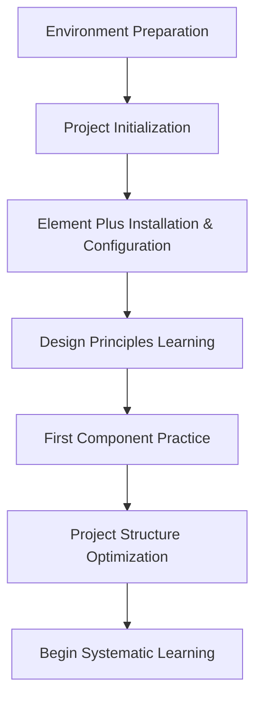

# 🚀 Quick Start

Welcome to the **Element Plus Study Guide**! This guide will help you quickly set up your development environment and begin your Element Plus learning journey.

## 📋 Learning Roadmap



## 🎯 Learning Objectives

- ✅ Set up a modern Vue 3 + Element Plus development environment
- ✅ Understand Element Plus core design principles
- ✅ Master basic component usage methods
- ✅ Create your first complete component demo page
- ✅ Establish good code standards and project structure

## 🛠️ Environment Preparation

### System Requirements

| Tool | Version Requirement | Recommended Version | Description |
|------|----------|----------|------|
| Node.js | >= 16.0.0 | 18.x LTS | JavaScript runtime environment |
| npm | >= 7.0.0 | Latest version | Package manager |
| Vue | >= 3.3.0 | 3.5.x | Frontend framework |
| Element Plus | >= 2.4.0 | 2.10.x | UI component library |

### Recommended Development Tools

- **IDE**: VS Code + Volar extension
- **Browser**: Chrome/Edge (with Vue DevTools support)
- **Package Manager**: pnpm (recommended) / yarn / npm

## 🏗️ Project Initialization

### Option 1: Using This Project Template (Recommended)

```bash
# Clone the project
git clone https://github.com/shingle666/element-plus-study.git
cd element-plus-study

# Install dependencies
npm install
# Or use pnpm (recommended)
pnpm install

# Start development server
npm run dev

# Start documentation server
npm run docs:dev
```

### Option 2: Create Project from Scratch

```bash
# Create Vue 3 project with Vite
npm create vue@latest my-element-plus-app
cd my-element-plus-app

# Install dependencies
npm install

# Install Element Plus
npm install element-plus @element-plus/icons-vue

# Install auto-import plugins (optional but recommended)
npm install -D unplugin-vue-components unplugin-auto-import
```

## ⚙️ Element Plus Configuration

### Full Import (Suitable for Learning Phase)

Configure in `src/main.js`:

```javascript
import { createApp } from 'vue'
import App from './App.vue'
import ElementPlus from 'element-plus'
import 'element-plus/dist/index.css'
import * as ElementPlusIconsVue from '@element-plus/icons-vue'

const app = createApp(App)

// Register all icons
for (const [key, component] of Object.entries(ElementPlusIconsVue)) {
  app.component(key, component)
}

app.use(ElementPlus)
app.mount('#app')
```

### On-demand Import (Recommended for Production)

Configure in `vite.config.js`:

```javascript
import { defineConfig } from 'vite'
import vue from '@vitejs/plugin-vue'
import AutoImport from 'unplugin-auto-import/vite'
import Components from 'unplugin-vue-components/vite'
import { ElementPlusResolver } from 'unplugin-vue-components/resolvers'

export default defineConfig({
  plugins: [
    vue(),
    AutoImport({
      resolvers: [ElementPlusResolver()],
    }),
    Components({
      resolvers: [ElementPlusResolver()],
    }),
  ],
})
```

## 🎨 Deep Understanding of Design Principles

Element Plus follows four core design principles, understanding these principles is crucial for using components correctly:

### 🔄 Consistency

**Consistent with Real Life**
- Follow users' cognitive habits
- Use common interaction patterns
- Maintain consistency in language expression

**Consistent Interface Elements**
- Unified visual style
- Consistent interaction behavior
- Standardized layout structure

### 💬 Feedback

**Control Feedback**
- Visual feedback for button clicks
- Real-time form validation prompts
- Clear loading state display

**Page Feedback**
- Clear display of operation results
- Accurate error message communication
- Timely success state feedback

### ⚡ Efficiency

**Simplified Process**
- Reduce unnecessary operation steps
- Provide shortcut operation methods
- Smart default value settings

**Clear and Explicit**
- Concise text expression
- Intuitive icon design
- Clear operation guidance

### 🎛️ Controllability

**User Decision**
- Provide operation suggestions rather than forcing
- Important operations require confirmation
- Preserve user choice

**Controllable Results**
- Support undo operations
- Provide fallback mechanisms
- Allow process interruption

## 🎯 First Component Practice: Button

Let's practice using Element Plus with the Button component:

### Create Demo Page

Create `ButtonDemo.vue` in the `src/views/` directory:

```vue
<template>
  <div class="button-demo-container">
    <h2>🎯 Button Component Learning Practice</h2>
    
    <!-- Basic Buttons -->
    <section class="demo-section">
      <h3>Basic Buttons</h3>
      <div class="button-group">
        <el-button>Default Button</el-button>
        <el-button type="primary">Primary Button</el-button>
        <el-button type="success">Success Button</el-button>
        <el-button type="info">Info Button</el-button>
        <el-button type="warning">Warning Button</el-button>
        <el-button type="danger">Danger Button</el-button>
      </div>
    </section>

    <!-- Plain Buttons -->
    <section class="demo-section">
      <h3>Plain Buttons</h3>
      <div class="button-group">
        <el-button plain>Plain Button</el-button>
        <el-button type="primary" plain>Primary Button</el-button>
        <el-button type="success" plain>Success Button</el-button>
        <el-button type="info" plain>Info Button</el-button>
        <el-button type="warning" plain>Warning Button</el-button>
        <el-button type="danger" plain>Danger Button</el-button>
      </div>
    </section>

    <!-- Button Sizes -->
    <section class="demo-section">
      <h3>Button Sizes</h3>
      <div class="button-group">
        <el-button size="large">Large Button</el-button>
        <el-button>Default Button</el-button>
        <el-button size="small">Small Button</el-button>
      </div>
    </section>

    <!-- Button States -->
    <section class="demo-section">
      <h3>Button States</h3>
      <div class="button-group">
        <el-button :loading="loading" @click="handleLoading">Loading Button</el-button>
        <el-button disabled>Disabled Button</el-button>
        <el-button type="primary" :icon="Search">Search</el-button>
        <el-button type="primary" circle :icon="Plus" />
      </div>
    </section>

    <!-- Interaction Demo -->
    <section class="demo-section">
      <h3>Interaction Demo</h3>
      <div class="button-group">
        <el-button type="success" @click="showMessage('success')">Success Message</el-button>
        <el-button type="warning" @click="showMessage('warning')">Warning Message</el-button>
        <el-button type="danger" @click="showMessage('error')">Error Message</el-button>
      </div>
    </section>
  </div>
</template>

<script setup>
import { ref } from 'vue'
import { ElMessage } from 'element-plus'
import { Search, Plus } from '@element-plus/icons-vue'

const loading = ref(false)

const handleLoading = () => {
  loading.value = true
  setTimeout(() => {
    loading.value = false
    ElMessage.success('Loading complete!')
  }, 2000)
}

const showMessage = (type) => {
  const messages = {
    success: 'Operation successful!',
    warning: 'Please note!',
    error: 'Operation failed!'
  }
  ElMessage[type](messages[type])
}
</script>

<style scoped>
.button-demo-container {
  padding: 20px;
  max-width: 1200px;
  margin: 0 auto;
}

.demo-section {
  margin-bottom: 40px;
  padding: 20px;
  border: 1px solid #e4e7ed;
  border-radius: 8px;
  background-color: #fafafa;
}

.demo-section h3 {
  margin-bottom: 16px;
  color: #303133;
  font-size: 18px;
}

.button-group {
  display: flex;
  gap: 12px;
  flex-wrap: wrap;
  align-items: center;
}

.button-group .el-button {
  margin: 0;
}
</style>
```

### Router Configuration

Add route in `src/router/index.js`:

```javascript
import { createRouter, createWebHistory } from 'vue-router'
import ButtonDemo from '../views/ButtonDemo.vue'

const routes = [
  {
    path: '/button-demo',
    name: 'ButtonDemo',
    component: ButtonDemo
  }
]

const router = createRouter({
  history: createWebHistory(),
  routes
})

export default router
```

## ✅ Learning Checklist

### Environment Setup
- [ ] ✅ Node.js version >= 16.0.0
- [ ] ✅ Successfully created Vue 3 project
- [ ] ✅ Element Plus installed and configured
- [ ] ✅ Development server started normally
- [ ] ✅ Browser can access the project normally

### Design Principles Understanding
- [ ] 📖 Understand the importance of consistency principle
- [ ] 📖 Master application scenarios of feedback principle
- [ ] 📖 Learn practical methods of efficiency principle
- [ ] 📖 Clarify design ideas of controllability principle

### Component Practice
- [ ] 🎯 Create Button component demo page
- [ ] 🎯 Implement different types of buttons
- [ ] 🎯 Master button size and state control
- [ ] 🎯 Complete interaction function demonstration
- [ ] 🎯 Understand component API design ideas

### Code Quality
- [ ] 💻 Clear and reasonable code structure
- [ ] 💻 Follow Vue 3 best practices
- [ ] 💻 Unified style standards
- [ ] 💻 Complete and accurate comments

## 📚 Learning Resources

### Official Documentation
- 🌐 [Element Plus Official Website](https://element-plus.org/en-US/) - Most authoritative component documentation
- 🎨 [Design Guide](https://element-plus.org/en-US/guide/design.html) - Deep understanding of design principles
- 🔧 [Button Component Documentation](https://element-plus.org/en-US/component/button.html) - Detailed API description
- 📖 [Vue 3 Official Documentation](https://vuejs.org/) - Vue 3 basic knowledge

### Development Tools
- 🛠️ [Vue DevTools](https://devtools.vuejs.org/) - Vue developer tools
- 🎯 [Volar](https://marketplace.visualstudio.com/items?itemName=Vue.volar) - VS Code Vue plugin
- 📦 [Element Plus Playground](https://element-plus.run/) - Online code demonstration

### Community Resources
- 💬 [Element Plus GitHub](https://github.com/element-plus/element-plus) - Source code and issue discussions
- 🎓 [Vue 3 + Element Plus Tutorial](https://www.youtube.com/results?search_query=vue+3+element+plus+tutorial) - Video tutorials
- 📝 [Medium Element Plus Articles](https://medium.com/tag/element-plus) - Technical articles

## ⚠️ Important Notes

### Environment Requirements
- ✅ **Node.js Version**: >= 16.0.0 (18.x LTS recommended)
- ✅ **Package Manager**: pnpm > yarn > npm recommended
- ✅ **Browser**: Modern browsers supporting ES2018+

### Best Practices
- 🎯 **On-demand Import**: Recommended for production to reduce package size
- 🔧 **TypeScript**: Recommended for better development experience
- 📱 **Responsive Design**: Pay attention to mobile adaptation and responsive layout
- 🎨 **Theme Customization**: Learn to use CSS variables for theme customization

### Common Issues

<details>
<summary>🤔 What if component styles don't work?</summary>

1. Check if Element Plus CSS file is correctly imported
2. Confirm if the component is correctly registered
3. Check for style conflicts or overrides
</details>

<details>
<summary>🤔 On-demand import configuration failed?</summary>

1. Confirm compatibility of `unplugin-vue-components` and `unplugin-auto-import` versions
2. Check if Vite configuration file syntax is correct
3. Restart development server
</details>

<details>
<summary>🤔 Icons not displaying properly?</summary>

1. Confirm `@element-plus/icons-vue` is installed
2. Check if icon components are correctly imported and registered
3. Confirm icon names are spelled correctly
</details>

## 🚀 Next Learning Plan

Congratulations on completing the Element Plus quick start! Here's a suggested path to continue learning:

### 📅 Week 1: Master Basic Components
- 📖 [Design Principles & Basic Concepts](./basic-concepts/design-principles-and-basic-concepts.md)
- 🧩 [Button](./basic-components/button.md) - Deep learning of button component
- 🎨 [Layout](./basic-components/layout.md) - Master page layout
- 🔗 [Icon](./basic-components/icon.md) - Icon system usage

### 📅 Week 2: Form Component Practice
- 📝 [Input](./form-components/input.md)
- ☑️ [Checkbox](./form-components/checkbox.md)
- 🔘 [Radio](./form-components/radio.md)
- 📋 [Form](./form-components/form.md)

### 📅 Week 3: Data Display Components
- 📊 [Table](./data-display-components/table.md)
- 🌳 [Tree](./data-display-components/tree.md)
- 🃏 [Card](./data-display-components/card.md)

### 📅 Advanced Learning
- 🏗️ [Architecture Design](./architecture-design/overall-architecture-and-design-philosophy.md) - Deep understanding of component library architecture
- ⚡ [Performance Optimization](./performance-optimization/component-performance-analysis.md) - Master performance optimization techniques
- 🎨 [Theme Customization](./advanced-topics/component-extension-and-customization.md) - Learn theme system
- 💼 [Project Practice](./project-practice/comprehensive-project-practice-one.md) - Comprehensive project development

---

## 📝 Learning Record

**Learning Date:** `___________`  
**Completion Status:** `___________`  
**Learning Duration:** `___________`

### 📖 Learning Notes
```
Record your learning insights and important knowledge points here:

1. 
2. 
3. 
```

### ❓ Problems Encountered
```
Record problems encountered during learning:

Problem 1:
Solution:

Problem 2:
Solution:
```

### 💡 Gains and Insights
```
Record your gains and understanding of Element Plus:


```

---

<div align="center">

**🎉 Congratulations on completing the quick start!**

[📖 View Complete Study Guide](./element-plus-study-guide.md) | [🏠 Return to Home](./index.md) | [📋 View Changelog](./changelog.md)

</div>