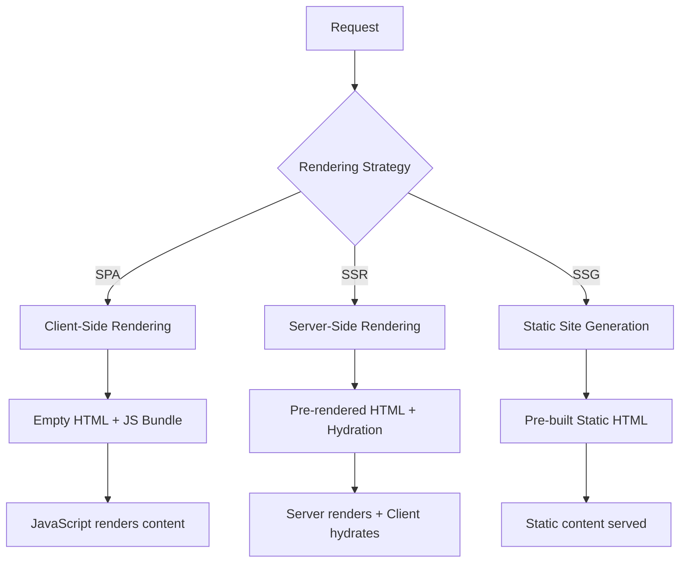

# Basic Concepts and Environment Setup for SSR

## Overview

Server-Side Rendering (SSR) with Element Plus enables you to render Vue.js applications on the server, providing better SEO, faster initial page loads, and improved user experience. This guide covers the fundamental concepts and setup process for implementing SSR with Element Plus.

## What is Server-Side Rendering?

### Definition

Server-Side Rendering is a technique where the initial HTML content is generated on the server rather than in the browser. The server sends a fully rendered page to the client, which can then be hydrated with JavaScript to become interactive.

### Benefits of SSR

1. **Improved SEO**: Search engines can easily crawl and index server-rendered content
2. **Faster First Contentful Paint (FCP)**: Users see content immediately without waiting for JavaScript to load
3. **Better Performance on Slow Devices**: Less JavaScript processing required on the client
4. **Social Media Sharing**: Meta tags and Open Graph data are available immediately

### SSR vs SPA vs Static Generation



## Element Plus SSR Considerations

### Component Compatibility

Most Element Plus components are SSR-compatible, but some require special handling:

```javascript
// Components that need client-side only rendering
const clientOnlyComponents = [
  'ElInfiniteScroll',
  'ElAffix',
  'ElBacktop',
  'ElImageViewer'
]

// Components that need special SSR configuration
const ssrSpecialComponents = [
  'ElTable', // Large datasets
  'ElSelect', // Virtual scrolling
  'ElTree', // Dynamic loading
  'ElDatePicker' // Locale-dependent
]
```

### Hydration Mismatch Prevention

```vue
<template>
  <div>
    <!-- Safe for SSR -->
    <el-button type="primary">Static Button</el-button>
    
    <!-- Potential hydration mismatch -->
    <el-button v-if="isClient" @click="handleClick">
      {{ currentTime }}
    </el-button>
    
    <!-- Better approach -->
    <ClientOnly>
      <el-button @click="handleClick">
        {{ currentTime }}
      </el-button>
      <template #fallback>
        <el-skeleton :rows="1" animated />
      </template>
    </ClientOnly>
  </div>
</template>

<script setup>
import { ref, onMounted } from 'vue'

const isClient = ref(false)
const currentTime = ref('')

onMounted(() => {
  isClient.value = true
  currentTime.value = new Date().toLocaleTimeString()
})

const handleClick = () => {
  currentTime.value = new Date().toLocaleTimeString()
}
</script>
```

## Environment Setup

### Prerequisites

```bash
# Node.js version requirements
node --version  # >= 16.0.0
npm --version   # >= 7.0.0

# Or using yarn
yarn --version  # >= 1.22.0
```

### Project Structure

```
ssr-element-plus-app/
├── src/
│   ├── components/
│   │   ├── AppHeader.vue
│   │   ├── AppFooter.vue
│   │   └── ClientOnly.vue
│   ├── pages/
│   │   ├── Home.vue
│   │   ├── About.vue
│   │   └── Contact.vue
│   ├── router/
│   │   └── index.js
│   ├── store/
│   │   └── index.js
│   ├── app.js
│   ├── entry-client.js
│   ├── entry-server.js
│   └── main.js
├── server/
│   ├── index.js
│   ├── render.js
│   └── middleware/
├── dist/
│   ├── client/
│   └── server/
├── public/
├── package.json
├── vite.config.js
└── index.html
```

### Basic Dependencies

```json
{
  "name": "ssr-element-plus-app",
  "version": "1.0.0",
  "type": "module",
  "scripts": {
    "dev": "node server",
    "build": "npm run build:client && npm run build:server",
    "build:client": "vite build --outDir dist/client",
    "build:server": "vite build --outDir dist/server --ssr src/entry-server.js",
    "preview": "cross-env NODE_ENV=production node server",
    "serve": "node server"
  },
  "dependencies": {
    "vue": "^3.4.0",
    "vue-router": "^4.2.0",
    "pinia": "^2.1.0",
    "element-plus": "^2.4.0",
    "@element-plus/icons-vue": "^2.3.0",
    "express": "^4.18.0",
    "compression": "^1.7.4",
    "serve-static": "^1.15.0"
  },
  "devDependencies": {
    "@vitejs/plugin-vue": "^4.5.0",
    "vite": "^5.0.0",
    "cross-env": "^7.0.3",
    "unplugin-vue-components": "^0.25.0",
    "unplugin-auto-import": "^0.16.0"
  }
}
```

### Vite Configuration

```javascript
// vite.config.js
import { defineConfig } from 'vite'
import vue from '@vitejs/plugin-vue'
import { resolve } from 'path'
import AutoImport from 'unplugin-auto-import/vite'
import Components from 'unplugin-vue-components/vite'
import { ElementPlusResolver } from 'unplugin-vue-components/resolvers'

export default defineConfig({
  plugins: [
    vue(),
    AutoImport({
      resolvers: [ElementPlusResolver()],
      dts: true
    }),
    Components({
      resolvers: [ElementPlusResolver()],
      dts: true
    })
  ],
  
  resolve: {
    alias: {
      '@': resolve(__dirname, 'src')
    }
  },
  
  build: {
    rollupOptions: {
      output: {
        manualChunks: {
          'element-plus': ['element-plus'],
          'vue-vendor': ['vue', 'vue-router', 'pinia']
        }
      }
    }
  },
  
  ssr: {
    // Externalize dependencies that shouldn't be bundled
    external: ['express'],
    // Dependencies to include in SSR bundle
    noExternal: ['element-plus']
  },
  
  optimizeDeps: {
    include: [
      'element-plus/es',
      'element-plus/es/components/*/style/css',
      '@element-plus/icons-vue'
    ]
  }
})
```

### Application Entry Points

#### Main Application Setup

```javascript
// src/app.js
import { createSSRApp } from 'vue'
import { createPinia } from 'pinia'
import { createRouter, createMemoryHistory, createWebHistory } from 'vue-router'
import ElementPlus from 'element-plus'
import 'element-plus/dist/index.css'
import App from './App.vue'
import { routes } from './router'

// Create app factory for SSR
export function createApp() {
  const app = createSSRApp(App)
  
  // Create router with appropriate history
  const router = createRouter({
    history: import.meta.env.SSR 
      ? createMemoryHistory() 
      : createWebHistory(),
    routes
  })
  
  // Create store
  const pinia = createPinia()
  
  // Install plugins
  app.use(router)
  app.use(pinia)
  app.use(ElementPlus)
  
  return { app, router, pinia }
}
```

#### Client Entry

```javascript
// src/entry-client.js
import { createApp } from './app.js'

const { app, router } = createApp()

// Wait for router to be ready before mounting
router.isReady().then(() => {
  app.mount('#app')
})
```

#### Server Entry

```javascript
// src/entry-server.js
import { createApp } from './app.js'
import { renderToString } from 'vue/server-renderer'

export async function render(url, manifest) {
  const { app, router } = createApp()
  
  // Navigate to the requested route
  await router.push(url)
  await router.isReady()
  
  // Render app to string
  const html = await renderToString(app)
  
  // Extract CSS and preload links from manifest
  const preloadLinks = renderPreloadLinks(manifest)
  const cssLinks = renderCSSLinks(manifest)
  
  return {
    html,
    preloadLinks,
    cssLinks
  }
}

function renderPreloadLinks(manifest) {
  let links = ''
  if (manifest) {
    for (const file in manifest) {
      if (manifest[file].isEntry || manifest[file].type === 'text/css') {
        links += renderPreloadLink(manifest[file])
      }
    }
  }
  return links
}

function renderPreloadLink(file) {
  if (file.type === 'text/css') {
    return `<link rel="stylesheet" href="${file.file}">`
  } else if (file.type === 'text/javascript') {
    return `<link rel="modulepreload" crossorigin href="${file.file}">`
  } else {
    return ''
  }
}

function renderCSSLinks(manifest) {
  let links = ''
  if (manifest) {
    for (const file in manifest) {
      if (manifest[file].type === 'text/css') {
        links += `<link rel="stylesheet" href="${manifest[file].file}">`
      }
    }
  }
  return links
}
```

### Express Server Setup

```javascript
// server/index.js
import express from 'express'
import compression from 'compression'
import serveStatic from 'serve-static'
import { fileURLToPath } from 'url'
import { dirname, resolve } from 'path'
import { readFileSync } from 'fs'

const __dirname = dirname(fileURLToPath(import.meta.url))
const isProduction = process.env.NODE_ENV === 'production'
const port = process.env.PORT || 3000

const app = express()

// Enable compression
app.use(compression())

let vite
if (!isProduction) {
  // Development mode with Vite dev server
  const { createServer } = await import('vite')
  vite = await createServer({
    server: { middlewareMode: true },
    appType: 'custom'
  })
  app.use(vite.ssrLoadModule)
} else {
  // Production mode with static files
  app.use(serveStatic(resolve(__dirname, '../dist/client'), {
    index: false
  }))
}

// SSR middleware
app.use('*', async (req, res, next) => {
  try {
    const url = req.originalUrl
    
    let template
    let render
    let manifest
    
    if (!isProduction) {
      // Development: read template and transform with Vite
      template = readFileSync(resolve(__dirname, '../index.html'), 'utf-8')
      template = await vite.transformIndexHtml(url, template)
      render = (await vite.ssrLoadModule('/src/entry-server.js')).render
    } else {
      // Production: use built files
      template = readFileSync(resolve(__dirname, '../dist/client/index.html'), 'utf-8')
      render = (await import('../dist/server/entry-server.js')).render
      manifest = JSON.parse(
        readFileSync(resolve(__dirname, '../dist/client/ssr-manifest.json'), 'utf-8')
      )
    }
    
    // Render the app
    const { html, preloadLinks, cssLinks } = await render(url, manifest)
    
    // Replace placeholders in template
    const finalHtml = template
      .replace('<!--preload-links-->', preloadLinks)
      .replace('<!--css-links-->', cssLinks)
      .replace('<!--ssr-outlet-->', html)
    
    res.status(200).set({ 'Content-Type': 'text/html' }).end(finalHtml)
    
  } catch (error) {
    if (!isProduction) {
      vite.ssrFixStacktrace(error)
    }
    console.error(error)
    res.status(500).end(error.message)
  }
})

app.listen(port, () => {
  console.log(`Server running at http://localhost:${port}`)
})
```

### HTML Template

```html
<!-- index.html -->
<!DOCTYPE html>
<html lang="en">
<head>
  <meta charset="UTF-8">
  <meta name="viewport" content="width=device-width, initial-scale=1.0">
  <title>Element Plus SSR App</title>
  <meta name="description" content="Element Plus Server-Side Rendered Application">
  
  <!-- Preload links will be injected here -->
  <!--preload-links-->
  
  <!-- CSS links will be injected here -->
  <!--css-links-->
</head>
<body>
  <div id="app">
    <!-- SSR content will be injected here -->
    <!--ssr-outlet-->
  </div>
  
  <!-- Client-side JavaScript -->
  <script type="module" src="/src/entry-client.js"></script>
</body>
</html>
```

## Development Workflow

### Starting Development Server

```bash
# Install dependencies
npm install

# Start development server
npm run dev

# The server will start at http://localhost:3000
```

### Building for Production

```bash
# Build both client and server bundles
npm run build

# Start production server
npm run preview
```

### Development vs Production

| Aspect | Development | Production |
|--------|-------------|------------|
| Template | Read from file system | Pre-built and cached |
| Modules | Transformed by Vite | Pre-bundled |
| Hot Reload | Enabled | Disabled |
| Source Maps | Enabled | Disabled |
| Minification | Disabled | Enabled |
| Caching | Minimal | Aggressive |

## Common Issues and Solutions

### Hydration Mismatches

```javascript
// Problem: Different content on server vs client
// Solution: Use ClientOnly wrapper or ensure consistent data

// Bad
<template>
  <div>{{ Math.random() }}</div>
</template>

// Good
<template>
  <ClientOnly>
    <div>{{ randomNumber }}</div>
    <template #fallback>
      <div>Loading...</div>
    </template>
  </ClientOnly>
</template>

<script setup>
import { ref, onMounted } from 'vue'

const randomNumber = ref(0)

onMounted(() => {
  randomNumber.value = Math.random()
})
</script>
```

### Window/Document Access

```javascript
// Problem: Server doesn't have window/document
// Solution: Check for client-side environment

const isClient = typeof window !== 'undefined'

if (isClient) {
  // Safe to access window/document
  const width = window.innerWidth
}

// Or use onMounted
onMounted(() => {
  // This only runs on client
  const width = window.innerWidth
})
```

### CSS-in-JS Issues

```javascript
// Problem: Dynamic styles not rendered on server
// Solution: Use CSS variables or static classes

// Bad
const dynamicStyle = computed(() => ({
  color: props.color,
  fontSize: `${props.size}px`
}))

// Good
const cssVars = computed(() => ({
  '--dynamic-color': props.color,
  '--dynamic-size': `${props.size}px`
}))
```

## Performance Considerations

### Server Performance

1. **Caching**: Implement page-level and component-level caching
2. **Streaming**: Use streaming SSR for better TTFB
3. **Resource Management**: Properly manage memory and connections
4. **Load Balancing**: Use multiple server instances

### Client Performance

1. **Code Splitting**: Split bundles by routes
2. **Lazy Loading**: Load components on demand
3. **Preloading**: Preload critical resources
4. **Hydration Optimization**: Minimize hydration overhead

## Next Steps

After setting up the basic SSR environment:

1. **Configure Nuxt.js Integration** - Learn about Nuxt.js for easier SSR setup
2. **Implement Caching Strategies** - Add Redis or memory caching
3. **Optimize Performance** - Implement streaming and code splitting
4. **Add Error Handling** - Robust error boundaries and fallbacks
5. **Deploy to Production** - Configure for cloud deployment

This foundation provides a solid starting point for building SSR applications with Element Plus, ensuring good performance, SEO, and user experience.