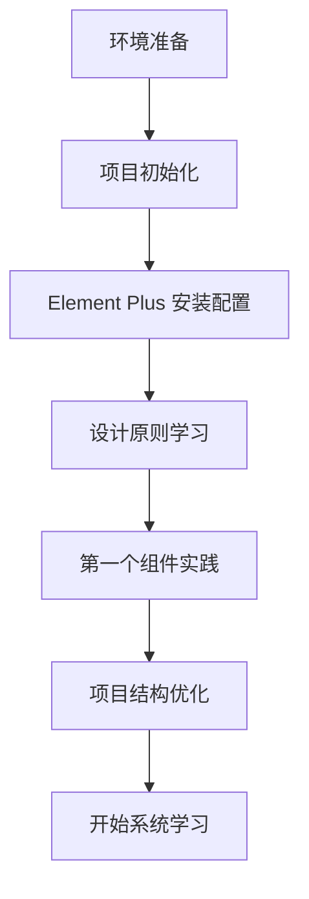

# 🚀 快速开始

欢迎来到 **Element Plus 学习宝典**！本指南将帮助你快速搭建开发环境，并开始你的 Element Plus 学习之旅。

## 📋 学习路线图



## 🎯 本章学习目标

- ✅ 搭建现代化的 Vue 3 + Element Plus 开发环境
- ✅ 理解 Element Plus 的核心设计原则
- ✅ 掌握组件的基本使用方法
- ✅ 创建第一个完整的组件演示页面
- ✅ 建立良好的代码规范和项目结构

## 🛠️ 环境准备

### 系统要求

| 工具 | 版本要求 | 推荐版本 | 说明 |
|------|----------|----------|------|
| Node.js | >= 16.0.0 | 18.x LTS | JavaScript 运行环境 |
| npm | >= 7.0.0 | 最新版本 | 包管理器 |
| Vue | >= 3.3.0 | 3.5.x | 前端框架 |
| Element Plus | >= 2.4.0 | 2.10.x | UI 组件库 |

### 开发工具推荐

- **IDE**: VS Code + Volar 插件
- **浏览器**: Chrome/Edge (支持 Vue DevTools)
- **包管理器**: pnpm (推荐) / yarn / npm

## 🏗️ 项目初始化

### 方式一：使用本项目模板（推荐）

```bash
# 克隆项目
git clone https://github.com/shingle666/element-plus-study.git
cd element-plus-study

# 安装依赖
npm install
# 或使用 pnpm（推荐）
pnpm install

# 启动开发服务器
npm run dev

# 启动文档服务器
npm run docs:dev
```

### 方式二：从零开始创建项目

```bash
# 使用 Vite 创建 Vue 3 项目
npm create vue@latest my-element-plus-app
cd my-element-plus-app

# 安装依赖
npm install

# 安装 Element Plus
npm install element-plus @element-plus/icons-vue

# 安装自动导入插件（可选但推荐）
npm install -D unplugin-vue-components unplugin-auto-import
```

## ⚙️ Element Plus 配置

### 完整引入（适合学习阶段）

在 `src/main.js` 中配置：

```javascript
import { createApp } from 'vue'
import App from './App.vue'
import ElementPlus from 'element-plus'
import 'element-plus/dist/index.css'
import * as ElementPlusIconsVue from '@element-plus/icons-vue'

const app = createApp(App)

// 注册所有图标
for (const [key, component] of Object.entries(ElementPlusIconsVue)) {
  app.component(key, component)
}

app.use(ElementPlus)
app.mount('#app')
```

### 按需导入（生产环境推荐）

在 `vite.config.js` 中配置：

```javascript
import { defineConfig } from 'vite'
import vue from '@vitejs/plugin-vue'
import AutoImport from 'unplugin-auto-import/vite'
import Components from 'unplugin-vue-components/vite'
import { ElementPlusResolver } from 'unplugin-vue-components/resolvers'

export default defineConfig({
  plugins: [
    vue(),
    AutoImport({
      resolvers: [ElementPlusResolver()],
    }),
    Components({
      resolvers: [ElementPlusResolver()],
    }),
  ],
})
```

## 🎨 设计原则深入理解

Element Plus 遵循四大核心设计原则，理解这些原则对于正确使用组件至关重要：

### 🔄 一致性 (Consistency)

**与现实生活一致**
- 遵循用户的认知习惯
- 使用通用的交互模式
- 保持语言表达的一致性

**界面元素一致**
- 统一的视觉风格
- 一致的交互行为
- 规范的布局结构

### 💬 反馈 (Feedback)

**控制反馈**
- 按钮点击有视觉反馈
- 表单验证实时提示
- 加载状态清晰展示

**页面反馈**
- 操作结果明确显示
- 错误信息准确传达
- 成功状态及时反馈

### ⚡ 效率 (Efficiency)

**简化流程**
- 减少不必要的操作步骤
- 提供快捷操作方式
- 智能默认值设置

**清晰明确**
- 简洁的文案表达
- 直观的图标设计
- 明确的操作指引

### 🎛️ 可控性 (Controllability)

**用户决策**
- 提供操作建议而非强制
- 重要操作需要确认
- 保留用户选择权

**结果可控**
- 支持撤销操作
- 提供回退机制
- 允许中断流程

## 🎯 第一个组件实践：Button 按钮

让我们通过 Button 组件来实践 Element Plus 的使用：

### 创建演示页面

在 `src/views/` 目录下创建 `ButtonDemo.vue`：

```vue
<template>
  <div class="button-demo-container">
    <h2>🎯 Button 组件学习实践</h2>
    
    <!-- 基础按钮 -->
    <section class="demo-section">
      <h3>基础按钮</h3>
      <div class="button-group">
        <el-button>默认按钮</el-button>
        <el-button type="primary">主要按钮</el-button>
        <el-button type="success">成功按钮</el-button>
        <el-button type="info">信息按钮</el-button>
        <el-button type="warning">警告按钮</el-button>
        <el-button type="danger">危险按钮</el-button>
      </div>
    </section>

    <!-- 朴素按钮 -->
    <section class="demo-section">
      <h3>朴素按钮</h3>
      <div class="button-group">
        <el-button plain>朴素按钮</el-button>
        <el-button type="primary" plain>主要按钮</el-button>
        <el-button type="success" plain>成功按钮</el-button>
        <el-button type="info" plain>信息按钮</el-button>
        <el-button type="warning" plain>警告按钮</el-button>
        <el-button type="danger" plain>危险按钮</el-button>
      </div>
    </section>

    <!-- 按钮尺寸 -->
    <section class="demo-section">
      <h3>按钮尺寸</h3>
      <div class="button-group">
        <el-button size="large">大型按钮</el-button>
        <el-button>默认按钮</el-button>
        <el-button size="small">小型按钮</el-button>
      </div>
    </section>

    <!-- 按钮状态 -->
    <section class="demo-section">
      <h3>按钮状态</h3>
      <div class="button-group">
        <el-button :loading="loading" @click="handleLoading">加载按钮</el-button>
        <el-button disabled>禁用按钮</el-button>
        <el-button type="primary" :icon="Search">搜索</el-button>
        <el-button type="primary" circle :icon="Plus" />
      </div>
    </section>

    <!-- 交互演示 -->
    <section class="demo-section">
      <h3>交互演示</h3>
      <div class="button-group">
        <el-button type="success" @click="showMessage('success')">成功消息</el-button>
        <el-button type="warning" @click="showMessage('warning')">警告消息</el-button>
        <el-button type="danger" @click="showMessage('error')">错误消息</el-button>
      </div>
    </section>
  </div>
</template>

<script setup>
import { ref } from 'vue'
import { ElMessage } from 'element-plus'
import { Search, Plus } from '@element-plus/icons-vue'

const loading = ref(false)

const handleLoading = () => {
  loading.value = true
  setTimeout(() => {
    loading.value = false
    ElMessage.success('加载完成！')
  }, 2000)
}

const showMessage = (type) => {
  const messages = {
    success: '操作成功！',
    warning: '请注意！',
    error: '操作失败！'
  }
  ElMessage[type](messages[type])
}
</script>

<style scoped>
.button-demo-container {
  padding: 20px;
  max-width: 1200px;
  margin: 0 auto;
}

.demo-section {
  margin-bottom: 40px;
  padding: 20px;
  border: 1px solid #e4e7ed;
  border-radius: 8px;
  background-color: #fafafa;
}

.demo-section h3 {
  margin-bottom: 16px;
  color: #303133;
  font-size: 18px;
}

.button-group {
  display: flex;
  gap: 12px;
  flex-wrap: wrap;
  align-items: center;
}

.button-group .el-button {
  margin: 0;
}
</style>
```

### 路由配置

在 `src/router/index.js` 中添加路由：

```javascript
import { createRouter, createWebHistory } from 'vue-router'
import ButtonDemo from '../views/ButtonDemo.vue'

const routes = [
  {
    path: '/button-demo',
    name: 'ButtonDemo',
    component: ButtonDemo
  }
]

const router = createRouter({
  history: createWebHistory(),
  routes
})

export default router
```

## ✅ 学习检查清单

### 环境搭建
- [ ] ✅ Node.js 版本 >= 16.0.0
- [ ] ✅ 成功创建 Vue 3 项目
- [ ] ✅ Element Plus 安装并配置完成
- [ ] ✅ 开发服务器正常启动
- [ ] ✅ 浏览器能正常访问项目

### 设计原则理解
- [ ] 📖 理解一致性原则的重要性
- [ ] 📖 掌握反馈原则的应用场景
- [ ] 📖 学会效率原则的实践方法
- [ ] 📖 明确可控性原则的设计思路

### 组件实践
- [ ] 🎯 创建 Button 组件演示页面
- [ ] 🎯 实现不同类型的按钮
- [ ] 🎯 掌握按钮尺寸和状态控制
- [ ] 🎯 完成交互功能演示
- [ ] 🎯 理解组件 API 设计思路

### 代码质量
- [ ] 💻 代码结构清晰合理
- [ ] 💻 遵循 Vue 3 最佳实践
- [ ] 💻 样式规范统一
- [ ] 💻 注释完整准确

## 📚 学习资源

### 官方文档
- 🌐 [Element Plus 官网](https://element-plus.org/zh-CN/) - 最权威的组件文档
- 🎨 [设计指南](https://element-plus.org/zh-CN/guide/design.html) - 深入理解设计原则
- 🔧 [Button 组件文档](https://element-plus.org/zh-CN/component/button.html) - 详细的 API 说明
- 📖 [Vue 3 官方文档](https://cn.vuejs.org/) - Vue 3 基础知识

### 开发工具
- 🛠️ [Vue DevTools](https://devtools.vuejs.org/) - Vue 开发者工具
- 🎯 [Volar](https://marketplace.visualstudio.com/items?itemName=Vue.volar) - VS Code Vue 插件
- 📦 [Element Plus Playground](https://element-plus.run/) - 在线代码演示

### 社区资源
- 💬 [Element Plus GitHub](https://github.com/element-plus/element-plus) - 源码和问题讨论
- 🎓 [Vue 3 + Element Plus 教程](https://www.bilibili.com/video/BV1kv4y1g7nT) - 视频教程
- 📝 [掘金 Element Plus 专栏](https://juejin.cn/tag/Element%20Plus) - 技术文章

## ⚠️ 重要提示

### 环境要求
- ✅ **Node.js 版本**: >= 16.0.0 (推荐 18.x LTS)
- ✅ **包管理器**: 推荐使用 pnpm > yarn > npm
- ✅ **浏览器**: 现代浏览器，支持 ES2018+

### 最佳实践
- 🎯 **按需导入**: 生产环境建议使用按需导入减少包体积
- 🔧 **TypeScript**: 推荐使用 TypeScript 获得更好的开发体验
- 📱 **响应式设计**: 注意移动端适配和响应式布局
- 🎨 **主题定制**: 学会使用 CSS 变量进行主题定制

### 常见问题

<details>
<summary>🤔 组件样式不生效怎么办？</summary>

1. 检查是否正确导入了 Element Plus 的 CSS 文件
2. 确认组件是否正确注册
3. 检查是否有样式冲突或覆盖
</details>

<details>
<summary>🤔 按需导入配置失败？</summary>

1. 确认 `unplugin-vue-components` 和 `unplugin-auto-import` 版本兼容
2. 检查 Vite 配置文件语法是否正确
3. 重启开发服务器
</details>

<details>
<summary>🤔 图标显示不正常？</summary>

1. 确认已安装 `@element-plus/icons-vue`
2. 检查图标组件是否正确导入和注册
3. 确认图标名称拼写正确
</details>

## 🚀 下一步学习计划

恭喜你完成了 Element Plus 的快速入门！接下来建议按以下路径继续学习：

### 📅 第一周：基础组件掌握
- 📖 [设计原则与基础概念](./基础概念/01.设计原则与基础概念.md)
- 🧩 [Button 按钮](./基础组件/Button%20按钮.md) - 深入学习按钮组件
- 🎨 [Layout 布局](./基础组件/Layout%20布局.md) - 掌握页面布局
- 🔗 [Icon 图标](./基础组件/Icon%20图标.md) - 图标系统使用

### 📅 第二周：表单组件实践
- 📝 [Input 输入框](./表单组件/Input%20输入框.md)
- ☑️ [Checkbox 多选框](./表单组件/Checkbox%20多选框.md)
- 🔘 [Radio 单选框](./表单组件/Radio%20单选框.md)
- 📋 [Form 表单](./表单组件/Form%20表单.md)

### 📅 第三周：数据展示组件
- 📊 [Table 表格](./数据展示组件/Table%20表格.md)
- 🌳 [Tree 树形控件](./数据展示组件/Tree%20树形控件.md)
- 🃏 [Card 卡片](./数据展示组件/Card%20卡片.md)

### 📅 进阶学习
- 🏗️ [架构设计](./架构设计/) - 深入理解组件库架构
- ⚡ [性能优化](./性能优化/) - 掌握性能优化技巧
- 🎨 [主题定制](./高级主题/) - 学习主题系统
- 💼 [项目实践](./项目实践/) - 综合项目开发

---

## 📝 学习记录

**学习日期：** `___________`  
**完成状态：** `___________`  
**学习时长：** `___________`

### 📖 学习笔记
```
在此记录你的学习心得和重要知识点：

1. 
2. 
3. 
```

### ❓ 遇到的问题
```
记录学习过程中遇到的问题：

问题1：
解决方案：

问题2：
解决方案：
```

### 💡 收获与感悟
```
记录你的收获和对 Element Plus 的理解：


```

---

<div align="center">

**🎉 恭喜完成快速开始！**

[📖 查看完整学习宝典](./Element%20Plus学习宝典.md) | [🏠 返回首页](../index.md) | [📋 查看更新日志](./changelog.md)

</div>