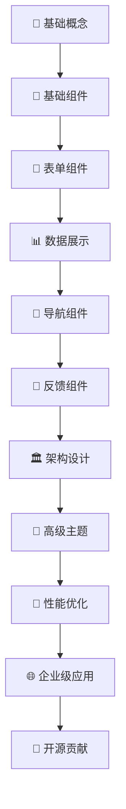

# 📚 Element Plus 学习宝典

<div align="center">


**🎯 系统掌握 Element Plus 组件库开发的完整学习路径**

</div>

## 🔗 快速导航

- 📋 **[更新日志](/changelog.html)** - 查看项目最新更新和版本变更
- 🏠 **[返回首页](/index.html)** - 回到项目主页
- 🚀 **[快速开始](/quickstart.html)** - 立即开始学习

## 🌟 项目简介

这是一个专为前端开发者设计的 **Element Plus 深度学习计划**，旨在帮助开发者系统性地掌握 Element Plus 组件库的使用。从基础概念到高级应用，从单个组件到完整项目开发，通过结构化的学习路径，不仅掌握组件使用，更要理解设计原理、源码实现和企业级应用实践。

### ✨ 为什么选择这个学习计划？

- 🎯 **系统性学习**：覆盖 Element Plus 全部 78 个组件的完整学习体系
- 🏗️ **架构思维**：深入理解组件库设计原理和最佳实践
- 💼 **企业级应用**：融入真实项目经验和工程化实践
- 🔍 **源码解析**：深度剖析核心组件实现原理
- 🌐 **全栈视野**：涵盖 SSR、国际化、性能优化等高级主题
- 🤝 **开源贡献**：从学习者到贡献者的完整成长路径

## 🎯 学习目标

通过系统化的学习路径，全面掌握 Element Plus 组件库的使用，能够独立开发复杂的企业级前端应用，并具备组件库设计和开发能力。

### 🏆 核心能力目标

<div style="display: grid; grid-template-columns: repeat(auto-fit, minmax(300px, 1fr)); gap: 20px; margin: 20px 0;">

**🧩 基础掌握**
- 熟练掌握 Element Plus 全部 78 个组件的使用
- 理解组件 API 设计和使用场景
- 掌握组件间的组合和配置技巧

**🏗️ 架构理解**
- 深入理解组件设计原理和架构模式
- 掌握 Vue 3 + TypeScript 最佳实践
- 理解组件库的整体设计思想

**🔍 源码分析**
- 能够阅读和理解核心组件源码
- 掌握组件实现的底层原理
- 具备源码调试和问题定位能力

**🎨 定制开发**
- 进行组件二次开发和功能扩展
- 掌握主题定制和样式覆盖技巧
- 开发自定义组件和插件

**⚡ 性能优化**
- 具备组件性能分析和优化能力
- 掌握大数据量场景的优化策略
- 理解虚拟化和懒加载技术

**🏭 工程实践**
- 掌握组件库开发、测试、发布流程
- 具备企业级项目架构设计能力
- 掌握 CI/CD 和自动化部署

</div>

## 📁 项目结构

```
element-plus-study/
├── 📄 README.md                     # 项目说明文档
├── 📚 docs/                         # 学习文档目录
│   ├── 🎯 基础概念/                  # 设计原则与基础概念
│   ├── 🧩 基础组件/                  # Button、Layout、Icon 等
│   ├── 📝 表单组件/                  # Input、Select、Form 等
│   ├── 📊 数据展示组件/              # Table、Tree、Card 等
│   ├── 🧭 导航组件/                  # Menu、Breadcrumb、Tabs 等
│   ├── 💬 反馈组件/                  # Dialog、Message、Loading 等
│   ├── ⚙️ 配置组件/                  # Config Provider 全局配置等
│   ├── 🔧 其他组件/                  # 布局容器、工具类组件等
│   ├── 🏛️ 架构设计/                  # 整体架构与设计理念
│   ├── ⚡ 高级特性/                  # 高级组件模式与实践
│   ├── 🎨 高级主题/                  # 主题定制与暗黑模式
│   ├── 🚀 性能优化/                  # 组件性能分析与优化
│   ├── 🖥️ SSR服务端渲染/             # 服务端渲染配置与优化
│   ├── 🌍 国际化与无障碍/            # 多语言与无障碍设计
│   ├── 🔗 Vue生态集成/               # Router、Pinia 等集成
│   ├── ⚙️ 工程化与构建/              # Vite、TypeScript、测试
│   ├── 📱 跨平台开发/                # 移动端适配与桌面应用
│   ├── 💼 项目实践/                  # 综合项目实战
│   ├── 🔓 开源贡献/                  # 开发流程与代码规范
│   ├── 👥 社区贡献/                  # 社区参与与维护
│   └── 📈 总结与规划/                # 学习总结与进阶规划
├── 🛠️ projects/                     # 实践项目目录
│   ├── basic-demo/                 # 基础示例项目
│   ├── admin-system/               # 企业级管理系统
│   ├── component-lib/              # 自定义组件库
│   ├── ssr-practice/               # SSR 实践项目
│   ├── i18n-practice/              # 国际化实践项目
│   ├── theme-system/               # 主题系统实践
│   ├── performance-demo/           # 性能优化示例
│   └── mobile-app/                 # 移动端应用示例
├── 📦 package.json                  # 项目依赖配置
├── ⚙️ vite.config.ts                # Vite 配置文件
├── 📝 tsconfig.json                 # TypeScript 配置
├── 🎨 .eslintrc.js                  # ESLint 配置
├── 💅 .prettierrc                   # Prettier 配置
└── 🚫 .gitignore                    # Git 忽略文件
```

## 📅 学习路径概览

我们将学习路径分为四个阶段，每个阶段都有明确的学习目标和实践项目：

<div style="display: grid; grid-template-columns: repeat(auto-fit, minmax(250px, 1fr)); gap: 20px; margin: 20px 0;">

### 🎯 第一阶段：基础概念与核心组件
**目标**：掌握 Element Plus 基础使用
- 环境搭建与配置
- 基础组件全面学习
- 表单组件深入实践
- 数据展示组件应用

### 🏗️ 第二阶段：架构设计与高级特性
**目标**：理解组件库设计原理
- 整体架构分析
- 高级组件模式
- 主题系统定制
- 性能优化策略

### 🌐 第三阶段：企业级应用实践
**目标**：掌握企业级开发技能
- SSR 服务端渲染
- 国际化与无障碍
- Vue 生态集成
- 工程化构建

### 🤝 第四阶段：开源贡献与精通
**目标**：成为 Element Plus 专家
- 项目实战开发
- 开源社区贡献
- 技术分享交流
- 持续学习规划

</div>

---

### 🎯 第一阶段：基础概念与核心组件

#### 基础概念
- [设计原则与基础概念](./基础概念/01.设计原则与基础概念.md)
- [环境搭建与快速开始](./quickstart.md)

#### 基础组件
- [Button 按钮](./基础组件/Button 按钮.md)
- [Border 边框](./基础组件/Border 边框.md)
- [Color 色彩](./基础组件/Color 色彩.md)
- [Container 布局容器](./基础组件/Container 布局容器.md)
- [Icon 图标](./基础组件/Icon 图标.md)
- [Layout 布局](./基础组件/Layout 布局.md)
- [Link 链接](./基础组件/Link 链接.md)
- [Scrollbar 滚动条](./基础组件/Scrollbar 滚动条.md)
- [Space 间距](./基础组件/Space 间距.md)
- [Splitter 分隔面板](./基础组件/Splitter 分隔面板.md)
- [Text 文本](./基础组件/Text 文本.md)
- [Typography 排版](./基础组件/Typography 排版.md)

#### 表单组件
- [Input 输入框](./表单组件/Input 输入框.md)
- [Autocomplete 自动补全输入框](./表单组件/Autocomplete 自动补全输入框.md)
- [Cascader 级联选择器](./表单组件/Cascader 级联选择器.md)
- [Checkbox 多选框](./表单组件/Checkbox 多选框.md)
- [Color Picker 颜色选择器](./表单组件/Color Picker 颜色选择器.md)
- [Date Picker 日期选择器](./表单组件/Date Picker 日期选择器.md)
- [DateTime Picker 日期时间选择器](./表单组件/DateTime Picker 日期时间选择器.md)
- [Form 表单](./表单组件/Form 表单.md)
- [Input Number 数字输入框](./表单组件/Input Number 数字输入框.md)
- [Radio 单选框](./表单组件/Radio 单选框.md)
- [Rate 评分](./表单组件/Rate 评分.md)
- [Select 选择器](./表单组件/Select 选择器.md)
- [Virtualized Select 虚拟化选择器](./表单组件/Virtualized Select 虚拟化选择器.md)
- [Slider 滑块](./表单组件/Slider 滑块.md)
- [Switch 开关](./表单组件/Switch 开关.md)
- [Time Picker 时间选择器](./表单组件/Time Picker 时间选择器.md)
- [Time Select 时间选择](./表单组件/Time Select 时间选择.md)
- [Transfer 穿梭框](./表单组件/Transfer 穿梭框.md)
- [TreeSelect 树形选择](./表单组件/TreeSelect 树形选择.md)
- [Upload 上传](./表单组件/Upload 上传.md)

#### 数据展示组件
- [Avatar 头像](./数据展示组件/Avatar 头像.md)
- [Badge 徽章](./数据展示组件/Badge 徽章.md)
- [Calendar 日历](./数据展示组件/Calendar 日历.md)
- [Card 卡片](./数据展示组件/Card 卡片.md)
- [Carousel 走马灯](./数据展示组件/Carousel 走马灯.md)
- [Collapse 折叠面板](./数据展示组件/Collapse 折叠面板.md)
- [Descriptions 描述列表](./数据展示组件/Descriptions 描述列表.md)
- [Empty 空状态](./数据展示组件/Empty 空状态.md)
- [Image 图片](./数据展示组件/Image 图片.md)
- [Infinite Scroll 无限滚动](./数据展示组件/Infinite Scroll 无限滚动.md)
- [Pagination 分页](./数据展示组件/Pagination 分页.md)
- [Progress 进度条](./数据展示组件/Progress 进度条.md)
- [Result 结果](./数据展示组件/Result 结果.md)
- [Segmented 分段控制器](./数据展示组件/Segmented 分段控制器.md)
- [Skeleton 骨架屏](./数据展示组件/Skeleton 骨架屏.md)
- [Statistic 统计组件](./数据展示组件/Statistic 统计组件.md)
- [Table 表格](./数据展示组件/Table 表格.md)
- [Tag 标签](./数据展示组件/Tag 标签.md)
- [Timeline 时间线](./数据展示组件/Timeline 时间线.md)
- [Tree 树形控件](./数据展示组件/Tree 树形控件.md)

- [Virtualized Table 虚拟化表格](./数据展示组件/Virtualized Table 虚拟化表格.md)
- [Virtualized Tree 虚拟化树形控件](./数据展示组件/Virtualized Tree 虚拟化树形控件.md)

#### 配置组件
- [Config Provider 全局配置](./配置组件/Config Provider 全局配置.md)

#### 导航组件
- [Affix 固钉](./导航组件/Affix 固钉.md)
- [Anchor 锚点](./导航组件/Anchor 锚点.md)
- [Backtop 回到顶部](./导航组件/Backtop 回到顶部.md)
- [Breadcrumb 面包屑](./导航组件/Breadcrumb 面包屑.md)
- [Dropdown 下拉菜单](./导航组件/Dropdown 下拉菜单.md)
- [Menu 菜单](./导航组件/Menu 菜单.md)
- [Page Header 页头](./导航组件/Page Header 页头.md)
- [Steps 步骤条](./导航组件/Steps 步骤条.md)
- [Tabs 标签页](./导航组件/Tabs 标签页.md)

#### 反馈组件
- [Alert 提示](./反馈组件/Alert 提示.md)
- [Dialog 对话框](./反馈组件/Dialog 对话框.md)
- [Drawer 抽屉](./反馈组件/Drawer 抽屉.md)
- [Loading 加载](./反馈组件/Loading 加载.md)
- [Message Box 消息弹出框](./反馈组件/Message Box 消息弹出框.md)
- [Message 消息提示](./反馈组件/Message 消息提示.md)
- [Notification 通知](./反馈组件/Notification 通知.md)
- [Popconfirm 气泡确认框](./反馈组件/Popconfirm 气泡确认框.md)
- [Popover 弹出框](./反馈组件/Popover 弹出框.md)
- [Tooltip 文字提示](./反馈组件/Tooltip 文字提示.md)

#### 其他组件
- [布局与容器进阶](./其他组件/01.布局与容器进阶.md)
- [工具类组件](./其他组件/02.工具类组件.md)
- [特效与动画](./其他组件/03.特效与动画.md)
- [特殊功能组件](./其他组件/04.特殊功能组件.md)
- [Divider 分割线](./其他组件/​Divider 分割线.md)
- [Watermark 水印](./其他组件/Watermark 水印.md)

#### 项目实践
- [综合项目实战一](./项目实践/01.综合项目实战一.md)
- [综合项目实战二](./项目实践/02.综合项目实战二.md)
- [综合项目实战三](./项目实践/03.综合项目实战三.md)
- [综合项目实战四](./项目实践/04.综合项目实战四.md)
- [第二周项目实践](./项目实践/05.第二周项目实践.md)
- [第三周项目实践](./项目实践/06.第三周项目实践.md)
- [综合项目开发](./项目实践/07.综合项目开发.md)
- [第一周总结与项目实践](./项目实践/08.第一周总结与项目实践.md)
- [项目实战总结与最佳实践](./项目实践/09.项目实战总结与最佳实践.md)

#### 学习总结
- [学习总结与进阶规划](./总结与规划/01.学习总结与进阶规划.md)

### 🏗️ 第二阶段：架构设计与高级特性

#### 架构设计
- [整体架构与设计理念](./架构设计/01.整体架构与设计理念.md)
- [组件设计模式分析](./架构设计/02.组件设计模式分析.md)
- [Vue3CompositionAPI应用](./架构设计/03.Vue3CompositionAPI应用.md)
- [组件通信机制深入](./架构设计/04.组件通信机制深入.md)
- [响应式系统与数据绑定](./架构设计/05.响应式系统与数据绑定.md)
- [生命周期管理与钩子函数](./架构设计/06.生命周期管理与钩子函数.md)
- [插件系统与扩展机制](./架构设计/07.插件系统与扩展机制.md)
- [测试策略与质量保证](./架构设计/08.测试策略与质量保证.md)
- [性能优化策略](./架构设计/09.性能优化策略.md)

#### 高级组件模式
- [组件扩展与自定义](./高级主题/01.组件扩展与自定义.md)
- [性能优化与最佳实践](./高级主题/02.性能优化与最佳实践.md)
- [高级特性综合实践](./高级特性/01.综合实践.md)
- [插件系统深入](./高级特性/02.插件系统深入.md)
- [高级主题定制与设计系统](./高级特性/03.高级主题定制与设计系统.md)
- [微前端架构实践](./高级特性/04.微前端架构实践.md)
- [自定义指令在组件中的应用](./高级特性/05.自定义指令在组件中的应用.md)
- [组件库二次开发](./高级特性/06.组件库二次开发.md)
- [组件间复杂通信模式](./高级特性/07.组件间复杂通信模式.md)

#### 主题系统定制
- [主题系统深入定制](./高级主题/03.主题系统深入定制.md)
- [全局配置与命名空间](./高级主题/05.全局配置与命名空间.md)
- [暗黑模式与自适应主题](./高级主题/06.暗黑模式与自适应主题.md)
- [响应式设计与移动端适配](./高级主题/07.响应式设计与移动端适配.md)
- [微前端架构与模块联邦](./高级主题/08.微前端架构与模块联邦.md)
- [可视化编辑器开发](./高级主题/09.可视化编辑器开发.md)
- [数据可视化与图表集成](./高级主题/10.数据可视化与图表集成.md)
- [自定义组件库开发](./高级主题/11.自定义组件库开发.md)
- [插件生态系统构建](./高级主题/12.插件生态系统构建.md)
- [企业级应用架构设计](./高级主题/13.企业级应用架构设计.md)

#### 性能优化策略
- [组件性能分析](./性能优化/01.组件性能分析.md)
- [Table组件大数据优化](./性能优化/02.Table组件大数据优化.md)
- [Select组件大选项优化](./性能优化/03.Select组件大选项优化.md)
- [Tree组件大数据渲染优化](./性能优化/04.Tree组件大数据渲染优化.md)
- [综合实践](./性能优化/05.综合实践.md)

#### 阶段总结
- [第二阶段总结与评估](./总结与规划/02.第二阶段总结与评估.md)

### 🌐 第三阶段：企业级应用实践

#### SSR服务端渲染
- [基础概念与环境搭建](./SSR服务端渲染/01.基础概念与环境搭建.md)
- [Nuxt.js集成与配置](./SSR服务端渲染/02.Nuxt.js集成与配置.md)
- [服务端渲染支持与配置](./SSR服务端渲染/03.服务端渲染支持与配置.md)
- [水合错误处理与优化](./SSR服务端渲染/04.水合错误处理与优化.md)
- [性能优化与缓存策略](./SSR服务端渲染/05.性能优化与缓存策略.md)
- [部署与运维](./SSR服务端渲染/06.部署与运维.md)
- [综合实践](./SSR服务端渲染/07.综合实践.md)

#### 国际化与无障碍
- [国际化系统详解](./国际化与无障碍/01.国际化系统详解.md)
- [国际化深入应用](./高级主题/04.国际化深入应用.md)
- [多语言切换实现与动态配置](./国际化与无障碍/02.多语言切换实现与动态配置.md)
- [RTL右到左布局支持](./国际化与无障碍/03.RTL右到左布局支持.md)
- [Day.js时间本地化配置](./国际化与无障碍/04.Day.js时间本地化配置.md)
- [无障碍设计实践与ARIA属性应用](./国际化与无障碍/05.无障碍设计实践与ARIA属性应用.md)
- [键盘导航与屏幕阅读器支持](./国际化与无障碍/06.键盘导航与屏幕阅读器支持.md)
- [综合实践](./国际化与无障碍/07.综合实践.md)

#### Vue生态集成
- [与VueRouter深度集成](./Vue生态集成/01.与VueRouter深度集成.md)
- [与Pinia状态管理](./Vue生态集成/02.与Pinia状态管理.md)
- [迁移工具使用与实践](./Vue生态集成/03.迁移工具使用与实践.md)

#### 工程化构建
- [构建系统深入ViteTypeScript](./工程化与构建/01.构建系统深入ViteTypeScript.md)
- [测试体系与质量保证](./工程化与构建/02.测试体系与质量保证.md)
- [工程化配置与构建优化](./工程化与构建/03.工程化配置与构建优化.md)
- [部署与生产环境优化](./工程化与构建/04.部署与生产环境优化.md)

#### 跨平台开发
- [跨平台开发实践](./跨平台开发/01.跨平台开发实践.md)

#### 企业级项目实践
- [高级特性综合项目实践](./项目实践/10.高级特性综合项目实践.md)

### 🤝 第四阶段：开源贡献与精通

#### 项目实战开发
- [综合项目展示与作品集](./项目实践/11.综合项目展示与作品集.md)
- [综合项目展示与作品集最终版](./项目实践/12.综合项目展示与作品集最终版.md)
- [项目实战总结与最佳实践补充](./项目实践/13.项目实战总结与最佳实践补充.md)

#### 开源社区贡献
- [开发流程与代码规范](./开源贡献/01.开发流程与代码规范.md)
- [代码贡献与PullRequest流程](./开源贡献/02.代码贡献与PullRequest流程.md)
- [测试编写与代码质量保证](./开源贡献/03.测试编写与代码质量保证.md)
- [社区参与建设与维护实践](./开源贡献/04.社区参与建设与维护实践.md)
- [社区参与建设与维护实践补充](./开源贡献/05.社区参与建设与维护实践补充.md)
- [社区贡献与开源实践](./社区贡献/01.社区贡献与开源实践.md)
- [开源项目深度参与](./社区贡献/02.开源项目深度参与.md)
- [Bug修复与功能增强贡献](./社区贡献/03.Bug修复与功能增强贡献.md)
- [文档改进与翻译](./社区贡献/04.文档改进与翻译.md)
- [版本发布与变更管理](./社区贡献/05.版本发布与变更管理.md)
- [生态系统建设](./社区贡献/06.生态系统建设.md)
- [开源贡献综合实践](./社区贡献/07.开源贡献综合实践.md)
- [源码贡献实践](./社区贡献/08.源码贡献实践.md)

#### 技术分享交流
- [最佳实践总结](./总结与规划/03.最佳实践总结.md)
- [技术分享与知识传播](./总结与规划/04.技术分享与知识传播.md)
- [未来发展趋势分析](./总结与规划/05.未来发展趋势分析.md)
- [基于ElementPlus的组件库设计](./总结与规划/06.基于ElementPlus的组件库设计.md)

#### 持续学习规划
- [相关职业发展规划](./总结与规划/07.相关职业发展规划.md)
- [进阶学习规划](./总结与规划/08.进阶学习规划.md)
- [精通总结与持续学习计划](./总结与规划/09.精通总结与持续学习计划.md)
- [未来发展趋势与技术展望](./总结与规划/10.未来发展趋势与技术展望.md)

## 🎓 学习方式

### 📚 学习方法论

<div style="display: grid; grid-template-columns: repeat(auto-fit, minmax(300px, 1fr)); gap: 20px; margin: 20px 0;">

**🔄 理论与实践并重**
- 每个主题都包含理论知识和实际代码练习
- 通过动手实践加深对组件的理解
- 结合真实项目场景进行学习

**📈 循序渐进学习**
- 从基础组件开始，逐步深入到高级特性
- 每个阶段都有明确的学习目标和评估标准
- 建立完整的知识体系和技能树

**🏗️ 项目驱动学习**
- 通过实际项目巩固所学知识
- 每个阶段都有对应的实践项目
- 从简单示例到复杂企业级应用

**🔍 源码深度解析**
- 深入分析 Element Plus 核心组件源码
- 理解组件库的整体架构和设计思想
- 掌握组件实现的底层原理和技术细节

**⚡ 性能优化实践**
- 掌握大型应用的性能优化技巧
- 学习虚拟化、懒加载等高级技术
- 具备性能问题诊断和解决能力

**🏭 工程化全流程**
- 学习组件库的设计、开发、测试、发布全流程
- 掌握现代前端工程化最佳实践
- 具备企业级项目架构设计能力

</div>

### ✨ 学习特色

- 📖 **文档齐全**：每个学习主题都有详细的文档和示例代码
- 🤝 **社区支持**：鼓励在学习过程中参与社区讨论和贡献
- 🚀 **技能进阶**：从使用者到贡献者，从初学者到专家
- 💼 **企业实践**：融入真实企业级项目经验和最佳实践
- 🔄 **持续更新**：跟随 Element Plus 版本更新，保持内容时效性

## 💻 学习环境要求

### 🛠️ 基础环境

| 工具 | 版本要求 | 说明 |
|------|----------|------|
|  | 18+ | JavaScript 运行环境 |
|  | 3.3+ | 前端框架 |
|  | 2.4+ | UI 组件库 |
|  | 5.0+ | 类型系统 |
|  | 4.0+ | 构建工具 |

### 🌐 浏览器支持

- 
- 
- 
- 

### 🔧 开发工具

**代码编辑器**
- 
- 

**版本控制**
- 

**包管理器**
- 
- 
- 

### 🔌 VS Code 推荐插件

```json
{
  "recommendations": [
    "Vue.volar",                    // Vue Language Features
    "Vue.vscode-typescript-vue-plugin", // TypeScript Vue Plugin
    "dbaeumer.vscode-eslint",       // ESLint
    "esbenp.prettier-vscode",       // Prettier
    "eamodio.gitlens",              // GitLens
    "ElementPlus.vscode-element-plus-helper", // Element Plus Helper
    "bradlc.vscode-tailwindcss",    // Tailwind CSS IntelliSense
    "ms-vscode.vscode-typescript-next" // TypeScript Importer
  ]
}
```

## 🚀 快速开始

### 📦 环境准备

**1. 检查 Node.js 版本**
```bash
node --version  # 确保 >= 18.0.0
npm --version   # 确保 >= 8.0.0
```

**2. 克隆学习项目**
```bash
git clone https://github.com/shingle666/element-plus-study.git
cd element-plus-study
```

**3. 安装依赖**
```bash
# 使用 npm
npm install

# 或使用 pnpm（推荐）
pnpm install

# 或使用 yarn
yarn install
```

### 🏃‍♂️ 启动开发环境

**启动文档站点**
```bash
npm run docs:dev
# 访问 http://localhost:5173
```

**启动示例项目**
```bash
npm run dev
# 访问 http://localhost:3000
```

### 📚 开始学习

<div style="background: linear-gradient(135deg, #667eea 0%, #764ba2 100%); padding: 20px; border-radius: 10px; color: white; margin: 20px 0;">

**🎯 学习路径建议**

1. **📖 阅读文档**：从基础概念开始，了解 Element Plus 设计理念
2. **💻 动手实践**：每学习一个组件，都要亲自编写代码实践
3. **📝 记录笔记**：记录学习过程中的重点、难点和心得体会
4. **🏗️ 项目实战**：将学到的知识应用到实际项目中
5. **🤝 社区参与**：积极参与 Element Plus 社区讨论和贡献

</div>

### 🗂️ 学习顺序



## 学习资源

### Element Plus 官方资源 <mcreference link="https://element-plus.org/zh-CN/component/overview.html" index="1">1</mcreference> <mcreference link="https://cn.element-plus.org/zh-CN/component/overview.html" index="2">2</mcreference>
- [Element Plus 官网](https://element-plus.org/zh-CN/)
- [Element Plus 组件总览](https://element-plus.org/zh-CN/component/overview.html) - 包含所有78个组件的完整列表
- [Element Plus 设计指南](https://element-plus.org/zh-CN/guide/design.html)
- [Element Plus 快速开始](https://element-plus.org/zh-CN/guide/quickstart.html)
- [Element Plus 主题配置](https://element-plus.org/zh-CN/guide/theming.html)
- [Element Plus 国际化](https://element-plus.org/zh-CN/guide/i18n.html)
- [Element Plus 暗黑模式](https://element-plus.org/zh-CN/guide/dark-mode.html)
- [Element Plus SSR 服务端渲染](https://element-plus.org/zh-CN/guide/ssr.html)
- [Element Plus 全局配置](https://element-plus.org/zh-CN/component/config-provider.html)
- [Element Plus 自定义命名空间](https://element-plus.org/zh-CN/guide/namespace.html)
- [Element Plus GitHub 仓库](https://github.com/element-plus/element-plus)
- [Element Plus 贡献指南](https://github.com/element-plus/element-plus/blob/dev/CONTRIBUTING.md)
- [Element Plus 代码规范](https://github.com/element-plus/element-plus/blob/dev/CODE_OF_CONDUCT.md)
- [Element Plus 变更日志](https://github.com/element-plus/element-plus/blob/dev/CHANGELOG.md)
- [Element Plus 迁移工具](https://github.com/element-plus/element-plus-migration-tool)
- [Element Plus 在线演练场](https://element-plus.run/)

### 核心技术栈资源
- [Vue 3 官方文档](https://cn.vuejs.org/)
- [Vue 3 Composition API](https://cn.vuejs.org/guide/extras/composition-api-faq.html)
- [TypeScript 官方文档](https://www.typescriptlang.org/)
- [Vite 构建工具](https://vitejs.dev/)

### 开发工具
- [Vue DevTools](https://devtools.vuejs.org/)
- [Element Plus Helper (VS Code 插件)](https://marketplace.visualstudio.com/items?itemName=ElemeFE.vscode-element-helper)
- [Vue Language Features (Volar)](https://marketplace.visualstudio.com/items?itemName=Vue.volar)
- [Element Plus 代码迁移工具](https://github.com/element-plus/element-plus-migration-tool)

## 项目特色

- **完整覆盖**：涵盖 Element Plus 全部78个组件，按官方6大分类系统学习 <mcreference link="https://element-plus.org/zh-CN/component/overview.html" index="1">1</mcreference>
- **四阶段进阶**：从基础使用到源码分析，再到企业级应用和精通实践的完整学习路径
- **官方同步**：学习内容与 Element Plus 官方文档和最新版本保持同步
- **实践导向**：每个组件都有具体的实践项目和应用场景
- **源码深入**：深度解析 Element Plus 核心组件的实现原理和设计思想
- **企业应用**：融入真实企业级项目中的 Element Plus 应用经验和最佳实践
- **SSR 支持**：深入学习服务端渲染配置与优化
- **国际化完整**：全面掌握多语言、RTL 布局和无障碍设计
- **开源贡献**：从学习者到贡献者的完整成长路径

## 💡 学习建议

### 🎯 学习策略

<div style="display: grid; grid-template-columns: repeat(auto-fit, minmax(300px, 1fr)); gap: 20px; margin: 20px 0;">

**📈 循序渐进**
- 严格按照学习路径进行，不要跳跃式学习
- 每个阶段都有明确的学习目标和评估标准
- 建立完整的知识体系，避免知识碎片化

**💻 动手实践**
- 每个组件都要亲自编写代码实践
- 通过实际项目加深对组件的理解
- 尝试不同的配置和使用场景

**📝 记录总结**
- 记录学习过程中的重点和难点
- 整理常用的代码片段和最佳实践
- 定期回顾和总结学习成果

**🔍 深入探索**
- 深入阅读 Element Plus 源码，理解设计原理
- 关注组件的实现细节和性能优化
- 学习组件库的架构设计和工程化实践

**🤝 社区参与**
- 积极参与 Element Plus 社区讨论和贡献
- 分享学习心得和实践经验
- 帮助其他学习者解决问题

**🚀 持续学习**
- 关注 Element Plus 的版本更新和新特性
- 跟进前端技术发展趋势
- 从学习者成长为 Element Plus 的贡献者

</div>

### ⚠️ 常见误区

- ❌ **只看不练**：仅仅阅读文档而不动手实践
- ❌ **急于求成**：跳过基础直接学习高级特性
- ❌ **孤立学习**：不参与社区讨论和交流
- ❌ **忽视源码**：只会使用组件而不理解实现原理
- ❌ **缺乏总结**：学完就忘，没有形成知识体系

## 🤝 贡献指南

我们欢迎所有形式的贡献，让这个学习计划变得更好！

### 📝 如何贡献

<div style="display: grid; grid-template-columns: repeat(auto-fit, minmax(250px, 1fr)); gap: 20px; margin: 20px 0;">

**🐛 报告问题**
- 发现文档错误或不清楚的地方
- 报告代码示例中的 Bug
- 提出改进建议

**💡 提供建议**
- 分享更好的学习方法
- 推荐有用的学习资源
- 提出新的学习主题

**📚 完善内容**
- 补充实践项目案例
- 添加更多代码示例
- 改进文档结构和表达

**🎯 分享经验**
- 分享学习心得和体会
- 提供实际项目经验
- 贡献最佳实践案例

</div>

### 🔄 贡献流程

1. **Fork** 本仓库
2. **创建** 特性分支 (`git checkout -b feature/amazing-feature`)
3. **提交** 你的修改 (`git commit -m 'Add some amazing feature'`)
4. **推送** 到分支 (`git push origin feature/amazing-feature`)
5. **创建** Pull Request

### 📋 贡献规范

- 遵循现有的文档格式和风格
- 确保代码示例可以正常运行
- 提供清晰的提交信息
- 在 PR 中详细描述你的修改

---

## 📄 许可证

本项目采用 MIT License 开源协议。

---

<div align="center">

## 🎉 开始你的 Element Plus 学习之旅吧！

**如果这个学习计划对你有帮助，请给个 ⭐️ 支持一下！**

[](https://github.com/shingle666/element-plus-study)
[](https://github.com/shingle666/element-plus-study)

### 🔗 相关链接

[📚 开始学习](./基础概念/01.设计原则与基础概念.md) |
[🏠 返回首页](./index.md) |
[💬 加入讨论](https://github.com/shingle666/element-plus-study/discussions) |
[🐛 报告问题](https://github.com/shingle666/element-plus-study/issues)

---

**Made with ❤️ by Element Plus Learning Community**

</div>