# 📚 Element Plus 学习宝典

<div align="center">


**🎯 系统掌握 Element Plus 组件库开发的完整学习路径**

</div>

## 🔗 快速导航

- 📋 **[更新日志](/changelog.html)** - 查看项目最新更新和版本变更
- 🏠 **[返回首页](/index.html)** - 回到项目主页
- 🚀 **[快速开始](/quickstart.html)** - 立即开始学习

## 🌟 项目简介

这是一个专为前端开发者设计的 **Element Plus 深度学习计划**，旨在帮助开发者系统性地掌握 Element Plus 组件库的使用。从基础概念到高级应用，从单个组件到完整项目开发，通过结构化的学习路径，不仅掌握组件使用，更要理解设计原理、源码实现和企业级应用实践。

### ✨ 为什么选择这个学习计划？

- 🎯 **系统性学习**：覆盖 Element Plus 全部 78 个组件的完整学习体系
- 🏗️ **架构思维**：深入理解组件库设计原理和最佳实践
- 💼 **企业级应用**：融入真实项目经验和工程化实践
- 🔍 **源码解析**：深度剖析核心组件实现原理
- 🌐 **全栈视野**：涵盖 SSR、国际化、性能优化等高级主题
- 🤝 **开源贡献**：从学习者到贡献者的完整成长路径

## 🎯 学习目标

通过系统化的学习路径，全面掌握 Element Plus 组件库的使用，能够独立开发复杂的企业级前端应用，并具备组件库设计和开发能力。

### 🏆 核心能力目标

<div style="display: grid; grid-template-columns: repeat(auto-fit, minmax(300px, 1fr)); gap: 20px; margin: 20px 0;">

**🧩 基础掌握**
- 熟练掌握 Element Plus 全部 78 个组件的使用
- 理解组件 API 设计和使用场景
- 掌握组件间的组合和配置技巧

**🏗️ 架构理解**
- 深入理解组件设计原理和架构模式
- 掌握 Vue 3 + TypeScript 最佳实践
- 理解组件库的整体设计思想

**🔍 源码分析**
- 能够阅读和理解核心组件源码
- 掌握组件实现的底层原理
- 具备源码调试和问题定位能力

**🎨 定制开发**
- 进行组件二次开发和功能扩展
- 掌握主题定制和样式覆盖技巧
- 开发自定义组件和插件

**⚡ 性能优化**
- 具备组件性能分析和优化能力
- 掌握大数据量场景的优化策略
- 理解虚拟化和懒加载技术

**🏭 工程实践**
- 掌握组件库开发、测试、发布流程
- 具备企业级项目架构设计能力
- 掌握 CI/CD 和自动化部署

</div>

## 📁 项目结构

```
element-plus-study/
├── 📄 README.md                     # 项目说明文档
├── 📚 docs/                         # 学习文档目录
│   ├── 🎯 基础概念/                  # 设计原则与基础概念
│   ├── 🧩 基础组件/                  # Button、Layout、Icon 等
│   ├── 📝 表单组件/                  # Input、Select、Form 等
│   ├── 📊 数据展示组件/              # Table、Tree、Card 等
│   ├── 🧭 导航组件/                  # Menu、Breadcrumb、Tabs 等
│   ├── 💬 反馈组件/                  # Dialog、Message、Loading 等
│   ├── ⚙️ 配置组件/                  # Config Provider 全局配置等
│   ├── 🔧 其他组件/                  # 布局容器、工具类组件等
│   ├── 🏛️ 架构设计/                  # 整体架构与设计理念
│   ├── ⚡ 高级特性/                  # 高级组件模式与实践
│   ├── 🎨 高级主题/                  # 主题定制与暗黑模式
│   ├── 🚀 性能优化/                  # 组件性能分析与优化
│   ├── 🖥️ SSR服务端渲染/             # 服务端渲染配置与优化
│   ├── 🌍 国际化与无障碍/            # 多语言与无障碍设计
│   ├── 🔗 Vue生态集成/               # Router、Pinia 等集成
│   ├── ⚙️ 工程化与构建/              # Vite、TypeScript、测试
│   ├── 📱 跨平台开发/                # 移动端适配与桌面应用
│   ├── 💼 项目实践/                  # 综合项目实战
│   ├── 🔓 开源贡献/                  # 开发流程与代码规范
│   ├── 👥 社区贡献/                  # 社区参与与维护
│   └── 📈 总结与规划/                # 学习总结与进阶规划
├── 🛠️ projects/                     # 实践项目目录
│   ├── basic-demo/                 # 基础示例项目
│   ├── admin-system/               # 企业级管理系统
│   ├── component-lib/              # 自定义组件库
│   ├── ssr-practice/               # SSR 实践项目
│   ├── i18n-practice/              # 国际化实践项目
│   ├── theme-system/               # 主题系统实践
│   ├── performance-demo/           # 性能优化示例
│   └── mobile-app/                 # 移动端应用示例
├── 📦 package.json                  # 项目依赖配置
├── ⚙️ vite.config.ts                # Vite 配置文件
├── 📝 tsconfig.json                 # TypeScript 配置
├── 🎨 .eslintrc.js                  # ESLint 配置
├── 💅 .prettierrc                   # Prettier 配置
└── 🚫 .gitignore                    # Git 忽略文件
```

## 📅 学习路径概览

我们将学习路径分为四个阶段，每个阶段都有明确的学习目标和实践项目：

<div style="display: grid; grid-template-columns: repeat(auto-fit, minmax(250px, 1fr)); gap: 20px; margin: 20px 0;">

### 🎯 第一阶段：基础概念与核心组件
**目标**：掌握 Element Plus 基础使用
- 环境搭建与配置
- 基础组件全面学习
- 表单组件深入实践
- 数据展示组件应用

### 🏗️ 第二阶段：架构设计与高级特性
**目标**：理解组件库设计原理
- 整体架构分析
- 高级组件模式
- 主题系统定制
- 性能优化策略

### 🌐 第三阶段：企业级应用实践
**目标**：掌握企业级开发技能
- SSR 服务端渲染
- 国际化与无障碍
- Vue 生态集成
- 工程化构建

### 🤝 第四阶段：开源贡献与精通
**目标**：成为 Element Plus 专家
- 项目实战开发
- 开源社区贡献
- 技术分享交流
- 持续学习规划

</div>

---

### 🎯 第一阶段：基础概念与核心组件

#### 基础概念
- [设计原则与基础概念](./basic-concepts/design-principles-and-basic-concepts.md)
- [环境搭建与快速开始](./quickstart.md)

#### 基础组件
- [Button 按钮](./basic-components/Button 按钮.md)
- [Border 边框](./basic-components/Border 边框.md)
- [Color 色彩](./basic-components/Color 色彩.md)
- [Container 布局容器](./basic-components/Container 布局容器.md)
- [Icon 图标](./basic-components/Icon 图标.md)
- [Layout 布局](./basic-components/Layout 布局.md)
- [Link 链接](./basic-components/Link 链接.md)
- [Scrollbar 滚动条](./basic-components/Scrollbar 滚动条.md)
- [Space 间距](./basic-components/Space 间距.md)
- [Splitter 分隔面板](./basic-components/Splitter 分隔面板.md)
- [Text 文本](./basic-components/Text 文本.md)
- [Typography 排版](./basic-components/Typography 排版.md)

#### 表单组件
- [Input 输入框](./form-components/Input 输入框.md)
- [Autocomplete 自动补全输入框](./form-components/Autocomplete 自动补全输入框.md)
- [Cascader 级联选择器](./form-components/Cascader 级联选择器.md)
- [Checkbox 多选框](./form-components/Checkbox 多选框.md)
- [Color Picker 颜色选择器](./form-components/Color Picker 颜色选择器.md)
- [Date Picker 日期选择器](./form-components/Date Picker 日期选择器.md)
- [DateTime Picker 日期时间选择器](./form-components/DateTime Picker 日期时间选择器.md)
- [Form 表单](./form-components/Form 表单.md)
- [Input Number 数字输入框](./form-components/Input Number 数字输入框.md)
- [Radio 单选框](./form-components/Radio 单选框.md)
- [Rate 评分](./form-components/Rate 评分.md)
- [Select 选择器](./form-components/Select 选择器.md)
- [Virtualized Select 虚拟化选择器](./form-components/Virtualized Select 虚拟化选择器.md)
- [Slider 滑块](./form-components/Slider 滑块.md)
- [Switch 开关](./form-components/Switch 开关.md)
- [Time Picker 时间选择器](./form-components/Time Picker 时间选择器.md)
- [Time Select 时间选择](./form-components/Time Select 时间选择.md)
- [Transfer 穿梭框](./form-components/Transfer 穿梭框.md)
- [TreeSelect 树形选择](./form-components/TreeSelect 树形选择.md)
- [Upload 上传](./form-components/Upload 上传.md)

#### 数据展示组件
- [Avatar 头像](./data-display-components/Avatar 头像.md)
- [Badge 徽章](./data-display-components/Badge 徽章.md)
- [Calendar 日历](./data-display-components/Calendar 日历.md)
- [Card 卡片](./data-display-components/Card 卡片.md)
- [Carousel 走马灯](./data-display-components/Carousel 走马灯.md)
- [Collapse 折叠面板](./data-display-components/Collapse 折叠面板.md)
- [Descriptions 描述列表](./data-display-components/Descriptions 描述列表.md)
- [Empty 空状态](./data-display-components/Empty 空状态.md)
- [Image 图片](./data-display-components/Image 图片.md)
- [Infinite Scroll 无限滚动](./data-display-components/Infinite Scroll 无限滚动.md)
- [Pagination 分页](./data-display-components/Pagination 分页.md)
- [Progress 进度条](./data-display-components/Progress 进度条.md)
- [Result 结果](./data-display-components/Result 结果.md)
- [Segmented 分段控制器](./data-display-components/Segmented 分段控制器.md)
- [Skeleton 骨架屏](./data-display-components/Skeleton 骨架屏.md)
- [Statistic 统计组件](./data-display-components/Statistic 统计组件.md)
- [Table 表格](./data-display-components/Table 表格.md)
- [Tag 标签](./data-display-components/Tag 标签.md)
- [Timeline 时间线](./data-display-components/Timeline 时间线.md)
- [Tree 树形控件](./data-display-components/Tree 树形控件.md)

- [Virtualized Table 虚拟化表格](./data-display-components/Virtualized Table 虚拟化表格.md)
- [Virtualized Tree 虚拟化树形控件](./data-display-components/Virtualized Tree 虚拟化树形控件.md)

#### 配置组件
- [Config Provider 全局配置](./configuration-components/Config Provider 全局配置.md)

#### 导航组件
- [Affix 固钉](./navigation-components/Affix 固钉.md)
- [Anchor 锚点](./navigation-components/Anchor 锚点.md)
- [Backtop 回到顶部](./navigation-components/Backtop 回到顶部.md)
- [Breadcrumb 面包屑](./navigation-components/Breadcrumb 面包屑.md)
- [Dropdown 下拉菜单](./navigation-components/Dropdown 下拉菜单.md)
- [Menu 菜单](./navigation-components/Menu 菜单.md)
- [Page Header 页头](./navigation-components/Page Header 页头.md)
- [Steps 步骤条](./navigation-components/Steps 步骤条.md)
- [Tabs 标签页](./navigation-components/Tabs 标签页.md)

#### 反馈组件
- [Alert 提示](./feedback-components/Alert 提示.md)
- [Dialog 对话框](./feedback-components/Dialog 对话框.md)
- [Drawer 抽屉](./feedback-components/Drawer 抽屉.md)
- [Loading 加载](./feedback-components/Loading 加载.md)
- [Message Box 消息弹出框](./feedback-components/Message Box 消息弹出框.md)
- [Message 消息提示](./feedback-components/Message 消息提示.md)
- [Notification 通知](./feedback-components/Notification 通知.md)
- [Popconfirm 气泡确认框](./feedback-components/Popconfirm 气泡确认框.md)
- [Popover 弹出框](./feedback-components/Popover 弹出框.md)
- [Tooltip 文字提示](./feedback-components/Tooltip 文字提示.md)

#### 其他组件
- [布局与容器进阶](./other-components/layout-and-container-advanced.md)
- [工具类组件](./other-components/utility-components.md)
- [特效与动画](./other-components/effects-and-animations.md)
- [特殊功能组件](./other-components/special-function-components.md)
- [Divider 分割线](./other-components/​Divider 分割线.md)
- [Watermark 水印](./other-components/Watermark 水印.md)

#### 项目实践
- [综合项目实战一](./project-practice/comprehensive-project-practice-one.md)
- [综合项目实战二](./project-practice/comprehensive-project-practice-two.md)
- [综合项目实战三](./project-practice/comprehensive-project-practice-three.md)
- [综合项目实战四](./project-practice/comprehensive-project-practice-four.md)
- [第二周项目实践](./project-practice/week-two-project-practice.md)
- [第三周项目实践](./project-practice/week-three-project-practice.md)
- [综合项目开发](./project-practice/comprehensive-project-development.md)
- [第一周总结与项目实践](./project-practice/week-one-summary-and-project-practice.md)
- [项目实战总结与最佳实践](./project-practice/project-practice-summary-and-best-practices.md)

#### 学习总结
- [学习总结与进阶规划](./summary-and-planning/learning-summary-and-advanced-planning.md)

### 🏗️ 第二阶段：架构设计与高级特性

#### 架构设计
- [整体架构与设计理念](./architecture-design/overall-architecture-and-design-philosophy.md)
- [组件设计模式分析](./architecture-design/component-design-pattern-analysis.md)
- [Vue3CompositionAPI应用](./architecture-design/vue3-composition-api-application.md)
- [组件通信机制深入](./architecture-design/component-communication-mechanism-deep-dive.md)
- [响应式系统与数据绑定](./architecture-design/reactive-system-and-data-binding.md)
- [生命周期管理与钩子函数](./architecture-design/lifecycle-management-and-hook-functions.md)
- [插件系统与扩展机制](./architecture-design/plugin-system-and-extension-mechanism.md)
- [测试策略与质量保证](./architecture-design/testing-strategy-and-quality-assurance.md)
- [性能优化策略](./architecture-design/performance-optimization-strategy.md)

#### 高级组件模式
- [组件扩展与自定义](./advanced-topics/component-extension-and-customization.md)
- [性能优化与最佳实践](./advanced-topics/performance-optimization-and-best-practices.md)
- [高级特性综合实践](./advanced-features/comprehensive-practice.md)
- [插件系统深入](./advanced-features/plugin-system-deep-dive.md)
- [高级主题定制与设计系统](./advanced-features/advanced-theme-customization-and-design-system.md)
- [微前端架构实践](./advanced-features/micro-frontend-architecture-practice.md)
- [自定义指令在组件中的应用](./advanced-features/custom-directive-application-in-components.md)
- [组件库二次开发](./advanced-features/component-library-secondary-development.md)
- [组件间复杂通信模式](./advanced-features/complex-communication-patterns-between-components.md)

#### 主题系统定制
- [主题系统深入定制](./advanced-topics/advanced-theme-customization.md)
- [国际化深入应用](./advanced-topics/internationalization-advanced-application.md)
- [全局配置与命名空间](./advanced-topics/global-configuration-and-namespace.md)
- [暗黑模式与自适应主题](./advanced-topics/dark-mode-and-adaptive-theme.md)
- [响应式设计与移动端适配](./advanced-topics/responsive-design-and-mobile-adaptation.md)
- [微前端架构与模块联邦](./advanced-topics/micro-frontend-architecture-and-module-federation.md)
- [可视化编辑器开发](./advanced-topics/visual-editor-development.md)
- [数据可视化与图表集成](./advanced-topics/data-visualization-and-chart-integration.md)
- [自定义组件库开发](./advanced-topics/custom-component-library-development.md)
- [插件生态系统构建](./advanced-topics/plugin-ecosystem-construction.md)
- [企业级应用架构设计](./advanced-topics/enterprise-application-architecture-design.md)

#### 性能优化实践
- [组件性能分析](./performance-optimization/component-performance-analysis.md)
- [Table组件大数据优化](./performance-optimization/table-component-big-data-optimization.md)
- [Select组件大选项优化](./performance-optimization/select-component-large-options-optimization.md)
- [Tree组件大数据渲染优化](./performance-optimization/tree-component-big-data-rendering-optimization.md)
- [综合实践](./performance-optimization/comprehensive-practice.md)

#### 阶段总结
- [第二阶段总结与评估](./summary-and-planning/second-stage-summary-and-evaluation.md)

### 🌐 第三阶段：企业级应用实践

#### SSR服务端渲染
- [基础概念与环境搭建](./ssr-server-side-rendering/basic-concepts-and-environment-setup.md)
- [Nuxt.js集成与配置](./ssr-server-side-rendering/nuxtjs-integration-and-configuration.md)
- [服务端渲染支持与配置](./ssr-server-side-rendering/server-side-rendering-support-and-configuration.md)
- [水合错误处理与优化](./ssr-server-side-rendering/hydration-error-handling-and-optimization.md)
- [性能优化与缓存策略](./ssr-server-side-rendering/performance-optimization-and-caching-strategy.md)
- [部署与运维](./ssr-server-side-rendering/deployment-and-operations.md)
- [综合实践](./ssr-server-side-rendering/comprehensive-practice.md)

#### 国际化与无障碍
- [国际化系统详解](./internationalization-and-accessibility/internationalization-system-detailed.md)
- [国际化深入应用](./advanced-topics/internationalization-advanced-application.md)
- [多语言切换实现与动态配置](./internationalization-and-accessibility/multilingual-switching-implementation-and-dynamic-configuration.md)
- [RTL右到左布局支持](./internationalization-and-accessibility/rtl-right-to-left-layout-support.md)
- [Day.js时间本地化配置](./internationalization-and-accessibility/dayjs-time-localization-configuration.md)
- [无障碍设计实践与ARIA属性应用](./internationalization-and-accessibility/accessibility-design-practice-and-aria-attribute-application.md)
- [键盘导航与屏幕阅读器支持](./internationalization-and-accessibility/keyboard-navigation-and-screen-reader-support.md)
- [综合实践](./internationalization-and-accessibility/comprehensive-practice.md)

#### Vue生态集成
- [与VueRouter深度集成](./vue-ecosystem-integration/vue-router-deep-integration.md)
- [与Pinia状态管理](./vue-ecosystem-integration/pinia-state-management.md)
- [迁移工具使用与实践](./vue-ecosystem-integration/migration-tool-usage-and-practice.md)

#### 工程化构建
- [构建系统深入ViteTypeScript](./engineering-and-build/build-system-deep-dive-vite-typescript.md)
- [测试体系与质量保证](./engineering-and-build/testing-system-and-quality-assurance.md)
- [工程化配置与构建优化](./engineering-and-build/engineering-configuration-and-build-optimization.md)
- [部署与生产环境优化](./engineering-and-build/deployment-and-production-environment-optimization.md)

#### 跨平台开发
- [跨平台开发实践](./cross-platform-development/cross-platform-development-practice.md)

#### 企业级项目实践
- [高级特性综合项目实践](./project-practice/advanced-features-comprehensive-project-practice.md)

### 🤝 第四阶段：开源贡献与精通

#### 项目实战开发
- [综合项目展示与作品集](./project-practice/comprehensive-project-showcase-and-portfolio.md)
- [综合项目展示与作品集最终版](./project-practice/comprehensive-project-showcase-and-portfolio-final.md)
- [项目实战总结与最佳实践补充](./project-practice/project-practice-summary-and-best-practices-supplement.md)

#### 开源社区贡献
- [开发流程与代码规范](./open-source-contribution/development-process-and-code-standards.md)
- [代码贡献与PullRequest流程](./open-source-contribution/code-contribution-and-pull-request-process.md)
- [测试编写与代码质量保证](./open-source-contribution/test-writing-and-code-quality-assurance.md)
- [社区参与建设与维护实践](./open-source-contribution/community-participation-construction-and-maintenance-practice.md)
- [社区参与建设与维护实践补充](./open-source-contribution/community-participation-construction-and-maintenance-practice-supplement.md)
- [社区贡献与开源实践](./community-contribution/community-contribution-and-open-source-practice.md)
- [开源项目深度参与](./community-contribution/open-source-project-deep-participation.md)
- [Bug修复与功能增强贡献](./community-contribution/bug-fix-and-feature-enhancement-contribution.md)
- [文档改进与翻译](./community-contribution/documentation-improvement-and-translation.md)
- [版本发布与变更管理](./community-contribution/version-release-and-change-management.md)
- [生态系统建设](./community-contribution/ecosystem-construction.md)
- [开源贡献综合实践](./community-contribution/open-source-contribution-comprehensive-practice.md)
- [源码贡献实践](./community-contribution/source-code-contribution-practice.md)

#### 技术分享交流
- [最佳实践总结](./summary-and-planning/best-practices-summary.md)
- [技术分享与知识传播](./summary-and-planning/technical-sharing-and-knowledge-dissemination.md)
- [未来发展趋势分析](./summary-and-planning/future-development-trend-analysis.md)
- [基于ElementPlus的组件库设计](./summary-and-planning/component-library-design-based-on-element-plus.md)

#### 持续学习规划
- [相关职业发展规划](./summary-and-planning/related-career-development-planning.md)
- [进阶学习规划](./summary-and-planning/advanced-learning-planning.md)
- [精通总结与持续学习计划](./summary-and-planning/mastery-summary-and-continuous-learning-plan.md)
- [未来发展趋势与技术展望](./summary-and-planning/future-development-trends-and-technical-outlook.md)

## 🎓 学习方式

### 📚 学习方法论

<div style="display: grid; grid-template-columns: repeat(auto-fit, minmax(300px, 1fr)); gap: 20px; margin: 20px 0;">

**🔄 理论与实践并重**
- 每个主题都包含理论知识和实际代码练习
- 通过动手实践加深对组件的理解
- 结合真实项目场景进行学习

**📈 循序渐进学习**
- 从基础组件开始，逐步深入到高级特性
- 每个阶段都有明确的学习目标和评估标准
- 建立完整的知识体系和技能树

**🏗️ 项目驱动学习**
- 通过实际项目巩固所学知识
- 每个阶段都有对应的实践项目
- 从简单示例到复杂企业级应用

**🔍 源码深度解析**
- 深入分析 Element Plus 核心组件源码
- 理解组件库的整体架构和设计思想
- 掌握组件实现的底层原理和技术细节

**⚡ 性能优化实践**
- 掌握大型应用的性能优化技巧
- 学习虚拟化、懒加载等高级技术
- 具备性能问题诊断和解决能力

**🏭 工程化全流程**
- 学习组件库的设计、开发、测试、发布全流程
- 掌握现代前端工程化最佳实践
- 具备企业级项目架构设计能力

</div>

### ✨ 学习特色

- 📖 **文档齐全**：每个学习主题都有详细的文档和示例代码
- 🤝 **社区支持**：鼓励在学习过程中参与社区讨论和贡献
- 🚀 **技能进阶**：从使用者到贡献者，从初学者到专家
- 💼 **企业实践**：融入真实企业级项目经验和最佳实践
- 🔄 **持续更新**：跟随 Element Plus 版本更新，保持内容时效性

## 💻 学习环境要求

### 🛠️ 基础环境

| 工具 | 版本要求 | 说明 |
|------|----------|------|
|  | 18+ | JavaScript 运行环境 |
|  | 3.3+ | 前端框架 |
|  | 2.4+ | UI 组件库 |
|  | 5.0+ | 类型系统 |
|  | 4.0+ | 构建工具 |

### 🌐 浏览器支持

- 
- 
- 
- 

### 🔧 开发工具

**代码编辑器**
- 
- 

**版本控制**
- 

**包管理器**
- 
- 
- 

### 🔌 VS Code 推荐插件

```json
{
  "recommendations": [
    "Vue.volar",                    // Vue Language Features
    "Vue.vscode-typescript-vue-plugin", // TypeScript Vue Plugin
    "dbaeumer.vscode-eslint",       // ESLint
    "esbenp.prettier-vscode",       // Prettier
    "eamodio.gitlens",              // GitLens
    "ElementPlus.vscode-element-plus-helper", // Element Plus Helper
    "bradlc.vscode-tailwindcss",    // Tailwind CSS IntelliSense
    "ms-vscode.vscode-typescript-next" // TypeScript Importer
  ]
}
```

## 🚀 快速开始

### 📦 环境准备

**1. 检查 Node.js 版本**
```bash
node --version  # 确保 >= 18.0.0
npm --version   # 确保 >= 8.0.0
```

**2. 克隆学习项目**
```bash
git clone https://github.com/shingle666/element-plus-study.git
cd element-plus-study
```

**3. 安装依赖**
```bash
# 使用 npm
npm install

# 或使用 pnpm（推荐）
pnpm install

# 或使用 yarn
yarn install
```

### 🏃‍♂️ 启动开发环境

**启动文档站点**
```bash
npm run docs:dev
# 访问 http://localhost:5173
```

**启动示例项目**
```bash
npm run dev
# 访问 http://localhost:3000
```

### 📚 开始学习

<div style="background: linear-gradient(135deg, #667eea 0%, #764ba2 100%); padding: 20px; border-radius: 10px; color: white; margin: 20px 0;">

**🎯 学习路径建议**

1. **📖 阅读文档**：从基础概念开始，了解 Element Plus 设计理念
2. **💻 动手实践**：每学习一个组件，都要亲自编写代码实践
3. **📝 记录笔记**：记录学习过程中的重点、难点和心得体会
4. **🏗️ 项目实战**：将学到的知识应用到实际项目中
5. **🤝 社区参与**：积极参与 Element Plus 社区讨论和贡献

</div>

### 🗂️ 学习顺序

```mermaid
graph TD
    A[🎯 基础概念] --> B[🧩 基础组件]
    B --> C[📝 表单组件]
    C --> D[📊 数据展示]
    D --> E[🧭 导航组件]
    E --> F[💬 反馈组件]
    F --> G[🏛️ 架构设计]
    G --> H[🎨 高级主题]
    H --> I[🚀 性能优化]
    I --> J[🌐 企业级应用]
    J --> K[🤝 开源贡献]
```



## 学习资源

### Element Plus 官方资源 <mcreference link="https://element-plus.org/zh-CN/component/overview.html" index="1">1</mcreference> <mcreference link="https://cn.element-plus.org/zh-CN/component/overview.html" index="2">2</mcreference>
- [Element Plus 官网](https://element-plus.org/zh-CN/)
- [Element Plus 组件总览](https://element-plus.org/zh-CN/component/overview.html) - 包含所有78个组件的完整列表
- [Element Plus 设计指南](https://element-plus.org/zh-CN/guide/design.html)
- [Element Plus 快速开始](https://element-plus.org/zh-CN/guide/quickstart.html)
- [Element Plus 主题配置](https://element-plus.org/zh-CN/guide/theming.html)
- [Element Plus 国际化](https://element-plus.org/zh-CN/guide/i18n.html)
- [Element Plus 暗黑模式](https://element-plus.org/zh-CN/guide/dark-mode.html)
- [Element Plus SSR 服务端渲染](https://element-plus.org/zh-CN/guide/ssr.html)
- [Element Plus 全局配置](https://element-plus.org/zh-CN/component/config-provider.html)
- [Element Plus 自定义命名空间](https://element-plus.org/zh-CN/guide/namespace.html)
- [Element Plus GitHub 仓库](https://github.com/element-plus/element-plus)
- [Element Plus 贡献指南](https://github.com/element-plus/element-plus/blob/dev/CONTRIBUTING.md)
- [Element Plus 代码规范](https://github.com/element-plus/element-plus/blob/dev/CODE_OF_CONDUCT.md)
- [Element Plus 变更日志](https://github.com/element-plus/element-plus/blob/dev/CHANGELOG.md)
- [Element Plus 迁移工具](https://github.com/element-plus/element-plus-migration-tool)
- [Element Plus 在线演练场](https://element-plus.run/)

### 核心技术栈资源
- [Vue 3 官方文档](https://cn.vuejs.org/)
- [Vue 3 Composition API](https://cn.vuejs.org/guide/extras/composition-api-faq.html)
- [TypeScript 官方文档](https://www.typescriptlang.org/)
- [Vite 构建工具](https://vitejs.dev/)

### 开发工具
- [Vue DevTools](https://devtools.vuejs.org/)
- [Element Plus Helper (VS Code 插件)](https://marketplace.visualstudio.com/items?itemName=ElemeFE.vscode-element-helper)
- [Vue Language Features (Volar)](https://marketplace.visualstudio.com/items?itemName=Vue.volar)
- [Element Plus 代码迁移工具](https://github.com/element-plus/element-plus-migration-tool)

## 项目特色

- **完整覆盖**：涵盖 Element Plus 全部78个组件，按官方6大分类系统学习 <mcreference link="https://element-plus.org/zh-CN/component/overview.html" index="1">1</mcreference>
- **四阶段进阶**：从基础使用到源码分析，再到企业级应用和精通实践的完整学习路径
- **官方同步**：学习内容与 Element Plus 官方文档和最新版本保持同步
- **实践导向**：每个组件都有具体的实践项目和应用场景
- **源码深入**：深度解析 Element Plus 核心组件的实现原理和设计思想
- **企业应用**：融入真实企业级项目中的 Element Plus 应用经验和最佳实践
- **SSR 支持**：深入学习服务端渲染配置与优化
- **国际化完整**：全面掌握多语言、RTL 布局和无障碍设计
- **开源贡献**：从学习者到贡献者的完整成长路径

## 💡 学习建议

### 🎯 学习策略

<div style="display: grid; grid-template-columns: repeat(auto-fit, minmax(300px, 1fr)); gap: 20px; margin: 20px 0;">

**📈 循序渐进**
- 严格按照学习路径进行，不要跳跃式学习
- 每个阶段都有明确的学习目标和评估标准
- 建立完整的知识体系，避免知识碎片化

**💻 动手实践**
- 每个组件都要亲自编写代码实践
- 通过实际项目加深对组件的理解
- 尝试不同的配置和使用场景

**📝 记录总结**
- 记录学习过程中的重点和难点
- 整理常用的代码片段和最佳实践
- 定期回顾和总结学习成果

**🔍 深入探索**
- 深入阅读 Element Plus 源码，理解设计原理
- 关注组件的实现细节和性能优化
- 学习组件库的架构设计和工程化实践

**🤝 社区参与**
- 积极参与 Element Plus 社区讨论和贡献
- 分享学习心得和实践经验
- 帮助其他学习者解决问题

**🚀 持续学习**
- 关注 Element Plus 的版本更新和新特性
- 跟进前端技术发展趋势
- 从学习者成长为 Element Plus 的贡献者

</div>

### ⚠️ 常见误区

- ❌ **只看不练**：仅仅阅读文档而不动手实践
- ❌ **急于求成**：跳过基础直接学习高级特性
- ❌ **孤立学习**：不参与社区讨论和交流
- ❌ **忽视源码**：只会使用组件而不理解实现原理
- ❌ **缺乏总结**：学完就忘，没有形成知识体系

## 🤝 贡献指南

我们欢迎所有形式的贡献，让这个学习计划变得更好！

### 📝 如何贡献

<div style="display: grid; grid-template-columns: repeat(auto-fit, minmax(250px, 1fr)); gap: 20px; margin: 20px 0;">

**🐛 报告问题**
- 发现文档错误或不清楚的地方
- 报告代码示例中的 Bug
- 提出改进建议

**💡 提供建议**
- 分享更好的学习方法
- 推荐有用的学习资源
- 提出新的学习主题

**📚 完善内容**
- 补充实践项目案例
- 添加更多代码示例
- 改进文档结构和表达

**🎯 分享经验**
- 分享学习心得和体会
- 提供实际项目经验
- 贡献最佳实践案例

</div>

### 🔄 贡献流程

1. **Fork** 本仓库
2. **创建** 特性分支 (`git checkout -b feature/amazing-feature`)
3. **提交** 你的修改 (`git commit -m 'Add some amazing feature'`)
4. **推送** 到分支 (`git push origin feature/amazing-feature`)
5. **创建** Pull Request

### 📋 贡献规范

- 遵循现有的文档格式和风格
- 确保代码示例可以正常运行
- 提供清晰的提交信息
- 在 PR 中详细描述你的修改

---

## 📄 许可证

本项目采用 MIT License 开源协议。

---

<div align="center">

## 🎉 开始你的 Element Plus 学习之旅吧！

**如果这个学习计划对你有帮助，请给个 ⭐️ 支持一下！**

[](https://github.com/shingle666/element-plus-study)
[](https://github.com/shingle666/element-plus-study)

### 🔗 相关链接

[📚 开始学习](./basic-concepts/design-principles-and-basic-concepts.md) |
[🏠 返回首页](./index.md) |
[💬 加入讨论](https://github.com/shingle666/element-plus-study/discussions) |
[🐛 报告问题](https://github.com/shingle666/element-plus-study/issues)

---

**Made with ❤️ by Element Plus Learning Community**

</div>