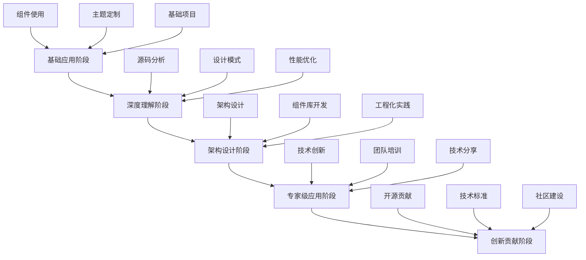

# 第98天：Element Plus 进阶学习规划

## 学习目标
- 制定 Element Plus 深度学习路线图
- 掌握高级特性和最佳实践
- 了解前沿技术发展趋势
- 建立持续学习体系

## 1. 进阶学习路线图

### 1.1 学习阶段划分


### 1.2 技能树体系
```typescript
interface SkillTree {
  核心技能: {
    Vue生态: {
      Vue3CompositionAPI: number // 1-10 熟练度
      Pinia状态管理: number
      VueRouter路由: number
      VueUse工具库: number
    }
    
    ElementPlus: {
      组件使用: number
      主题定制: number
      源码理解: number
      扩展开发: number
    }
    
    工程化: {
      Vite构建: number
      TypeScript: number
      测试框架: number
      CI_CD: number
    }
  }
  
  进阶技能: {
    架构设计: {
      微前端: number
      组件库设计: number
      性能优化: number
      监控体系: number
    }
    
    跨端开发: {
      移动端适配: number
      小程序开发: number
      桌面应用: number
      服务端渲染: number
    }
  }
  
  软技能: {
    项目管理: number
    团队协作: number
    技术分享: number
    问题解决: number
  }
}
```

## 2. 深度学习计划

### 2.1 源码深度分析（第1-2个月）

#### 学习目标
- 理解 Element Plus 架构设计
- 掌握组件实现原理
- 学习设计模式应用

#### 学习内容
```typescript
// 源码分析重点
interface SourceCodeAnalysis {
  架构层面: {
    项目结构: '了解 monorepo 架构'
    构建系统: '分析 Vite + Rollup 配置'
    类型系统: 'TypeScript 类型定义'
    主题系统: 'CSS 变量和 SCSS 架构'
  }
  
  组件层面: {
    基础组件: 'Button、Input 等实现原理'
    复杂组件: 'Table、Tree、Form 等'
    组合组件: 'Dialog、Drawer 等'
    函数式组件: 'Message、Notification 等'
  }
  
  工具层面: {
    工具函数: 'utils 目录分析'
    Hooks系统: 'use-* 系列分析'
    指令系统: 'v-loading 等指令'
    插件系统: 'ElMessage 等插件'
  }
}
```

#### 实践项目
```bash
# 源码学习项目
mkdir element-plus-source-study
cd element-plus-source-study

# 克隆源码
git clone https://github.com/element-plus/element-plus.git
cd element-plus

# 安装依赖
pnpm install

# 本地开发
pnpm dev
```

### 2.2 高级特性掌握（第3-4个月）

#### 学习目标
- 掌握高级组件使用技巧
- 理解性能优化策略
- 学习可访问性最佳实践

#### 学习内容
```vue
<!-- 高级特性示例 -->
<template>
  <div class="advanced-features">
    <!-- 虚拟化表格 -->
    <el-table-v2
      :columns="columns"
      :data="data"
      :width="700"
      :height="400"
      fixed
    />
    
    <!-- 自定义渲染器 -->
    <el-table :data="tableData">
      <el-table-column label="操作">
        <template #default="{ row }">
          <el-button
            v-if="row.status === 'pending'"
            type="primary"
            @click="handleApprove(row)"
          >
            审批
          </el-button>
          <el-tag v-else :type="getStatusType(row.status)">
            {{ getStatusText(row.status) }}
          </el-tag>
        </template>
      </el-table-column>
    </el-table>
    
    <!-- 动态表单 -->
    <el-form
      ref="formRef"
      :model="dynamicForm"
      :rules="dynamicRules"
    >
      <el-form-item
        v-for="field in formFields"
        :key="field.prop"
        :label="field.label"
        :prop="field.prop"
      >
        <component
          :is="field.component"
          v-model="dynamicForm[field.prop]"
          v-bind="field.props"
        />
      </el-form-item>
    </el-form>
  </div>
</template>

<script setup lang="ts">
import { ref, computed } from 'vue'
import type { FormInstance, FormRules } from 'element-plus'

// 动态表单配置
interface FormField {
  prop: string
  label: string
  component: string
  props?: Record<string, any>
  rules?: any[]
}

const formFields = ref<FormField[]>([
  {
    prop: 'name',
    label: '姓名',
    component: 'el-input',
    props: { placeholder: '请输入姓名' }
  },
  {
    prop: 'age',
    label: '年龄',
    component: 'el-input-number',
    props: { min: 0, max: 120 }
  },
  {
    prop: 'gender',
    label: '性别',
    component: 'el-select',
    props: {
      placeholder: '请选择性别',
      options: [
        { label: '男', value: 'male' },
        { label: '女', value: 'female' }
      ]
    }
  }
])

const dynamicForm = ref({})
const dynamicRules = computed<FormRules>(() => {
  const rules: FormRules = {}
  formFields.value.forEach(field => {
    if (field.rules) {
      rules[field.prop] = field.rules
    }
  })
  return rules
})
</script>
```

### 2.3 架构设计能力（第5-6个月）

#### 学习目标
- 掌握大型项目架构设计
- 学习微前端架构实践
- 理解组件库设计原则

#### 学习内容
```typescript
// 企业级架构设计
interface EnterpriseArchitecture {
  应用架构: {
    微前端架构: {
      主应用: 'qiankun/single-spa'
      子应用: '独立的 Vue + Element Plus 应用'
      通信机制: '应用间通信方案'
      状态共享: '全局状态管理'
    }
    
    模块化设计: {
      业务模块: '按业务领域划分'
      通用模块: '可复用的业务组件'
      基础模块: '工具函数和服务'
    }
  }
  
  技术架构: {
    前端框架: 'Vue 3 + TypeScript'
    UI组件库: 'Element Plus + 自定义组件'
    状态管理: 'Pinia + 持久化'
    路由管理: 'Vue Router + 权限控制'
    构建工具: 'Vite + 插件生态'
    测试框架: 'Vitest + Testing Library'
  }
  
  工程架构: {
    代码规范: 'ESLint + Prettier + Husky'
    版本控制: 'Git Flow + Conventional Commits'
    CI_CD: 'GitHub Actions + 自动化部署'
    监控体系: '错误监控 + 性能监控'
  }
}
```

#### 实践项目
```bash
# 微前端架构实践
npx create-qiankun-app my-micro-frontend
cd my-micro-frontend

# 主应用
cd main-app
npm install element-plus

# 子应用
cd ../sub-app-1
npm install element-plus
```

## 3. 专业技能提升

### 3.1 性能优化专项（第7个月）

#### 学习目标
- 掌握前端性能优化策略
- 学习 Element Plus 性能最佳实践
- 建立性能监控体系

#### 优化策略
```typescript
// 性能优化清单
interface PerformanceOptimization {
  加载优化: {
    按需加载: '组件和样式按需引入'
    代码分割: '路由级别的代码分割'
    资源压缩: 'Gzip + Brotli 压缩'
    CDN加速: '静态资源 CDN 分发'
  }
  
  渲染优化: {
    虚拟滚动: '大数据列表虚拟化'
    组件缓存: 'keep-alive 合理使用'
    防抖节流: '用户交互优化'
    图片懒加载: '图片资源优化'
  }
  
  内存优化: {
    事件清理: '组件销毁时清理事件'
    定时器清理: '清理定时器和观察者'
    闭包优化: '避免内存泄漏'
    大对象释放: '及时释放大对象'
  }
}
```

#### 性能监控实现
```typescript
// 性能监控工具
class PerformanceMonitor {
  private observer: PerformanceObserver
  
  constructor() {
    this.initPerformanceObserver()
    this.monitorPageLoad()
    this.monitorUserInteraction()
  }
  
  private initPerformanceObserver() {
    this.observer = new PerformanceObserver((list) => {
      for (const entry of list.getEntries()) {
        this.reportPerformanceData(entry)
      }
    })
    
    this.observer.observe({ entryTypes: ['navigation', 'paint', 'largest-contentful-paint'] })
  }
  
  private monitorPageLoad() {
    window.addEventListener('load', () => {
      const navigation = performance.getEntriesByType('navigation')[0] as PerformanceNavigationTiming
      
      const metrics = {
        FCP: this.getFCP(),
        LCP: this.getLCP(),
        FID: this.getFID(),
        CLS: this.getCLS(),
        TTFB: navigation.responseStart - navigation.requestStart,
        domContentLoaded: navigation.domContentLoadedEventEnd - navigation.navigationStart,
        loadComplete: navigation.loadEventEnd - navigation.navigationStart
      }
      
      this.reportMetrics(metrics)
    })
  }
  
  private reportMetrics(metrics: any) {
    // 上报性能数据
    console.log('Performance Metrics:', metrics)
  }
}
```

### 3.2 测试驱动开发（第8个月）

#### 学习目标
- 掌握前端测试策略
- 学习组件测试最佳实践
- 建立完整的测试体系

#### 测试体系
```typescript
// 测试策略
interface TestingStrategy {
  单元测试: {
    工具: 'Vitest + Vue Test Utils'
    覆盖率: '组件逻辑测试'
    目标: '90% 代码覆盖率'
  }
  
  集成测试: {
    工具: 'Cypress + Testing Library'
    覆盖率: '用户交互流程'
    目标: '核心功能覆盖'
  }
  
  端到端测试: {
    工具: 'Playwright + Cucumber'
    覆盖率: '完整业务流程'
    目标: '关键路径覆盖'
  }
  
  视觉回归测试: {
    工具: 'Chromatic + Storybook'
    覆盖率: 'UI 组件视觉'
    目标: '视觉一致性保证'
  }
}
```

#### 组件测试示例
```typescript
// 组件测试实践
import { mount } from '@vue/test-utils'
import { describe, it, expect, vi } from 'vitest'
import { ElButton, ElMessage } from 'element-plus'
import UserForm from '../UserForm.vue'

describe('UserForm', () => {
  it('should render form correctly', () => {
    const wrapper = mount(UserForm, {
      props: {
        user: {
          name: 'John Doe',
          email: 'john@example.com'
        }
      },
      global: {
        components: {
          ElButton
        }
      }
    })
    
    expect(wrapper.find('[data-testid="user-name"]').element.value).toBe('John Doe')
    expect(wrapper.find('[data-testid="user-email"]').element.value).toBe('john@example.com')
  })
  
  it('should validate form on submit', async () => {
    const mockSubmit = vi.fn()
    const wrapper = mount(UserForm, {
      props: {
        onSubmit: mockSubmit
      }
    })
    
    // 提交空表单
    await wrapper.find('[data-testid="submit-btn"]').trigger('click')
    
    // 验证错误信息显示
    expect(wrapper.find('.el-form-item__error').exists()).toBe(true)
    expect(mockSubmit).not.toHaveBeenCalled()
  })
  
  it('should submit valid form', async () => {
    const mockSubmit = vi.fn()
    const wrapper = mount(UserForm, {
      props: {
        onSubmit: mockSubmit
      }
    })
    
    // 填写表单
    await wrapper.find('[data-testid="user-name"]').setValue('John Doe')
    await wrapper.find('[data-testid="user-email"]').setValue('john@example.com')
    
    // 提交表单
    await wrapper.find('[data-testid="submit-btn"]').trigger('click')
    
    expect(mockSubmit).toHaveBeenCalledWith({
      name: 'John Doe',
      email: 'john@example.com'
    })
  })
})
```

## 4. 前沿技术探索

### 4.1 新技术趋势（第9个月）

#### 学习目标
- 了解前端技术发展趋势
- 探索新技术在 Element Plus 中的应用
- 建立技术前瞻性思维

#### 技术趋势
```typescript
interface TechTrends {
  框架发展: {
    Vue4展望: 'Vapor Mode 和性能优化'
    React18特性: 'Concurrent Features'
    Svelte发展: '编译时优化'
    SolidJS: '细粒度响应式'
  }
  
  构建工具: {
    Vite生态: '插件和工具链'
    Turbopack: 'Webpack 继任者'
    ESBuild: '极速构建'
    SWC: 'Rust 工具链'
  }
  
  新兴技术: {
    WebAssembly: '高性能计算'
    WebComponents: '原生组件'
    WebGPU: '图形计算'
    WebXR: '虚拟现实'
  }
  
  开发模式: {
    低代码平台: '可视化开发'
    微前端: '应用架构'
    Serverless: '无服务器'
    EdgeComputing: '边缘计算'
  }
}
```

### 4.2 实验性项目（第10个月）

#### 项目目标
- 将新技术与 Element Plus 结合
- 探索创新的解决方案
- 积累前沿技术经验

#### 实验项目
```typescript
// WebAssembly + Element Plus
interface WasmProject {
  项目描述: '使用 WebAssembly 优化数据处理'
  技术栈: 'Vue 3 + Element Plus + WebAssembly'
  应用场景: {
    大数据表格: '百万级数据渲染'
    图像处理: '前端图像算法'
    数据分析: '复杂计算优化'
  }
}

// Web Components + Element Plus
interface WebComponentsProject {
  项目描述: '基于 Web Components 的组件库'
  技术栈: 'Lit + Element Plus 设计系统'
  应用场景: {
    跨框架组件: '在 React/Angular 中使用'
    微前端: '技术栈无关的组件'
    渐进增强: '传统项目集成'
  }
}
```

## 5. 社区贡献计划

### 5.1 开源贡献（第11个月）

#### 贡献目标
- 参与 Element Plus 开源贡献
- 提升开源项目影响力
- 建立技术声誉

#### 贡献方式
```markdown
#### 代码贡献
- Bug 修复
- 新功能开发
- 性能优化
- 文档改进

#### 社区建设
- Issue 回复和处理
- PR Review
- 技术讨论参与
- 新人指导

#### 生态建设
- 插件开发
- 工具创建
- 最佳实践分享
- 技术文章撰写
```

### 5.2 知识分享（第12个月）

#### 分享目标
- 建立个人技术品牌
- 推广 Element Plus 最佳实践
- 促进技术社区发展

#### 分享形式
```typescript
interface KnowledgeSharing {
  技术博客: {
    平台: '掘金、知乎、个人博客'
    内容: 'Element Plus 深度解析'
    频率: '每周 1-2 篇'
  }
  
  技术演讲: {
    会议: '前端技术大会'
    主题: 'Element Plus 最佳实践'
    形式: '线上/线下分享'
  }
  
  开源项目: {
    类型: 'Element Plus 相关工具'
    目标: '解决实际问题'
    维护: '长期维护和更新'
  }
  
  视频教程: {
    平台: 'B站、YouTube'
    内容: 'Element Plus 实战教程'
    系列: '从入门到精通'
  }
}
```

## 6. 学习资源推荐

### 6.1 官方资源
```markdown
#### 核心文档
- [Vue.js 官方文档](https://vuejs.org/)
- [Element Plus 官方文档](https://element-plus.org/)
- [TypeScript 官方文档](https://www.typescriptlang.org/)

#### 源码仓库
- [Vue.js GitHub](https://github.com/vuejs/core)
- [Element Plus GitHub](https://github.com/element-plus/element-plus)
- [Vite GitHub](https://github.com/vitejs/vite)
```

### 6.2 学习平台
```markdown
#### 在线课程
- 慕课网 Vue 3 高级课程
- 极客时间前端专栏
- Udemy Vue.js 课程

#### 技术社区
- Vue.js 官方论坛
- Element Plus 讨论区
- Stack Overflow
- 掘金前端社区

#### 技术博客
- Vue.js 官方博客
- 尤雨溪个人博客
- 前端技术专家博客
```

### 6.3 实践平台
```markdown
#### 代码托管
- GitHub 开源项目
- GitLab 企业项目
- Gitee 国内平台

#### 在线编辑
- CodePen 代码片段
- CodeSandbox 项目演示
- StackBlitz 在线开发

#### 部署平台
- Vercel 静态部署
- Netlify 前端部署
- GitHub Pages 项目展示
```

## 7. 评估与调整

### 7.1 学习评估指标
```typescript
interface LearningMetrics {
  技术指标: {
    代码质量: '代码审查评分'
    项目完成度: '项目交付质量'
    问题解决: '技术难题攻克'
    创新能力: '新技术应用'
  }
  
  影响力指标: {
    开源贡献: 'GitHub 贡献统计'
    技术分享: '文章阅读量'
    社区参与: '讨论参与度'
    同行认可: '技术声誉'
  }
  
  职业指标: {
    技能提升: '技能评估结果'
    项目经验: '项目复杂度'
    团队协作: '协作效果评价'
    领导能力: '团队影响力'
  }
}
```

### 7.2 计划调整策略
```markdown
#### 定期评估
- 月度技能自评
- 季度目标回顾
- 年度计划调整

#### 反馈收集
- 同事评价
- 导师建议
- 社区反馈

#### 计划优化
- 学习重点调整
- 时间分配优化
- 资源配置改进
```

## 总结

今天制定了 Element Plus 进阶学习规划，包括深度学习路线、专业技能提升、前沿技术探索和社区贡献计划。这个规划将指导未来的学习方向和职业发展。

## 作业

1. 评估当前技能水平，制定个人技能树
2. 选择一个感兴趣的进阶方向深入学习
3. 开始一个实践项目，应用所学知识
4. 参与一个开源项目，进行代码贡献
5. 撰写一篇技术文章，分享学习心得