# 第100天：Element Plus 精通总结与持续学习计划

## 学习目标
- 总结 100 天的学习成果
- 评估技能掌握程度
- 制定持续学习计划
- 规划未来发展方向

## 1. 学习成果总结

### 1.1 学习历程回顾

```mermaid
gantt
    title Element Plus 100天学习历程
    dateFormat  X
    axisFormat %d天
    
    section 基础阶段
    环境搭建与基础概念    :done, basic1, 0, 7
    基础组件学习          :done, basic2, 7, 14
    表单与数据展示        :done, basic3, 14, 21
    
    section 进阶阶段
    高级组件应用          :done, advanced1, 21, 35
    主题定制与扩展        :done, advanced2, 35, 49
    性能优化实践          :done, advanced3, 49, 63
    
    section 深入阶段
    源码分析与理解        :done, deep1, 63, 77
    架构设计与最佳实践    :done, deep2, 77, 91
    
    section 精通阶段
    项目实战与作品集      :done, master1, 91, 100
```


### 1.2 技能掌握评估
```typescript
interface SkillAssessment {
  基础技能: {
    Vue3基础: {
      掌握程度: 95
      评估标准: 'Composition API、响应式系统、生命周期'
      实践项目: '完成10+个Vue3项目'
    }
    
    ElementPlus组件: {
      掌握程度: 98
      评估标准: '所有组件熟练使用、API完全掌握'
      实践项目: '使用过90%以上的组件'
    }
    
    TypeScript: {
      掌握程度: 90
      评估标准: '类型定义、泛型、高级类型'
      实践项目: '所有项目都使用TypeScript开发'
    }
  }
  
  进阶技能: {
    主题定制: {
      掌握程度: 92
      评估标准: 'CSS变量、SCSS、主题切换'
      实践项目: '开发了3套自定义主题'
    }
    
    性能优化: {
      掌握程度: 88
      评估标准: '虚拟滚动、懒加载、代码分割'
      实践项目: '优化了5个大型项目性能'
    }
    
    组件扩展: {
      掌握程度: 85
      评估标准: '二次封装、自定义组件、插件开发'
      实践项目: '开发了20+个自定义组件'
    }
  }
  
  高级技能: {
    架构设计: {
      掌握程度: 80
      评估标准: '微前端、组件库设计、工程化'
      实践项目: '设计了2个大型项目架构'
    }
    
    源码理解: {
      掌握程度: 75
      评估标准: 'Element Plus源码、设计模式'
      实践项目: '分析了核心组件源码'
    }
    
    开源贡献: {
      掌握程度: 70
      评估标准: 'PR贡献、Issue解决、社区参与'
      实践项目: '贡献了12个PR到Element Plus'
    }
  }
}
```

### 1.3 项目成果统计
```typescript
interface ProjectAchievements {
  完成项目: {
    个人项目: {
      数量: 15
      类型: ['博客系统', '管理后台', '电商平台', '数据可视化']
      技术栈: 'Vue 3 + Element Plus + TypeScript'
      代码量: '50000+ 行'
    }
    
    企业项目: {
      数量: 8
      类型: ['企业管理系统', '客户关系管理', '财务系统']
      规模: '大型项目3个，中型项目5个'
      用户量: '10000+ 活跃用户'
    }
    
    开源项目: {
      数量: 5
      Star总数: 3500
      Fork总数: 800
      贡献者: 50
    }
  }
  
  技术文章: {
    发表数量: 25
    总阅读量: 150000
    平台分布: {
      掘金: 15
      知乎: 8
      个人博客: 2
    }
  }
  
  社区贡献: {
    ElementPlus: {
      PR数量: 12
      Issue解决: 15
      文档改进: 8
    }
    
    其他开源: {
      Vue生态: 5
      工具库: 3
    }
  }
}
```

## 2. 核心能力总结

### 2.1 技术能力矩阵
```vue
<template>
  <div class="skill-matrix">
    <el-table :data="skillData" border>
      <el-table-column prop="category" label="技能分类" width="120" />
      <el-table-column prop="skill" label="具体技能" width="200" />
      <el-table-column prop="level" label="掌握程度" width="120">
        <template #default="{ row }">
          <el-progress
            :percentage="row.level"
            :color="getProgressColor(row.level)"
            :stroke-width="8"
          />
        </template>
      </el-table-column>
      <el-table-column prop="experience" label="实践经验" />
      <el-table-column prop="certification" label="认证/证明" />
    </el-table>
  </div>
</template>

<script setup lang="ts">
const skillData = [
  {
    category: '前端框架',
    skill: 'Vue.js 3.x',
    level: 95,
    experience: '3年开发经验，完成15+项目',
    certification: 'Vue.js 官方认证'
  },
  {
    category: 'UI组件库',
    skill: 'Element Plus',
    level: 98,
    experience: '深度使用2年，贡献12个PR',
    certification: 'Element Plus 贡献者'
  },
  {
    category: '编程语言',
    skill: 'TypeScript',
    level: 90,
    experience: '2年TS开发，所有项目TS化',
    certification: 'TypeScript 高级开发者'
  },
  {
    category: '构建工具',
    skill: 'Vite',
    level: 88,
    experience: '熟练配置和优化，开发插件',
    certification: 'Vite 插件开发者'
  },
  {
    category: '状态管理',
    skill: 'Pinia',
    level: 92,
    experience: '大型项目状态管理实践',
    certification: 'Pinia 最佳实践'
  },
  {
    category: '测试框架',
    skill: 'Vitest',
    level: 85,
    experience: '单元测试和集成测试',
    certification: '测试驱动开发'
  },
  {
    category: '性能优化',
    skill: '前端性能',
    level: 88,
    experience: '多个项目性能优化实践',
    certification: '性能优化专家'
  },
  {
    category: '架构设计',
    skill: '微前端',
    level: 80,
    experience: '2个微前端项目架构设计',
    certification: '架构师认证'
  }
]

const getProgressColor = (level: number) => {
  if (level >= 90) return '#67c23a'
  if (level >= 80) return '#e6a23c'
  if (level >= 70) return '#f56c6c'
  return '#909399'
}
</script>
```

### 2.2 解决问题能力
```typescript
// 典型问题解决案例
interface ProblemSolvingCases {
  性能优化案例: {
    问题描述: '大数据表格渲染卡顿，用户体验差'
    解决方案: [
      '实现虚拟滚动技术',
      '优化数据结构和算法',
      '使用Web Worker处理数据',
      '实现增量渲染'
    ]
    技术难点: [
      '虚拟滚动的精确计算',
      '动态高度处理',
      '滚动性能优化'
    ]
    最终效果: {
      渲染时间: '从2000ms降至200ms'
      内存使用: '减少70%'
      用户体验: '流畅度提升90%'
    }
  }
  
  兼容性问题: {
    问题描述: 'Element Plus在IE11下样式异常'
    解决方案: [
      '分析CSS兼容性问题',
      '使用PostCSS插件处理',
      '添加polyfill支持',
      '降级处理方案'
    ]
    技术难点: [
      'CSS Grid兼容性',
      'ES6语法转换',
      '第三方库兼容'
    ]
    最终效果: {
      兼容性: '支持IE11+所有现代浏览器'
      功能完整性: '保持95%功能可用'
      维护成本: '增加20%但可接受'
    }
  }
  
  架构设计挑战: {
    问题描述: '多团队协作，代码冲突频繁'
    解决方案: [
      '设计微前端架构',
      '制定代码规范',
      '建立CI/CD流程',
      '实现自动化测试'
    ]
    技术难点: [
      '应用间通信机制',
      '状态共享方案',
      '部署策略设计'
    ]
    最终效果: {
      开发效率: '提升40%'
      代码质量: '缺陷率降低60%'
      部署频率: '从周发布到日发布'
    }
  }
}
```

## 3. 学习方法总结

### 3.1 有效学习策略
```typescript
interface LearningStrategies {
  理论学习: {
    官方文档: {
      方法: '系统性阅读，做笔记总结'
      效果: '建立完整知识体系'
      时间分配: '30%'
    }
    
    源码阅读: {
      方法: '从简单组件开始，逐步深入'
      效果: '理解设计思想和实现原理'
      时间分配: '25%'
    }
    
    技术文章: {
      方法: '筛选高质量文章，深度思考'
      效果: '了解最佳实践和踩坑经验'
      时间分配: '15%'
    }
  }
  
  实践学习: {
    项目实战: {
      方法: '从简单到复杂，循序渐进'
      效果: '积累实际开发经验'
      时间分配: '40%'
    }
    
    问题解决: {
      方法: '主动寻找和解决技术难题'
      效果: '提升问题分析和解决能力'
      时间分配: '20%'
    }
    
    开源贡献: {
      方法: '参与开源项目，贡献代码'
      效果: '提升代码质量和协作能力'
      时间分配: '15%'
    }
  }
  
  输出学习: {
    技术博客: {
      方法: '定期总结和分享学习心得'
      效果: '加深理解，建立个人品牌'
      频率: '每周1-2篇'
    }
    
    技术分享: {
      方法: '团队内部分享，参与技术会议'
      效果: '锻炼表达能力，获得反馈'
      频率: '每月1-2次'
    }
    
    开源项目: {
      方法: '维护个人开源项目'
      效果: '提升项目管理和技术影响力'
      数量: '3-5个活跃项目'
    }
  }
}
```

### 3.2 学习工具和资源
```markdown
#### 必备工具
- **开发环境：** VS Code + Vue 插件
- **调试工具：** Vue DevTools
- **文档工具：** VitePress
- **测试工具：** Vitest + Cypress
- **版本控制：** Git + GitHub

#### 学习资源
- **官方文档：** Vue.js、Element Plus 官方文档
- **视频教程：** B站、YouTube 技术频道
- **技术社区：** 掘金、知乎、Stack Overflow
- **开源项目：** GitHub 优秀项目
- **技术书籍：** 《Vue.js设计与实现》等

#### 实践平台
- **代码托管：** GitHub、GitLab
- **在线编辑：** CodeSandbox、StackBlitz
- **部署平台：** Vercel、Netlify
- **监控工具：** Sentry、Google Analytics
```

## 4. 持续学习计划

### 4.1 短期计划（未来6个月）
```typescript
interface ShortTermPlan {
  技术深化: {
    Vue生态: {
      目标: '深入学习Vue 3.4新特性'
      计划: [
        '学习Vapor Mode实验特性',
        '掌握新的Composition API',
        '研究性能优化新方案'
      ]
      时间: '2个月'
    }
    
    ElementPlus进阶: {
      目标: '成为Element Plus核心贡献者'
      计划: [
        '参与新组件开发',
        '优化现有组件性能',
        '改进文档和示例'
      ]
      时间: '3个月'
    }
    
    新技术探索: {
      目标: '学习前沿技术'
      计划: [
        '研究WebAssembly在前端的应用',
        '学习Web Components标准',
        '探索AI辅助开发工具'
      ]
      时间: '1个月'
    }
  }
  
  项目实践: {
    个人项目: {
      目标: '开发创新性项目'
      计划: [
        '基于Element Plus的低代码平台',
        'Vue 3 + WebAssembly性能优化工具',
        '智能组件生成器'
      ]
      数量: '3个项目'
    }
    
    开源贡献: {
      目标: '扩大开源影响力'
      计划: [
        '维护现有开源项目',
        '发起新的开源项目',
        '参与Vue生态建设'
      ]
      指标: '月均5个PR'
    }
  }
  
  知识分享: {
    技术文章: {
      目标: '建立技术影响力'
      计划: [
        'Element Plus深度解析系列',
        'Vue 3性能优化实战',
        '前端架构设计思考'
      ]
      频率: '每周2篇'
    }
    
    技术演讲: {
      目标: '提升个人品牌'
      计划: [
        '参加前端技术大会',
        '公司内部技术分享',
        '开源项目推广'
      ]
      频率: '每月1次'
    }
  }
}
```

### 4.2 中期计划（未来1-2年）
```typescript
interface MediumTermPlan {
  技术领域: {
    全栈发展: {
      目标: '成为全栈工程师'
      学习内容: [
        'Node.js后端开发',
        '数据库设计和优化',
        '云服务和DevOps',
        '移动端开发'
      ]
      时间规划: '1年'
    }
    
    架构能力: {
      目标: '具备架构师能力'
      学习内容: [
        '大型系统架构设计',
        '微服务架构',
        '分布式系统',
        '系统性能优化'
      ]
      时间规划: '1.5年'
    }
    
    新兴技术: {
      目标: '掌握前沿技术'
      学习内容: [
        'WebAssembly深度应用',
        'Web3和区块链前端',
        'AI/ML在前端的应用',
        'AR/VR Web开发'
      ]
      时间规划: '2年'
    }
  }
  
  职业发展: {
    技术专家: {
      目标: '成为前端技术专家'
      发展路径: [
        '深度技术研究',
        '技术标准制定',
        '开源项目领导',
        '技术咨询服务'
      ]
    }
    
    技术管理: {
      目标: '具备团队管理能力'
      发展路径: [
        '项目管理经验',
        '团队建设能力',
        '技术决策能力',
        '人才培养能力'
      ]
    }
  }
  
  影响力建设: {
    技术社区: {
      目标: '成为技术KOL'
      行动计划: [
        '持续输出高质量内容',
        '参与技术标准制定',
        '组织技术活动',
        '指导新人成长'
      ]
    }
    
    商业价值: {
      目标: '创造商业价值'
      行动计划: [
        '技术产品化',
        '技术服务商业化',
        '创业项目孵化',
        '投资技术项目'
      ]
    }
  }
}
```

### 4.3 长期愿景（未来5年）
```typescript
interface LongTermVision {
  技术愿景: {
    技术创新: {
      目标: '推动前端技术发展'
      具体规划: [
        '发明新的开发模式',
        '创建影响力技术标准',
        '开发革命性工具',
        '建立技术生态'
      ]
    }
    
    知识体系: {
      目标: '构建完整技术知识体系'
      涵盖领域: [
        '前端全栈技术',
        '系统架构设计',
        '产品和商业思维',
        '团队管理和领导力'
      ]
    }
  }
  
  职业愿景: {
    技术领导者: {
      角色定位: '前端技术领域的意见领袖'
      影响范围: [
        '技术社区影响力',
        '行业标准制定',
        '人才培养体系',
        '技术趋势引导'
      ]
    }
    
    创业机会: {
      方向探索: [
        '前端开发工具创业',
        '技术教育平台',
        '企业技术服务',
        '开源商业化'
      ]
    }
  }
  
  社会价值: {
    技术普及: {
      目标: '降低技术门槛'
      行动方向: [
        '开发易用的开发工具',
        '创建优质教育内容',
        '建立技术社区',
        '推广最佳实践'
      ]
    }
    
    人才培养: {
      目标: '培养更多优秀前端工程师'
      行动方向: [
        '指导和培训',
        '开源项目孵化',
        '技术分享和传播',
        '建立学习体系'
      ]
    }
  }
}
```

## 5. 学习资源推荐

### 5.1 持续关注的技术资源
```markdown
#### 官方资源
- **Vue.js 官方**
  - 官方文档和RFC
  - Vue Mastery课程
  - Vue.js官方博客
  - Evan You的技术分享

- **Element Plus 官方**
  - 官方文档和更新日志
  - GitHub Issues和Discussions
  - 官方示例和最佳实践
  - 社区贡献指南

#### 技术社区
- **国外社区**
  - Vue.js官方论坛
  - Reddit Vue.js社区
  - Stack Overflow
  - Dev.to前端话题

- **国内社区**
  - 掘金前端社区
  - 知乎前端话题
  - SegmentFault
  - V2EX前端节点

#### 技术博客
- **个人博客**
  - 尤雨溪个人博客
  - Anthony Fu博客
  - 前端技术专家博客
  - 国外前端大牛博客

- **团队博客**
  - Vue.js官方博客
  - 各大公司技术博客
  - 开源项目技术分享
```

### 5.2 学习工具和平台
```typescript
interface LearningTools {
  在线学习: {
    视频平台: [
      'Vue Mastery',
      'Frontend Masters',
      'Egghead.io',
      'B站技术UP主'
    ]
    
    互动平台: [
      'CodeSandbox',
      'StackBlitz',
      'Repl.it',
      'JSFiddle'
    ]
  }
  
  实践工具: {
    开发环境: [
      'VS Code + 插件',
      'WebStorm',
      'Vim/Neovim',
      'GitHub Codespaces'
    ]
    
    调试工具: [
      'Vue DevTools',
      'Chrome DevTools',
      'Firefox DevTools',
      'React DevTools'
    ]
  }
  
  协作工具: {
    版本控制: [
      'Git + GitHub',
      'GitLab',
      'Bitbucket'
    ]
    
    项目管理: [
      'GitHub Projects',
      'Jira',
      'Trello',
      'Notion'
    ]
  }
}
```

## 6. 成功指标和评估

### 6.1 技能评估标准
```typescript
interface SkillEvaluation {
  技术能力: {
    代码质量: {
      指标: ['可读性', '可维护性', '性能', '安全性']
      评估方式: 'Code Review + 静态分析'
      目标: '90分以上'
    }
    
    问题解决: {
      指标: ['分析能力', '解决速度', '方案质量']
      评估方式: '实际项目中的表现'
      目标: '独立解决复杂技术问题'
    }
    
    学习能力: {
      指标: ['新技术掌握速度', '知识迁移能力']
      评估方式: '学习新技术的时间和效果'
      目标: '快速适应技术变化'
    }
  }
  
  影响力: {
    技术贡献: {
      指标: ['开源贡献', '技术文章', '技术分享']
      评估方式: 'GitHub统计 + 文章阅读量'
      目标: '年度贡献100+ commits'
    }
    
    社区参与: {
      指标: ['问题回答', '讨论参与', '项目维护']
      评估方式: '社区活跃度统计'
      目标: '成为活跃贡献者'
    }
  }
  
  职业发展: {
    项目成果: {
      指标: ['项目成功率', '用户满意度', '业务价值']
      评估方式: '项目复盘和用户反馈'
      目标: '项目成功率95%以上'
    }
    
    团队协作: {
      指标: ['沟通效果', '协作质量', '知识分享']
      评估方式: '360度评估'
      目标: '成为团队核心成员'
    }
  }
}
```

### 6.2 定期评估计划
```markdown
#### 月度评估
- **技能自评：** 使用技能矩阵进行自我评估
- **项目回顾：** 总结当月项目经验和收获
- **学习总结：** 整理学习笔记和心得
- **目标调整：** 根据实际情况调整学习计划

#### 季度评估
- **深度复盘：** 全面回顾季度学习和工作成果
- **同行反馈：** 收集同事和社区的反馈意见
- **技能测试：** 通过实际项目验证技能水平
- **计划优化：** 优化下季度的学习和发展计划

#### 年度评估
- **全面总结：** 整理年度所有学习和工作成果
- **对标分析：** 与行业标准和优秀同行对比
- **职业规划：** 制定下一年的职业发展计划
- **长期调整：** 调整长期愿景和发展方向
```

## 7. 给未来学习者的建议

### 7.1 学习心得分享
```markdown
#### 学习态度
1. **保持好奇心：** 对新技术和解决方案保持开放态度
2. **持续学习：** 技术更新快，需要建立终身学习的习惯
3. **深度思考：** 不仅要知道怎么做，更要理解为什么这样做
4. **实践导向：** 理论学习必须结合实际项目练习
5. **分享交流：** 通过分享加深理解，通过交流获得新视角

#### 学习方法
1. **系统性学习：** 建立完整的知识体系，避免碎片化
2. **项目驱动：** 以实际项目为载体，学以致用
3. **源码阅读：** 深入理解技术原理和设计思想
4. **问题导向：** 主动寻找和解决技术难题
5. **输出倒逼：** 通过写作和分享倒逼深度学习

#### 职业发展
1. **技术深度：** 在某个领域做到专业和精通
2. **技术广度：** 了解相关技术栈，具备全局视野
3. **软技能：** 培养沟通、协作、管理等软技能
4. **商业思维：** 理解技术的商业价值和应用场景
5. **个人品牌：** 建立技术影响力和个人品牌
```

### 7.2 常见误区和避坑指南
```typescript
interface CommonMistakes {
  学习误区: {
    追求新技术: {
      问题: '盲目追求最新技术，基础不扎实'
      建议: '先打好基础，再学习新技术'
    }
    
    浅尝辄止: {
      问题: '学习不够深入，只停留在表面'
      建议: '选择重点技术深入学习'
    }
    
    缺乏实践: {
      问题: '只看不练，缺乏实际项目经验'
      建议: '理论学习必须结合项目实践'
    }
  }
  
  开发误区: {
    过度设计: {
      问题: '为了技术而技术，过度复杂化'
      建议: '根据实际需求选择合适的技术方案'
    }
    
    忽视性能: {
      问题: '只关注功能实现，忽视性能优化'
      建议: '从开发初期就考虑性能问题'
    }
    
    缺乏测试: {
      问题: '不写测试，代码质量难以保证'
      建议: '养成写测试的习惯'
    }
  }
  
  职业误区: {
    技术至上: {
      问题: '只关注技术，忽视业务和沟通'
      建议: '技术和软技能并重发展'
    }
    
    单打独斗: {
      问题: '不善于团队协作和知识分享'
      建议: '积极参与团队协作和社区活动'
    }
    
    缺乏规划: {
      问题: '没有明确的职业发展规划'
      建议: '制定清晰的短期和长期目标'
    }
  }
}
```

## 8. 结语

### 8.1 100天学习感悟
```markdown
经过100天的深入学习，我对Element Plus和Vue生态有了全面而深入的理解。
这不仅仅是技术技能的提升，更是思维方式和学习能力的成长。

**最大的收获：**
1. **系统性思维：** 学会了如何系统性地学习和掌握一门技术
2. **实践能力：** 通过大量项目实践，积累了丰富的开发经验
3. **问题解决：** 培养了独立分析和解决复杂技术问题的能力
4. **社区参与：** 通过开源贡献，提升了协作和影响力
5. **持续学习：** 建立了终身学习的习惯和方法

**深刻的体会：**
- 技术学习没有终点，只有不断的探索和进步
- 实践是检验学习效果的最好标准
- 分享和交流能够加深理解，扩大影响
- 开源精神让技术发展更加开放和包容
- 个人成长需要技术能力和软技能的平衡发展
```

### 8.2 对未来的展望
```markdown
**技术发展趋势：**
- 前端技术将更加成熟和标准化
- 开发工具将更加智能和自动化
- 跨平台开发将成为主流
- 性能优化将更加重要
- AI将深度融入前端开发

**个人发展方向：**
- 继续深耕Vue生态系统
- 扩展全栈开发能力
- 提升架构设计水平
- 增强技术影响力
- 培养更多优秀的前端工程师

**对社区的贡献：**
- 持续为Element Plus贡献代码
- 维护和发展个人开源项目
- 分享技术经验和最佳实践
- 帮助新人快速成长
- 推动前端技术的发展和普及
```

### 8.3 致谢
```markdown
感谢所有在这100天学习过程中给予帮助和支持的人：

- **Vue.js团队：** 创造了优秀的前端框架
- **Element Plus团队：** 提供了强大的组件库
- **开源社区：** 无私分享知识和经验
- **技术博主：** 输出高质量的技术内容
- **同事朋友：** 提供建议和反馈
- **家人：** 给予理解和支持

正是因为有了这些支持，才让这100天的学习之旅如此充实和有意义。
```

## 总结

100天的Element Plus学习之旅圆满结束！从基础入门到深度掌握，从简单应用到复杂项目，从个人学习到社区贡献，这个过程不仅提升了技术能力，更重要的是培养了持续学习的能力和习惯。

技术的学习永无止境，这100天只是一个开始。未来将继续在前端技术的道路上探索前进，为技术社区贡献自己的力量，帮助更多的开发者成长。

**愿每一位前端开发者都能在技术的道路上找到属于自己的方向，实现技术梦想！**

## 最后的作业

1. 完成个人技能评估，制定下阶段学习计划
2. 整理100天的学习笔记和项目代码
3. 撰写学习总结文章，分享给社区
4. 制定未来1年的技术发展规划
5. 开始新的技术学习之旅！

---

**🎉 恭喜完成Element Plus 100天精通之旅！🎉**