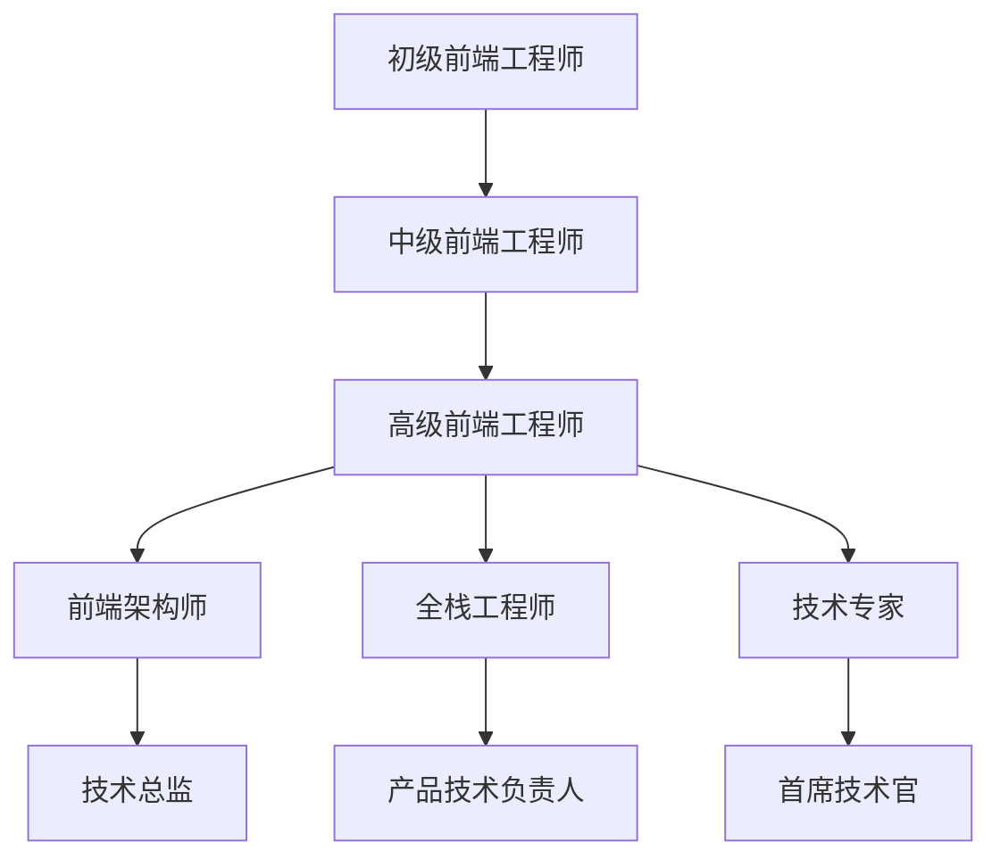

# 第97天：Element Plus 相关职业发展规划

## 学习目标
- 了解前端开发职业发展路径
- 掌握 Element Plus 相关技能在职场中的应用
- 制定个人职业发展规划
- 学习技能提升和职业转型策略

## 1. 前端开发职业发展路径

### 1.1 技术发展路线


### 1.2 职业发展阶段

#### 初级前端工程师（0-2年）
**核心技能要求：**
- HTML/CSS/JavaScript 基础
- Vue.js 框架使用
- Element Plus 组件库熟练应用
- 基础的 Git 版本控制
- 简单的项目开发经验

**职责范围：**
- 根据设计稿实现页面
- 使用 Element Plus 快速构建界面
- 处理简单的交互逻辑
- 配合后端完成数据对接

#### 中级前端工程师（2-4年）
**核心技能要求：**
- Vue 3 Composition API 深度应用
- Element Plus 主题定制和扩展
- TypeScript 开发
- 前端工程化工具使用
- 性能优化基础知识
- 跨浏览器兼容性处理

**职责范围：**
- 独立完成复杂功能模块
- Element Plus 组件二次封装
- 前端架构设计参与
- 代码质量把控
- 新人指导和培训

#### 高级前端工程师（4-7年）
**核心技能要求：**
- 前端架构设计能力
- Element Plus 源码理解
- 微前端架构实践
- 性能优化专家级技能
- 团队协作和项目管理
- 技术选型和决策能力

**职责范围：**
- 前端技术架构设计
- 组件库设计和维护
- 技术难点攻关
- 团队技术培训
- 跨团队技术协调

## 2. Element Plus 技能在职场中的应用

### 2.1 企业级应用开发
```typescript
// 企业管理系统示例
interface EnterpriseSystem {
  // 用户管理模块
  userManagement: {
    userList: ElTable
    userForm: ElForm
    userSearch: ElInput
  }
  
  // 权限管理模块
  permissionManagement: {
    roleTree: ElTree
    permissionMatrix: ElTable
    roleForm: ElDialog
  }
  
  // 数据可视化
  dashboard: {
    charts: ECharts
    dataCards: ElCard
    filters: ElDatePicker | ElSelect
  }
}
```

### 2.2 中后台系统开发
```vue
<!-- 典型的中后台页面结构 -->
<template>
  <el-container>
    <el-aside width="200px">
      <el-menu
        :default-active="activeMenu"
        router
        unique-opened
      >
        <el-sub-menu
          v-for="menu in menuList"
          :key="menu.id"
          :index="menu.path"
        >
          <template #title>
            <el-icon><component :is="menu.icon" /></el-icon>
            <span>{{ menu.title }}</span>
          </template>
          <el-menu-item
            v-for="item in menu.children"
            :key="item.id"
            :index="item.path"
          >
            {{ item.title }}
          </el-menu-item>
        </el-sub-menu>
      </el-menu>
    </el-aside>
    
    <el-container>
      <el-header>
        <el-breadcrumb separator="/">
          <el-breadcrumb-item
            v-for="item in breadcrumbs"
            :key="item.path"
            :to="{ path: item.path }"
          >
            {{ item.title }}
          </el-breadcrumb-item>
        </el-breadcrumb>
      </el-header>
      
      <el-main>
        <router-view />
      </el-main>
    </el-container>
  </el-container>
</template>
```

### 2.3 移动端适配开发
```scss
// 响应式设计实践
.responsive-layout {
  // 桌面端
  @media (min-width: 1200px) {
    .el-col-xl-6 {
      width: 25%;
    }
  }
  
  // 平板端
  @media (min-width: 768px) and (max-width: 1199px) {
    .el-col-md-8 {
      width: 33.33%;
    }
  }
  
  // 手机端
  @media (max-width: 767px) {
    .el-col-xs-12 {
      width: 100%;
    }
    
    .el-table {
      font-size: 12px;
    }
    
    .el-button {
      padding: 8px 12px;
    }
  }
}
```

## 3. 技能提升路径

### 3.1 技术深度提升
```markdown
#### 阶段一：基础巩固（1-3个月）
- Element Plus 所有组件熟练使用
- Vue 3 Composition API 深入理解
- TypeScript 基础语法掌握
- 前端工程化基础知识

#### 阶段二：进阶应用（3-6个月）
- Element Plus 主题定制
- 组件二次封装
- 性能优化实践
- 测试驱动开发

#### 阶段三：架构设计（6-12个月）
- 微前端架构
- 组件库设计
- 前端监控体系
- 团队协作流程
```

### 3.2 软技能发展
```typescript
interface SoftSkills {
  communication: {
    技术文档编写: string
    团队沟通协调: string
    需求理解分析: string
    问题解决能力: string
  }
  
  leadership: {
    项目管理: string
    团队建设: string
    技术培训: string
    决策制定: string
  }
  
  business: {
    业务理解: string
    产品思维: string
    用户体验: string
    商业价值: string
  }
}
```

## 4. 职业机会分析

### 4.1 热门职位需求

#### 前端开发工程师
**技能要求：**
- Vue.js + Element Plus 开发经验
- 响应式布局和移动端适配
- 前端工程化工具使用
- RESTful API 对接经验

**薪资范围：**
- 初级：8K-15K
- 中级：15K-25K
- 高级：25K-40K

#### 前端架构师
**技能要求：**
- 大型项目架构设计经验
- 组件库设计和维护
- 性能优化专家级技能
- 团队管理经验

**薪资范围：**
- 30K-60K

#### 全栈工程师
**技能要求：**
- 前端 + 后端开发能力
- 数据库设计和优化
- 云服务和部署经验
- DevOps 基础知识

**薪资范围：**
- 20K-45K

### 4.2 行业发展趋势
```markdown
#### 技术趋势
- 低代码/无代码平台
- 微前端架构普及
- WebAssembly 应用
- 边缘计算前端应用

#### 业务趋势
- 数字化转型加速
- 企业级应用需求增长
- 跨平台开发需求
- 用户体验要求提升
```

## 5. 个人发展规划制定

### 5.1 SWOT 分析模板
```typescript
interface PersonalSWOT {
  strengths: {
    技术优势: string[]
    项目经验: string[]
    学习能力: string
    团队协作: string
  }
  
  weaknesses: {
    技术短板: string[]
    经验不足: string[]
    软技能: string[]
  }
  
  opportunities: {
    行业机会: string[]
    技术趋势: string[]
    职位需求: string[]
  }
  
  threats: {
    竞争压力: string[]
    技术更新: string[]
    市场变化: string[]
  }
}
```

### 5.2 目标设定框架
```markdown
#### SMART 目标设定
- Specific（具体的）：明确的技能目标
- Measurable（可衡量的）：量化的学习成果
- Achievable（可实现的）：符合个人能力
- Relevant（相关的）：与职业发展相关
- Time-bound（有时限的）：明确的时间节点

#### 示例目标
- 3个月内掌握 Element Plus 高级特性
- 6个月内完成一个完整的企业级项目
- 1年内获得前端架构师职位
```

## 6. 求职准备策略

### 6.1 简历优化
```markdown
#### 技能关键词
- Vue.js 3.x + Composition API
- Element Plus 组件库
- TypeScript 开发
- 前端工程化（Vite/Webpack）
- 响应式设计
- 性能优化
- 单元测试

#### 项目经验描述
- 项目背景和规模
- 技术栈和架构
- 个人贡献和成果
- 解决的技术难点
- 项目收益和影响
```

### 6.2 面试准备
```typescript
// 常见面试题准备
interface InterviewPreparation {
  技术基础: {
    Vue响应式原理: string
    ElementPlus组件设计: string
    前端性能优化: string
    浏览器兼容性: string
  }
  
  项目经验: {
    架构设计思路: string
    技术选型理由: string
    问题解决过程: string
    团队协作经验: string
  }
  
  编程能力: {
    算法题练习: string
    代码实现题: string
    系统设计题: string
  }
}
```

## 7. 持续学习计划

### 7.1 学习资源
```markdown
#### 官方文档
- Vue.js 官方文档
- Element Plus 官方文档
- TypeScript 官方文档

#### 技术社区
- GitHub 开源项目
- Stack Overflow
- 掘金技术社区
- 知乎前端话题

#### 在线课程
- 慕课网前端课程
- 极客时间专栏
- B站技术视频

#### 技术书籍
- 《Vue.js 设计与实现》
- 《前端架构：从入门到微前端》
- 《JavaScript 高级程序设计》
```

### 7.2 实践项目
```typescript
// 个人项目规划
interface PersonalProjects {
  基础项目: {
    博客系统: 'Vue3 + Element Plus + TypeScript'
    管理后台: '企业级中后台系统'
    移动端应用: '响应式设计实践'
  }
  
  进阶项目: {
    组件库: '基于 Element Plus 的二次开发'
    微前端: '多应用集成方案'
    可视化: '数据可视化平台'
  }
  
  开源贡献: {
    Element Plus: '参与社区贡献'
    个人开源: '维护个人开源项目'
    技术分享: '技术博客和演讲'
  }
}
```

## 8. 职业转型策略

### 8.1 横向发展
- **全栈工程师**：学习后端技术
- **移动端开发**：React Native/Flutter
- **桌面应用开发**：Electron
- **游戏开发**：WebGL/Three.js

### 8.2 纵向发展
- **技术专家**：深入某个技术领域
- **架构师**：系统设计和技术决策
- **技术管理**：团队管理和项目管理
- **产品技术**：技术与产品结合

## 总结

今天学习了 Element Plus 相关的职业发展规划，包括职业路径、技能要求、发展策略等。制定了个人发展计划，为未来的职业发展奠定了基础。

## 作业

1. 分析自己的技能现状和职业目标
2. 制定个人的 SWOT 分析
3. 设定 3 个 SMART 目标
4. 准备一份技术简历
5. 规划未来 1 年的学习计划