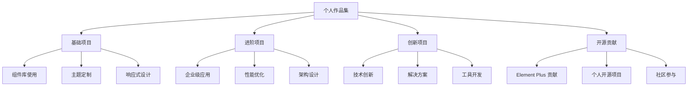

# 第99天：Element Plus 综合项目展示与作品集

## 学习目标
- 整理和展示学习成果
- 构建个人技术作品集
- 掌握项目展示技巧
- 建立个人技术品牌

## 1. 作品集规划

### 1.1 作品集结构


### 1.2 项目分类体系
```typescript
interface ProjectPortfolio {
  基础展示项目: {
    博客系统: {
      技术栈: 'Vue 3 + Element Plus + TypeScript'
      特色功能: '文章管理、评论系统、标签分类'
      展示重点: '组件使用熟练度'
    }
    
    管理后台: {
      技术栈: 'Vue 3 + Element Plus + Pinia'
      特色功能: '用户管理、权限控制、数据可视化'
      展示重点: '中后台开发能力'
    }
    
    电商平台: {
      技术栈: 'Vue 3 + Element Plus + Vue Router'
      特色功能: '商品展示、购物车、订单管理'
      展示重点: '业务理解和实现'
    }
  }
  
  进阶技术项目: {
    微前端架构: {
      技术栈: 'qiankun + Vue 3 + Element Plus'
      特色功能: '多应用集成、状态共享、独立部署'
      展示重点: '架构设计能力'
    }
    
    组件库开发: {
      技术栈: 'Vue 3 + TypeScript + Vite'
      特色功能: '基于 Element Plus 的二次开发'
      展示重点: '组件设计能力'
    }
    
    性能优化案例: {
      技术栈: 'Vue 3 + Element Plus + 监控工具'
      特色功能: '大数据渲染、虚拟滚动、懒加载'
      展示重点: '性能优化能力'
    }
  }
  
  创新解决方案: {
    低代码平台: {
      技术栈: 'Vue 3 + Element Plus + 拖拽引擎'
      特色功能: '可视化编辑、组件拖拽、代码生成'
      展示重点: '创新思维和实现'
    }
    
    数据可视化: {
      技术栈: 'Vue 3 + Element Plus + ECharts'
      特色功能: '动态图表、实时数据、交互分析'
      展示重点: '数据处理和展示'
    }
    
    跨端应用: {
      技术栈: 'Electron + Vue 3 + Element Plus'
      特色功能: '桌面应用、文件操作、系统集成'
      展示重点: '跨平台开发'
    }
  }
}
```

## 2. 核心项目展示

### 2.1 企业级管理系统

#### 项目概述
```markdown
**项目名称：** 智能办公管理系统
**项目描述：** 基于 Vue 3 + Element Plus 的企业级办公管理平台
**开发周期：** 3个月
**团队规模：** 5人（前端2人，后端2人，UI设计1人）
**个人职责：** 前端架构设计、核心功能开发、性能优化
```

#### 技术架构
```typescript
// 项目架构设计
interface SystemArchitecture {
  前端架构: {
    框架: 'Vue 3.3 + Composition API'
    UI库: 'Element Plus 2.4'
    状态管理: 'Pinia 2.1'
    路由管理: 'Vue Router 4.2'
    构建工具: 'Vite 4.4'
    类型检查: 'TypeScript 5.0'
  }
  
  项目结构: {
    src: {
      components: '通用组件'
      views: '页面组件'
      stores: '状态管理'
      utils: '工具函数'
      apis: 'API 接口'
      types: '类型定义'
      styles: '样式文件'
    }
  }
  
  核心功能: {
    用户管理: '用户增删改查、角色分配'
    权限控制: 'RBAC 权限模型、菜单权限'
    工作流: '审批流程、任务分配'
    数据统计: '图表展示、报表导出'
    系统设置: '参数配置、日志管理'
  }
}
```

#### 核心代码展示
```vue
<!-- 用户管理页面 -->
<template>
  <div class="user-management">
    <!-- 搜索区域 -->
    <el-card class="search-card">
      <el-form :model="searchForm" inline>
        <el-form-item label="用户名">
          <el-input
            v-model="searchForm.username"
            placeholder="请输入用户名"
            clearable
          />
        </el-form-item>
        <el-form-item label="状态">
          <el-select
            v-model="searchForm.status"
            placeholder="请选择状态"
            clearable
          >
            <el-option label="启用" value="1" />
            <el-option label="禁用" value="0" />
          </el-select>
        </el-form-item>
        <el-form-item>
          <el-button type="primary" @click="handleSearch">
            <el-icon><Search /></el-icon>
            搜索
          </el-button>
          <el-button @click="handleReset">
            <el-icon><Refresh /></el-icon>
            重置
          </el-button>
        </el-form-item>
      </el-form>
    </el-card>
    
    <!-- 操作区域 -->
    <el-card class="action-card">
      <el-button type="primary" @click="handleAdd">
        <el-icon><Plus /></el-icon>
        新增用户
      </el-button>
      <el-button
        type="danger"
        :disabled="!selectedUsers.length"
        @click="handleBatchDelete"
      >
        <el-icon><Delete /></el-icon>
        批量删除
      </el-button>
      <el-button @click="handleExport">
        <el-icon><Download /></el-icon>
        导出数据
      </el-button>
    </el-card>
    
    <!-- 数据表格 -->
    <el-card class="table-card">
      <el-table
        v-loading="loading"
        :data="tableData"
        @selection-change="handleSelectionChange"
      >
        <el-table-column type="selection" width="55" />
        <el-table-column prop="id" label="ID" width="80" />
        <el-table-column prop="username" label="用户名" />
        <el-table-column prop="email" label="邮箱" />
        <el-table-column prop="phone" label="手机号" />
        <el-table-column prop="role" label="角色">
          <template #default="{ row }">
            <el-tag :type="getRoleType(row.role)">
              {{ getRoleText(row.role) }}
            </el-tag>
          </template>
        </el-table-column>
        <el-table-column prop="status" label="状态">
          <template #default="{ row }">
            <el-switch
              v-model="row.status"
              :active-value="1"
              :inactive-value="0"
              @change="handleStatusChange(row)"
            />
          </template>
        </el-table-column>
        <el-table-column prop="createTime" label="创建时间" />
        <el-table-column label="操作" width="200">
          <template #default="{ row }">
            <el-button
              type="primary"
              size="small"
              @click="handleEdit(row)"
            >
              编辑
            </el-button>
            <el-button
              type="warning"
              size="small"
              @click="handleResetPassword(row)"
            >
              重置密码
            </el-button>
            <el-button
              type="danger"
              size="small"
              @click="handleDelete(row)"
            >
              删除
            </el-button>
          </template>
        </el-table-column>
      </el-table>
      
      <!-- 分页 -->
      <el-pagination
        v-model:current-page="pagination.page"
        v-model:page-size="pagination.size"
        :total="pagination.total"
        :page-sizes="[10, 20, 50, 100]"
        layout="total, sizes, prev, pager, next, jumper"
        @size-change="handleSizeChange"
        @current-change="handleCurrentChange"
      />
    </el-card>
    
    <!-- 用户表单弹窗 -->
    <UserFormDialog
      v-model="dialogVisible"
      :user-data="currentUser"
      @success="handleFormSuccess"
    />
  </div>
</template>

<script setup lang="ts">
import { ref, reactive, onMounted } from 'vue'
import { ElMessage, ElMessageBox } from 'element-plus'
import { Search, Refresh, Plus, Delete, Download } from '@element-plus/icons-vue'
import UserFormDialog from './components/UserFormDialog.vue'
import { userApi } from '@/apis/user'
import type { User } from '@/types/user'

// 响应式数据
const loading = ref(false)
const dialogVisible = ref(false)
const tableData = ref<User[]>([])
const selectedUsers = ref<User[]>([])
const currentUser = ref<User | null>(null)

const searchForm = reactive({
  username: '',
  status: ''
})

const pagination = reactive({
  page: 1,
  size: 20,
  total: 0
})

// 方法定义
const fetchUserList = async () => {
  loading.value = true
  try {
    const { data } = await userApi.getUserList({
      ...searchForm,
      page: pagination.page,
      size: pagination.size
    })
    tableData.value = data.list
    pagination.total = data.total
  } catch (error) {
    ElMessage.error('获取用户列表失败')
  } finally {
    loading.value = false
  }
}

const handleSearch = () => {
  pagination.page = 1
  fetchUserList()
}

const handleReset = () => {
  Object.assign(searchForm, {
    username: '',
    status: ''
  })
  handleSearch()
}

const handleAdd = () => {
  currentUser.value = null
  dialogVisible.value = true
}

const handleEdit = (row: User) => {
  currentUser.value = { ...row }
  dialogVisible.value = true
}

const handleDelete = async (row: User) => {
  try {
    await ElMessageBox.confirm(
      `确定要删除用户 "${row.username}" 吗？`,
      '删除确认',
      {
        confirmButtonText: '确定',
        cancelButtonText: '取消',
        type: 'warning'
      }
    )
    
    await userApi.deleteUser(row.id)
    ElMessage.success('删除成功')
    fetchUserList()
  } catch (error) {
    if (error !== 'cancel') {
      ElMessage.error('删除失败')
    }
  }
}

const handleStatusChange = async (row: User) => {
  try {
    await userApi.updateUserStatus(row.id, row.status)
    ElMessage.success('状态更新成功')
  } catch (error) {
    ElMessage.error('状态更新失败')
    row.status = row.status === 1 ? 0 : 1 // 回滚状态
  }
}

const handleSelectionChange = (selection: User[]) => {
  selectedUsers.value = selection
}

const handleFormSuccess = () => {
  dialogVisible.value = false
  fetchUserList()
}

const getRoleType = (role: string) => {
  const typeMap: Record<string, string> = {
    admin: 'danger',
    manager: 'warning',
    user: 'info'
  }
  return typeMap[role] || 'info'
}

const getRoleText = (role: string) => {
  const textMap: Record<string, string> = {
    admin: '管理员',
    manager: '经理',
    user: '普通用户'
  }
  return textMap[role] || '未知'
}

// 生命周期
onMounted(() => {
  fetchUserList()
})
</script>

<style scoped>
.user-management {
  padding: 20px;
}

.search-card,
.action-card,
.table-card {
  margin-bottom: 20px;
}

.el-pagination {
  margin-top: 20px;
  text-align: right;
}
</style>
```

#### 项目亮点
```markdown
**技术亮点：**
1. 基于 Composition API 的组件化设计
2. TypeScript 全面类型安全
3. 响应式布局适配多端
4. 权限控制精确到按钮级别
5. 性能优化：虚拟滚动、懒加载

**业务亮点：**
1. 完整的 RBAC 权限模型
2. 灵活的工作流引擎
3. 丰富的数据可视化
4. 完善的操作日志
5. 多租户架构支持

**工程亮点：**
1. 模块化的项目架构
2. 完善的代码规范
3. 自动化测试覆盖
4. CI/CD 自动化部署
5. 性能监控体系
```

### 2.2 组件库开发项目

#### 项目概述
```markdown
**项目名称：** ElementX 组件库
**项目描述：** 基于 Element Plus 的企业级组件库
**开发周期：** 2个月
**个人职责：** 独立开发
**技术特色：** 二次封装、主题定制、TypeScript 支持
```

#### 组件展示
```vue
<!-- 高级表格组件 -->
<template>
  <div class="advanced-table">
    <el-table
      ref="tableRef"
      v-loading="loading"
      :data="tableData"
      v-bind="tableProps"
      @selection-change="handleSelectionChange"
    >
      <!-- 选择列 -->
      <el-table-column
        v-if="selectable"
        type="selection"
        width="55"
      />
      
      <!-- 序号列 -->
      <el-table-column
        v-if="showIndex"
        type="index"
        label="序号"
        width="80"
      />
      
      <!-- 动态列 -->
      <el-table-column
        v-for="column in columns"
        :key="column.prop"
        v-bind="column"
      >
        <template #default="scope" v-if="column.render">
          <component
            :is="column.render"
            :row="scope.row"
            :column="column"
            :index="scope.$index"
          />
        </template>
        
        <template #header="scope" v-if="column.headerRender">
          <component
            :is="column.headerRender"
            :column="column"
            :index="scope.$index"
          />
        </template>
      </el-table-column>
      
      <!-- 操作列 -->
      <el-table-column
        v-if="actions.length"
        label="操作"
        :width="actionWidth"
        fixed="right"
      >
        <template #default="{ row, $index }">
          <template v-for="action in actions" :key="action.key">
            <el-button
              v-if="!action.hidden || !action.hidden(row, $index)"
              :type="action.type || 'primary'"
              :size="action.size || 'small'"
              :disabled="action.disabled && action.disabled(row, $index)"
              @click="action.handler(row, $index)"
            >
              <el-icon v-if="action.icon">
                <component :is="action.icon" />
              </el-icon>
              {{ action.label }}
            </el-button>
          </template>
        </template>
      </el-table-column>
    </el-table>
    
    <!-- 分页 -->
    <el-pagination
      v-if="pagination"
      v-model:current-page="currentPage"
      v-model:page-size="pageSize"
      :total="total"
      v-bind="paginationProps"
      @size-change="handleSizeChange"
      @current-change="handleCurrentChange"
    />
  </div>
</template>

<script setup lang="ts">
import { ref, computed, watch } from 'vue'
import type { TableInstance } from 'element-plus'

// 类型定义
interface TableColumn {
  prop: string
  label: string
  width?: string | number
  minWidth?: string | number
  fixed?: boolean | string
  sortable?: boolean
  render?: any
  headerRender?: any
  [key: string]: any
}

interface TableAction {
  key: string
  label: string
  type?: string
  size?: string
  icon?: any
  handler: (row: any, index: number) => void
  hidden?: (row: any, index: number) => boolean
  disabled?: (row: any, index: number) => boolean
}

interface Props {
  data: any[]
  columns: TableColumn[]
  actions?: TableAction[]
  loading?: boolean
  selectable?: boolean
  showIndex?: boolean
  pagination?: boolean
  total?: number
  pageSize?: number
  currentPage?: number
  actionWidth?: string | number
  tableProps?: Record<string, any>
  paginationProps?: Record<string, any>
}

const props = withDefaults(defineProps<Props>(), {
  data: () => [],
  columns: () => [],
  actions: () => [],
  loading: false,
  selectable: false,
  showIndex: false,
  pagination: true,
  total: 0,
  pageSize: 20,
  currentPage: 1,
  actionWidth: 200,
  tableProps: () => ({}),
  paginationProps: () => ({
    layout: 'total, sizes, prev, pager, next, jumper',
    pageSizes: [10, 20, 50, 100]
  })
})

const emit = defineEmits<{
  'selection-change': [selection: any[]]
  'size-change': [size: number]
  'current-change': [page: number]
}>()

// 响应式数据
const tableRef = ref<TableInstance>()
const tableData = computed(() => props.data)

// 方法
const handleSelectionChange = (selection: any[]) => {
  emit('selection-change', selection)
}

const handleSizeChange = (size: number) => {
  emit('size-change', size)
}

const handleCurrentChange = (page: number) => {
  emit('current-change', page)
}

// 暴露方法
defineExpose({
  getTableRef: () => tableRef.value,
  clearSelection: () => tableRef.value?.clearSelection(),
  toggleRowSelection: (row: any, selected?: boolean) => {
    tableRef.value?.toggleRowSelection(row, selected)
  }
})
</script>
```

### 2.3 性能优化案例

#### 优化前后对比
```typescript
// 性能优化成果
interface PerformanceResults {
  优化前: {
    首屏加载时间: '3.2s'
    包体积大小: '2.8MB'
    内存使用: '45MB'
    FCP: '2.1s'
    LCP: '3.5s'
  }
  
  优化后: {
    首屏加载时间: '1.8s'
    包体积大小: '1.2MB'
    内存使用: '28MB'
    FCP: '1.2s'
    LCP: '1.9s'
  }
  
  优化措施: {
    代码分割: '路由级别懒加载'
    组件懒加载: '非关键组件延迟加载'
    图片优化: 'WebP 格式 + 懒加载'
    缓存策略: 'HTTP 缓存 + Service Worker'
    包体积优化: 'Tree Shaking + 压缩'
    虚拟滚动: '大数据列表优化'
  }
}
```

## 3. 开源贡献展示

### 3.1 Element Plus 贡献
```markdown
#### 贡献统计
- **Pull Requests:** 12个（已合并8个）
- **Issues:** 解决15个问题
- **代码贡献:** 新增功能3个，Bug修复5个
- **文档贡献:** 改进文档10处

#### 主要贡献
1. **新增 Watermark 组件**
   - 实现水印功能
   - 支持文字和图片水印
   - 防篡改机制

2. **Table 组件性能优化**
   - 虚拟滚动实现
   - 大数据渲染优化
   - 内存泄漏修复

3. **TypeScript 类型完善**
   - 补充缺失的类型定义
   - 改进类型推导
   - 修复类型错误
```

### 3.2 个人开源项目
```typescript
// 个人开源项目列表
interface OpenSourceProjects {
  'element-plus-admin': {
    描述: '基于 Element Plus 的管理后台模板'
    技术栈: 'Vue 3 + Element Plus + TypeScript'
    Star数: 1200
    特色: '开箱即用、权限控制、主题切换'
  }
  
  'vue3-hooks': {
    描述: 'Vue 3 Composition API 工具库'
    技术栈: 'Vue 3 + TypeScript'
    Star数: 800
    特色: '常用 Hooks 封装、TypeScript 支持'
  }
  
  'element-plus-icons': {
    描述: 'Element Plus 图标扩展包'
    技术栈: 'SVG + Vue 3'
    Star数: 500
    特色: '丰富图标、按需加载、自定义主题'
  }
}
```

## 4. 作品集网站建设

### 4.1 网站架构
```vue
<!-- 作品集首页 -->
<template>
  <div class="portfolio">
    <!-- 导航栏 -->
    <el-header class="header">
      <el-menu
        mode="horizontal"
        :default-active="activeMenu"
        router
      >
        <el-menu-item index="/">首页</el-menu-item>
        <el-menu-item index="/projects">项目展示</el-menu-item>
        <el-menu-item index="/skills">技能树</el-menu-item>
        <el-menu-item index="/blog">技术博客</el-menu-item>
        <el-menu-item index="/about">关于我</el-menu-item>
      </el-menu>
      
      <div class="header-actions">
        <el-switch
          v-model="isDark"
          inline-prompt
          active-icon="Moon"
          inactive-icon="Sunny"
          @change="toggleTheme"
        />
        <el-button type="primary" @click="downloadResume">
          下载简历
        </el-button>
      </div>
    </el-header>
    
    <!-- 主要内容 -->
    <el-main class="main">
      <!-- 个人介绍 -->
      <section class="hero">
        <el-row :gutter="20" align="middle">
          <el-col :span="12">
            <h1 class="hero-title">前端工程师</h1>
            <h2 class="hero-subtitle">专注于 Vue.js 和 Element Plus</h2>
            <p class="hero-description">
              拥有3年前端开发经验，精通 Vue 3 生态系统，
              深度使用 Element Plus 构建企业级应用。
              热爱开源，积极参与社区贡献。
            </p>
            <div class="hero-actions">
              <el-button type="primary" size="large" @click="viewProjects">
                查看项目
              </el-button>
              <el-button size="large" @click="contactMe">
                联系我
              </el-button>
            </div>
          </el-col>
          <el-col :span="12">
            <div class="hero-avatar">
              <el-avatar :size="200" :src="avatarUrl" />
            </div>
          </el-col>
        </el-row>
      </section>
      
      <!-- 技能展示 -->
      <section class="skills">
        <h2 class="section-title">技能专长</h2>
        <el-row :gutter="20">
          <el-col :span="8" v-for="skill in skills" :key="skill.name">
            <el-card class="skill-card">
              <div class="skill-icon">
                <el-icon :size="40">
                  <component :is="skill.icon" />
                </el-icon>
              </div>
              <h3>{{ skill.name }}</h3>
              <p>{{ skill.description }}</p>
              <el-progress
                :percentage="skill.level"
                :color="skill.color"
              />
            </el-card>
          </el-col>
        </el-row>
      </section>
      
      <!-- 项目展示 -->
      <section class="projects">
        <h2 class="section-title">精选项目</h2>
        <el-row :gutter="20">
          <el-col :span="8" v-for="project in featuredProjects" :key="project.id">
            <el-card class="project-card" @click="viewProject(project)">
              <div class="project-image">
                <el-image :src="project.image" fit="cover" />
              </div>
              <div class="project-content">
                <h3>{{ project.title }}</h3>
                <p>{{ project.description }}</p>
                <div class="project-tags">
                  <el-tag
                    v-for="tag in project.tags"
                    :key="tag"
                    size="small"
                  >
                    {{ tag }}
                  </el-tag>
                </div>
              </div>
            </el-card>
          </el-col>
        </el-row>
      </section>
    </el-main>
    
    <!-- 页脚 -->
    <el-footer class="footer">
      <div class="footer-content">
        <p>&copy; 2024 我的作品集. All rights reserved.</p>
        <div class="social-links">
          <el-link :href="githubUrl" target="_blank">
            <el-icon><LogoGithub /></el-icon>
            GitHub
          </el-link>
          <el-link :href="blogUrl" target="_blank">
            <el-icon><Document /></el-icon>
            博客
          </el-link>
        </div>
      </div>
    </el-footer>
  </div>
</template>

<script setup lang="ts">
import { ref, onMounted } from 'vue'
import { useDark, useToggle } from '@vueuse/core'

// 响应式数据
const isDark = useDark()
const toggleTheme = useToggle(isDark)
const activeMenu = ref('/')

const skills = ref([
  {
    name: 'Vue.js',
    description: '精通 Vue 3 Composition API',
    level: 90,
    color: '#4fc08d',
    icon: 'Vue'
  },
  {
    name: 'Element Plus',
    description: '深度使用和定制',
    level: 95,
    color: '#409eff',
    icon: 'ElementPlus'
  },
  {
    name: 'TypeScript',
    description: '类型安全开发',
    level: 85,
    color: '#3178c6',
    icon: 'TypeScript'
  }
])

const featuredProjects = ref([
  {
    id: 1,
    title: '企业管理系统',
    description: '基于 Vue 3 + Element Plus 的企业级管理平台',
    image: '/images/project1.jpg',
    tags: ['Vue 3', 'Element Plus', 'TypeScript']
  },
  {
    id: 2,
    title: '组件库开发',
    description: '基于 Element Plus 的二次开发组件库',
    image: '/images/project2.jpg',
    tags: ['组件库', 'Vue 3', 'Vite']
  },
  {
    id: 3,
    title: '数据可视化',
    description: '企业级数据可视化分析平台',
    image: '/images/project3.jpg',
    tags: ['ECharts', 'Vue 3', 'Element Plus']
  }
])

// 方法
const viewProjects = () => {
  // 跳转到项目页面
}

const contactMe = () => {
  // 联系方式
}

const viewProject = (project: any) => {
  // 查看项目详情
}

const downloadResume = () => {
  // 下载简历
}
</script>

<style scoped>
.portfolio {
  min-height: 100vh;
  display: flex;
  flex-direction: column;
}

.header {
  display: flex;
  justify-content: space-between;
  align-items: center;
  padding: 0 20px;
  box-shadow: 0 2px 4px rgba(0, 0, 0, 0.1);
}

.header-actions {
  display: flex;
  align-items: center;
  gap: 16px;
}

.main {
  flex: 1;
  padding: 40px 20px;
}

.hero {
  margin-bottom: 80px;
  text-align: center;
}

.hero-title {
  font-size: 3rem;
  font-weight: bold;
  margin-bottom: 16px;
}

.hero-subtitle {
  font-size: 1.5rem;
  color: var(--el-text-color-secondary);
  margin-bottom: 24px;
}

.hero-description {
  font-size: 1.1rem;
  line-height: 1.6;
  margin-bottom: 32px;
}

.hero-actions {
  display: flex;
  gap: 16px;
  justify-content: center;
}

.section-title {
  font-size: 2rem;
  text-align: center;
  margin-bottom: 40px;
}

.skill-card {
  text-align: center;
  padding: 20px;
  height: 100%;
}

.skill-icon {
  margin-bottom: 16px;
}

.project-card {
  cursor: pointer;
  transition: transform 0.3s;
  height: 100%;
}

.project-card:hover {
  transform: translateY(-4px);
}

.project-image {
  height: 200px;
  margin-bottom: 16px;
}

.project-tags {
  display: flex;
  gap: 8px;
  flex-wrap: wrap;
  margin-top: 12px;
}

.footer {
  background-color: var(--el-bg-color-page);
  border-top: 1px solid var(--el-border-color);
}

.footer-content {
  display: flex;
  justify-content: space-between;
  align-items: center;
}

.social-links {
  display: flex;
  gap: 16px;
}
</style>
```

### 4.2 部署和优化
```bash
# 部署脚本
#!/bin/bash

# 构建项目
npm run build

# 部署到 GitHub Pages
gh-pages -d dist

# 或部署到 Vercel
vercel --prod

# 或部署到 Netlify
netlify deploy --prod --dir=dist
```

## 5. 简历优化

### 5.1 技术简历模板
```markdown
# 张三 - 前端工程师

## 个人信息
- **手机：** 138-0000-0000
- **邮箱：** zhangsan@example.com
- **GitHub：** https://github.com/zhangsan
- **作品集：** https://zhangsan.dev

## 技能清单
### 前端技术
- **框架：** Vue.js 3.x（精通）、React 18（熟悉）
- **UI库：** Element Plus（精通）、Ant Design（熟悉）
- **语言：** TypeScript（精通）、JavaScript ES6+（精通）
- **工具：** Vite、Webpack、Git、Docker

### 后端技术
- **语言：** Node.js（熟悉）
- **数据库：** MySQL、MongoDB（了解）

## 工作经验
### ABC科技有限公司 | 高级前端工程师 | 2022.03 - 至今
**项目：智能办公管理系统**
- 负责前端架构设计，采用 Vue 3 + Element Plus + TypeScript 技术栈
- 实现用户管理、权限控制、工作流等核心功能模块
- 优化首屏加载时间从 3.2s 降至 1.8s，提升 44% 性能
- 建立前端监控体系，错误率降低 60%

### XYZ网络公司 | 前端工程师 | 2021.06 - 2022.03
**项目：电商管理后台**
- 使用 Vue 2 + Element UI 开发企业级管理后台
- 实现商品管理、订单处理、数据统计等功能
- 封装 20+ 业务组件，提升开发效率 30%

## 项目经验
### ElementX 组件库（个人项目）
- **技术栈：** Vue 3 + TypeScript + Vite
- **项目描述：** 基于 Element Plus 的企业级组件库
- **主要功能：** 高级表格、表单生成器、图表组件等
- **项目成果：** GitHub Star 1200+，NPM 下载量 10k+

### 微前端架构实践
- **技术栈：** qiankun + Vue 3 + Element Plus
- **项目描述：** 大型企业应用微前端改造
- **主要贡献：** 设计微前端架构，实现应用间通信
- **项目成果：** 部署效率提升 50%，开发效率提升 30%

## 开源贡献
- **Element Plus：** 贡献 12 个 PR，解决 15 个 Issue
- **个人项目：** 维护 3 个开源项目，总计 2500+ Star
- **技术分享：** 发表技术文章 20+ 篇，总阅读量 10w+

## 教育背景
- **学历：** 本科 | 计算机科学与技术 | 某某大学 | 2017-2021
- **英语：** CET-6
```

### 5.2 面试准备
```typescript
// 面试常见问题准备
interface InterviewPreparation {
  技术问题: {
    Vue相关: [
      'Vue 3 Composition API 的优势',
      'Vue 响应式原理',
      'Vue 3 与 Vue 2 的区别',
      'Pinia 与 Vuex 的对比'
    ]
    
    ElementPlus相关: [
      'Element Plus 主题定制方案',
      '如何优化 Element Plus 性能',
      '组件二次封装的最佳实践',
      'Element Plus 源码分析'
    ]
    
    工程化: [
      'Vite 与 Webpack 的区别',
      '前端性能优化策略',
      '微前端架构设计',
      'TypeScript 类型系统'
    ]
  }
  
  项目问题: [
    '介绍你最有挑战性的项目',
    '如何解决技术难点',
    '项目中的性能优化',
    '团队协作经验'
  ]
  
  行为问题: [
    '为什么选择前端开发',
    '如何学习新技术',
    '职业规划',
    '处理工作压力的方式'
  ]
}
```

## 6. 个人品牌建设

### 6.1 技术博客
```markdown
#### 博客文章规划
1. **Element Plus 深度解析系列**
   - Element Plus 源码分析
   - 组件设计模式
   - 性能优化技巧

2. **Vue 3 实战系列**
   - Composition API 最佳实践
   - 状态管理方案对比
   - 测试驱动开发

3. **前端工程化系列**
   - Vite 插件开发
   - 微前端架构实践
   - 自动化部署方案
```

### 6.2 社交媒体
```typescript
interface SocialMedia {
  GitHub: {
    定位: '代码展示和开源贡献'
    内容: '项目代码、开源贡献、技术文档'
    更新频率: '每周 2-3 次提交'
  }
  
  掘金: {
    定位: '技术文章分享'
    内容: '深度技术文章、实战经验'
    更新频率: '每周 1 篇文章'
  }
  
  知乎: {
    定位: '技术问答和讨论'
    内容: '回答技术问题、参与讨论'
    更新频率: '每天回答 1-2 个问题'
  }
  
  微信公众号: {
    定位: '技术分享和个人品牌'
    内容: '原创技术文章、学习心得'
    更新频率: '每周 1 篇文章'
  }
}
```

## 总结

今天完成了 Element Plus 综合项目展示与作品集的构建，包括项目整理、作品集网站建设、简历优化和个人品牌建设。这些成果将有助于展示技术能力和获得更好的职业机会。

## 作业

1. 整理个人项目，按照重要性排序
2. 搭建个人作品集网站
3. 优化技术简历，突出核心优势
4. 准备面试常见问题的回答
5. 制定个人品牌建设计划